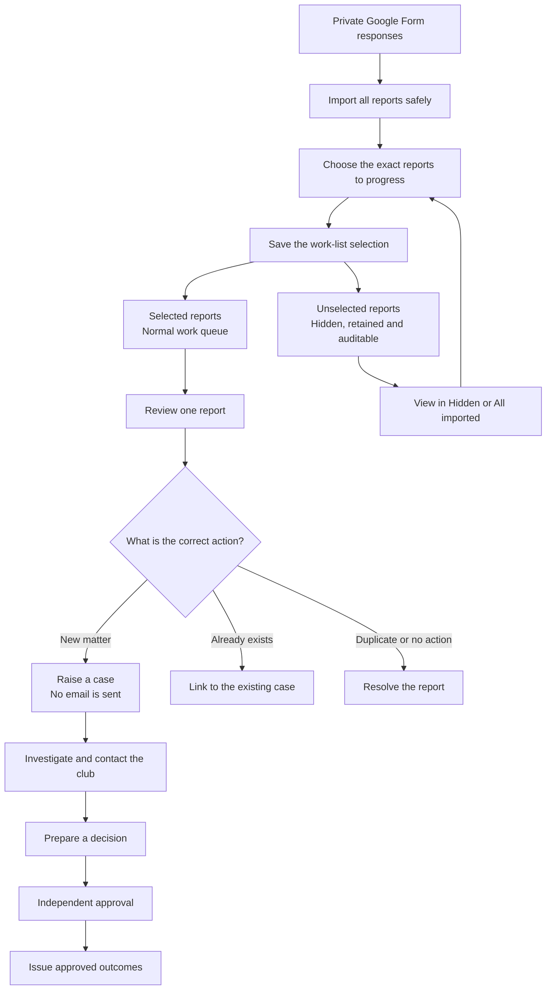

# GMCL ineligible-player work: quick guide

Three routes, one controlled process.

> **Important:** importing is not the same as raising a case. Google Form imports create reports for review. The tracker applies historical information only. A member of staff must deliberately raise every live case.

## Start here

1. Sign in to the GMCL admin portal.
2. Click **Sanctions**.
3. Click **Ineligible-player work**.
4. On **Ineligible-player cases**, choose the route that matches your task.

| What do you need to do? | Choose |
|---|---|
| Review one report and raise its case | **Route 1 - Raise one case** |
| Bring in several Google Form responses and choose which to progress | **Route 2 - Import and choose reports** |
| Reconcile the approved historical workbook | **Route 3 - Import historical tracker** |

### What “raise one case manually” means

An ineligible-player case must start from a private report in the queue. Do not use **Add card, ban, fine or points decision** to create a blank ineligible-player case.

If the report is not in the queue, complete the current private Google Form and follow Route 2.

## Route 1 - Raise one case

1. Click **Sanctions**.
2. Click **Ineligible-player work**.
3. Under **Route 1 - Raise one case**, click **Open next selected report**.
4. If the button says **View reports**, click it and then click **Review report** beside the correct entry.
5. On the intake page, check **Reported details** and any evidence.
6. Under **Raise this case**, check:
   1. **Offending team**
   2. **Reporting club**
   3. **Fixture date**
   4. **Player**
7. Usually no wording change is needed. If necessary, click **Review case wording** and check the recorded allegation and private investigation context.
8. Click **Raise case**.
9. When **Case [reference] is ready** appears, click **Open case**.

**Expected result:** an investigation opens. No email is sent and no outcome is decided.

### If a new case should not be raised

Click **Other outcomes**, then choose the appropriate action:

- Existing investigation: complete **Link to an existing case**, then click **Link and merge intake**.
- Duplicate report: complete **Resolve without a new case**, then click **Mark duplicate**.
- Irrelevant or no action: record the reason, then click **Ignore intake**.

## Route 2 - Import and choose reports

1. Make sure the reports are present in the private Google Form response sheet.
2. Click **Sanctions**.
3. Click **Ineligible-player work**.
4. Under **Route 2 - Import and choose reports**, click **Import and choose reports**.
5. Wait for the success message showing how many responses were seen, added, changed or returned errors.
6. On **Choose the reports to progress**, search if needed and tick **Progress** beside each required report.
7. Check the selected total. For the Rev 8 blue-row handover, this should be **18 reports**.
8. Enter a short reason, for example **Rev 8 blue rows**.
9. Click **Save selection and show work queue**.
10. Check that the normal queue contains the selected reports, then click **Review report** beside the first one.
11. Follow Route 1 from the **Reported details** check, then return to the queue and repeat.

**Expected result:** selected reports appear in the normal work queue. Unselected reports are hidden from that queue, not deleted, and remain available under **View hidden reports** or **All imported**.

> **Important:** the system reads the cell values, not blue formatting. Import the full configured sheet and use the selection screen. Do not delete or reorder rows in the live response sheet.

> A newly submitted report remains visible as **New - not yet chosen** until the next selection. Importing or selecting never sends an email, issues a sanction or bulk-creates live cases.

## Route 3 - Import the historical tracker

Use this route only for the approved historical workbook. It must be an `.xlsx` file no larger than 16 MB, with the **Form responses 1** sheet and the expected columns A to Z.

### Step 1 - Upload

1. Click **Sanctions**.
2. Click **Ineligible-player work**.
3. Under **Route 3 - Import historical tracker**, click **Open tracker import**.
4. Under **Step 1 - Upload tracker**, click **Tracker (.xlsx, max 16 MB)**.
5. Select the approved workbook.
6. Click **Upload tracker**.

The system opens **Import check #[number]**.

### Step 2 - Check every row

1. Leave **Needs checking** selected.
2. Review the totals for **Needs checking**, **Suggested matches** and **Needs help**.
3. Check the player, club, team, suggested Google intake and historical state on each row.
4. For a correct straightforward suggestion, click **Confirm suggested match**.
5. Repeat until every straightforward row has moved to **Verified history**.

If a row does not show **Confirm suggested match**, complete its full review:

1. Check **Reconciliation** and the **Google intake ID**.
2. Choose the **Historical case state**.
3. Complete the **Points/cards review** if it appears.
4. Record the review reason and reviewer.
5. Click **Verify row**.

Do not guess. Ask the casework lead to review ambiguous matches or points/cards wording.

### Step 3 - Sign off

When **Needs checking** reaches zero:

1. Find **Step 3 - Sign off**.
2. Check **Your name** and read the confirmation statement.
3. Tick **Save my name and confirmation in the audit history**.
4. Click **Sign off import**.

### Step 4 - Apply history

1. Review the application summary and **Application note**.
2. Tick the one-time application confirmation.
3. Click **Apply signed-off history**.

**Expected result:** signed-off private history and reviewed open/closed status are applied once. Unmatched or excluded rows remain untouched.

> The tracker cannot create a case, decision, sanction, points/cards entry, task, correspondence or email.

## After a live case is raised

1. Click **Open case** and check the evidence and published rule.
2. Save the initial email and reminder, then click **Send initial email to club** when ready.
3. Review the club response and any new evidence.
4. Complete **Prepare decision for approval** and click **Submit decision for approval**.
5. A different authorised administrator checks the proposal and clicks **Approve decision and lock outcomes**.
6. After the final previews, click **Issue approved outcomes**.

Stop and ask the casework lead for help if details conflict, an import reports errors, a tracker row is ambiguous, or the correct club, team, intake or case cannot be found.

## Safety checks to remember

- Raising a case does not send an email.
- A decision requires approval by a different authorised administrator.
- Outcomes are not sent until **Issue approved outcomes** is selected.

## Board flow: controlled intake to outcome

The board control is simple: the import is complete and auditable, staff deliberately choose the active workload, and only an independently approved decision can produce an outcome.
