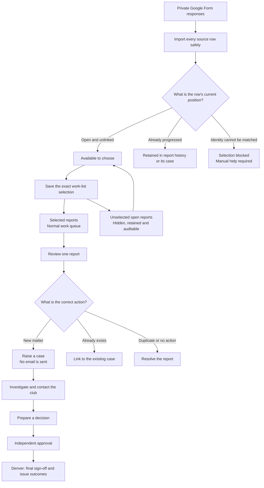

# GMCL ineligible-player work: quick guide

Three routes, one controlled process.

> **Important:** importing is not the same as raising a case. Google Form imports create reports for review. The tracker applies historical information only. A member of staff must deliberately raise every live case.

## Start here

1. Sign in to the GMCL admin portal.
2. Click **Sanctions**.
3. Click **Ineligible-player work**.
4. Read **Ineligible-player cases** from the top down.

### How the page is laid out

| Band | What it is | Who it is for |
|---|---|---|
| **Team queue** | Four shared numbers: reports to review, club replies to read, responses overdue, cases under investigation | The whole panel |
| **Latest import** | Whether the last Google Form import worked | Whoever imports |
| **Queue totals, filters and import routes** | Closed by default. Running totals, the search filters, and the three import routes | Only when you need them |
| **Report table** | The list the queue tabs and filters produce | Everyone |

The buttons at the top of the page are **Open next selected report**, **My cases** and **Close historic cases**. Everything else is one click away inside **Queue totals, filters and import routes**.

Your own cases, the club replies waiting on you and anything needing your approval are on the **Dashboard** page under **My work**; this page does not repeat them. **My cases** goes straight to the cases you own.

### If you give the final sign-off

The administrator who gives the final sign-off — the active **Play-Cricket** entry under **Notice recipients** — gets a different page. **Ineligible-player work** opens on **Outcomes to sign off**, which lists only:

1. cases with an approved, locked decision waiting for the final sign-off, and
2. league-table adjustments still to be keyed into Play-Cricket.

Report triage, imports, the shared queue and the running totals are hidden. **Show the full queue** at the bottom of the page opens the normal view, and **Back to outcomes to sign off** returns.

Running totals are not a to-do list. Denver's work is one entry, **With Denver for final sign-off**, and any open Play-Cricket league-points work is shown underneath it as a link.

| What do you need to do? | Choose |
|---|---|
| Review one report and raise its case | **Route 1 - Raise one case** |
| Bring in several Google Form responses and choose which to progress | **Route 2 - Import and choose reports** |
| Reconcile the approved historical workbook | **Route 3 - Import historical tracker** |
| Close old cases that were never finished | **Close historic cases** |

The three routes live inside **Queue totals, filters and import routes**. Open that section to see them.

### What “raise one case manually” means

An ineligible-player case must start from a private report in the queue. Do not use **Add card, ban, fine or points decision** to create a blank ineligible-player case.

If the report is not in the queue, complete the current private Google Form and follow Route 2.

## Route 1 - Raise one case

1. Click **Sanctions**.
2. Click **Ineligible-player work**.
3. Click **Open next selected report** at the top of the page.
4. If the button says **View reports**, click it and then click **Review report** beside the correct entry.
5. On the intake page, check **Reported details** and any evidence.
6. Under **Raise this case**, check:
   1. **Offending team**
   2. **Reporting club**
   3. **Fixture date**
   4. **Player**
7. Usually no wording change is needed. If necessary, click **Review case wording** and check the recorded allegation and private investigation context.
8. Click **Raise case**.
9. When **Case [reference] is ready** appears, click **Open case**.

**Expected result:** an investigation opens. No email is sent and no outcome is decided.

### If a new case should not be raised

Click **Other outcomes**, then choose the appropriate action:

- Existing investigation: complete **Link to an existing case**, then click **Link and merge intake**.
- Duplicate report: complete **Resolve without a new case**, then click **Mark duplicate**.
- Irrelevant or no action: record the reason, then click **Ignore intake**.

## Route 2 - Import and choose reports

1. Make sure the required reports are present in the private Google Form response sheet. Do not delete, copy or reorder live response rows.
2. Click **Sanctions**.
3. Click **Ineligible-player work**.
4. Open **Queue totals, filters and import routes**.
5. Under **Route 2 - Import and choose reports**, click **Import and choose reports**.
6. Read the import summary:
   1. **Source rows read** is every response read from Google.
   2. **Added** and **changed** are database updates. Zero is normal when the same sheet is imported again.
   3. **Need attention** means one or more rows have a warning; it does not automatically mean that the row is missing.
7. If the page says **Selection is blocked**, record the import number and error, plus any spreadsheet row shown, then stop for import or identity help.
8. The table contains open, unlinked reports only. Use **Fixture from**, **Fixture to**, **Order** or search to find the current handover.
9. Tick **Progress** beside each required report, or click **Select all shown**. Filtering never unticks a report that is already selected.
10. If a report is missing, click **Open report history** and search for the player. Do not select it again if it is already case-raised, linked, marked duplicate or ignored.
11. Check the selected total against the current handover list. Do not use an old fixed total.
12. Enter a short handover label, for example **Dave handover - 11 Aug 2026**.
13. Click **Save selection and show work queue**.
14. Click **Review report** beside the first selected report and follow Route 1.

**Expected result:** selected reports appear in the normal work queue. Unselected open reports are hidden from that queue, not deleted. Progressed reports remain in **Report history**.

> **One row means one report:** if the Player box contains several names, the chooser shows one checkbox. It does not automatically create one report or case per player. Review that row before raising anything.

> **Important:** the system reads cell values, not blue formatting. Import the full configured sheet and use the selection screen. A new submission remains visible as **New - not yet chosen** until the next selection. Importing or selecting never sends an email, issues a sanction or bulk-creates live cases.

## Route 3 - Import the historical tracker

Use this route only for the approved historical workbook. It must be an `.xlsx` file no larger than 16 MB, with the **Form responses 1** sheet and the expected columns A to Z.

### Step 1 - Upload

1. Click **Sanctions**.
2. Click **Ineligible-player work**.
3. Open **Queue totals, filters and import routes**.
4. Under **Route 3 - Import historical tracker**, click **Open tracker import**.
5. Under **Step 1 - Upload tracker**, click **Tracker (.xlsx, max 16 MB)**.
6. Select the approved workbook.
7. Click **Upload tracker**.

The system opens **Import check #[number]**.

### Step 2 - Check every row

1. Leave **Needs checking** selected.
2. Review the totals for **Needs checking**, **Suggested matches** and **Needs help**.
3. Check the player, club, team, suggested Google intake and historical state on each row.
4. For a correct straightforward suggestion, click **Confirm suggested match**.
5. Repeat until every straightforward row has moved to **Verified history**.

If a row does not show **Confirm suggested match**, complete its full review:

1. Check **Reconciliation** and the **Google intake ID**.
2. Choose the **Historical case state**.
3. Complete the **Points/cards review** if it appears.
4. Record the review reason and reviewer.
5. Click **Verify row**.

Do not guess. Ask the casework lead to review ambiguous matches or points/cards wording.

### Step 3 - Sign off

When **Needs checking** reaches zero:

1. Find **Step 3 - Sign off**.
2. Check **Your name** and read the confirmation statement.
3. Tick **Save my name and confirmation in the audit history**.
4. Click **Sign off import**.

### Step 4 - Apply history

1. Review the application summary and **Application note**.
2. Tick the one-time application confirmation.
3. Click **Apply signed-off history**.

**Expected result:** signed-off private history and reviewed open/closed status are applied once. Unmatched or excluded rows remain untouched.

> The tracker cannot create a case, decision, sanction, points/cards entry, task, correspondence or email.

## Close historic cases in one go

Use this for old cases that were never finished and need no sanction. It is the same action as **Close with no action** on a single case, applied to a list.

1. Click **Sanctions**.
2. Click **Ineligible-player work**.
3. Click **Close historic cases**.
4. Set **Opened before** to the cut-off date, and **Case source** if you only want one kind of case. Click **Show cases**.
5. Check the list. Only open cases assigned to you, or to nobody, are shown; a case owned by another administrator is counted in a note instead.
6. Tick each case to close, or search and click **Select all shown**.
7. Write one reason. It is recorded on every case you close, with your name.
8. Tick the confirmation and click **Close selected cases**.

**Expected result:** each selected case moves to **Closed**. Any pending response link, reminder, unsent email and open follow-up task is cancelled. Nothing is deleted, nothing is published and no email is sent.

- An unassigned case is recorded as yours before it is closed, so the history shows who closed it.
- A case that changed while you were choosing is skipped and named in the confirmation message.
- At most 200 cases can be closed at a time.
- Anything that needs a sanction must go through the normal decision, approval and Denver sign-off steps instead.

## Send the first email after raising a case

On the case page, use the large **Next action: contact the club for its explanation** section. Work down the three numbered cards in order.

1. If prompted, record and save the **Alleged rule under investigation** first.
2. Under **1. Review and save the initial email**, check the subject and body, then click **Save initial email**. This saves wording only; it does not contact the club.
3. Optional: after the green saved badge appears, tick the confirmation under **Optional safe test** and click **Send TEST copy to me**. The test goes only to your signed-in administrator email, contains no live response link and does not change the case.
4. Under **2. Review and save the reminder**, check the wording and click **Save reminder**. This also saves wording only.
5. Under **3. Send the initial email**, check the displayed **To** address is the offending club's verified official mailbox.
6. Click **Send initial email to club** only when you intend to contact the club. This is the only button in the section that sends the live first email.
7. Check the case delivery history. The seven-day response period begins only after delivery. The saved reminder is sent on day five only if it is still needed.

| Action | Contacts the club? | Changes the live response window? |
|---|---:|---:|
| Save initial email | No | No |
| Send TEST copy to me | No | No |
| Save reminder | No | No |
| Send initial email to club | **Yes** | Starts after confirmed delivery |

If the send button is disabled, read the message beneath it. The usual reasons are: the alleged rule has not been saved, both email drafts do not have green saved badges, there is no verified official club mailbox, or outbound ineligible-player email is disabled.

## Assign a case or ask another admin to help

Open **Case owner and help** on the case page.

- To hand over the whole investigation, choose an administrator under **Assign the whole investigation**, enter the reason and click **Save case owner**.
- To keep ownership but ask for one piece of work, use **Give a supporting task to another administrator**. Choose the administrator, describe the task, add an optional due date and click **Assign supporting task**.
- Open tasks appear on the case and in **Open task list**. Assignment changes and tasks are recorded in the audit history.

## Continue the case

1. Review the club response and any new evidence.
2. Complete **Prepare decision for approval** and click **Submit decision for approval**.
3. Dave or Warren checks the proposal and clicks **Approve decision and lock outcomes**. Either may approve a proposal they prepared because this step only locks the outcome and cannot issue it.
4. Denver completes the separate **Final sign-off and issue outcomes** step before anything is sent.

Stop and ask the casework lead for help if details conflict, **Selection is blocked**, a needs-attention warning cannot be resolved, a tracker row is ambiguous, or the correct club, team, intake or case cannot be found.

## Safety checks to remember

- Raising a case does not send an email.
- Saving either email draft does not send an email.
- **Send TEST copy to me** contacts only your administrator address and cannot open a club response window.
- **Send initial email to club** is the deliberate live-send action.
- Dave or Warren must approve and lock the decision; this may be the person who prepared it because Denver still provides the separate final sign-off.
- Outcomes are not sent until Denver selects **Final sign-off and issue outcomes**.
- **Close selected cases** never sends an email or publishes anything; it only records that no action is needed.

## Board flow: controlled intake to outcome

The board control is simple: every source row is accounted for, only open and unlinked work is offered for selection, progressed reports remain auditable, and only an independently approved decision can produce an outcome.
