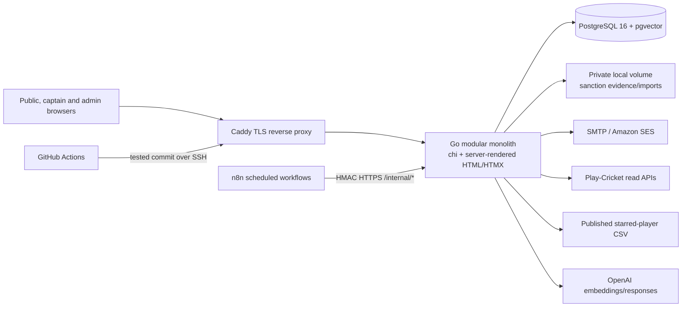
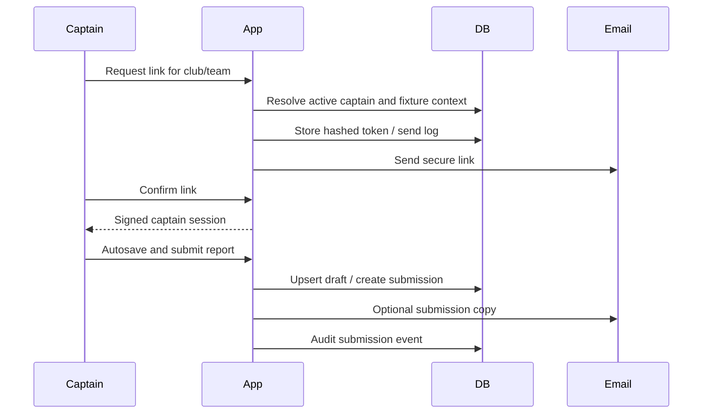

# Current-State Repository Audit

**Audit date:** 26 July 2026
**Repository baseline:** commit `23090f87100c74e66a0caa3c39cac1eca05e60e7`

## Current architecture

**Verified fact:** The public, captain and administrator interfaces are served by one Go process. HMAC-protected internal endpoints support reminders, reports, fixture sync, starred-player sync, rules sync and sanction outbox processing (`internal/httpserver/router.go:43-157`).

**Verified fact:** Caddy is the only public ingress; app, PostgreSQL and n8n share a Docker network. The database is not published as a host port (`docker-compose.yml:1-61`, `Caddyfile.production:1-31`).

**Recommendation:** Retain this deployment shape for the portal foundation. Establish explicit internal modules and repository boundaries before considering service extraction. The fixture solver may later become an isolated worker because its runtime and resource profile differ materially.

## Authentication and session management

### Captains

- A captain record belongs to one team and has an active date range (`migrations/0001_core_schema.sql:45-54`).
- Magic tokens contain captain, season, week and optional match/delegate context. Token hashes, request IP and user agent are stored (`migrations/0002_auth_tokens_audit.sql:2-17`, `migrations/0016_magic_token_match_date.sql:1-3`).
- Current validation permits a link to be reused until expiry or supersession; a separate consume function supports one-time flows (`internal/auth/magic.go:123-225`).
- The captain cookie is HMAC signed, has audience `cap`, is `Secure`, `HttpOnly`, `SameSite=Lax`, scoped to `/captain` and expires after two hours (`internal/httpserver/captain.go:1320-1395`).
- Stand-in invitations and captain-change requests exist, but they do not create durable named identities (`migrations/0005_delegate_and_club_umpires.sql:7-23`, `migrations/0030_captain_change_requests.sql:1-29`).

### Administrators

- Administrator credentials use bcrypt. Five failed attempts lock the account for 15 minutes by default (`internal/auth/admin.go:18-68`).
- The second factor is a six-digit emailed code with a ten-minute expiry (`internal/auth/admin.go:115-161`).
- The signed administrator cookie lasts eight hours and contains the role at issue time (`internal/httpserver/admin.go:364-393`, `internal/httpserver/admin.go:2658-2727`).
- `requireAdmin` validates only the cookie. It does not re-check account activity, role validity or a revocation store on every request (`internal/httpserver/admin.go:2541-2551`).
- `super_admin` can be derived from the cookie, database role, environment list or a hard-coded username (`internal/httpserver/admin.go:2554-2647`).
- `DISABLE_2FA=1` can bypass the email factor and must be forbidden in production readiness checks (`internal/httpserver/admin.go:307-339`).

**Technical debt:** A portal cannot safely reuse either identity model. It needs a common person/identity model, server-side sessions, current authorization checks and immediate revocation. Existing captain access should remain as a compatibility path during staged migration.

## Users, roles and permissions

**Verified fact:** There is no general `users`, `identities`, `club_memberships` or `role_assignments` table.

**Verified fact:** Administrator roles are limited to `admin` and `super_admin`. `admin_user_permissions` holds string permissions, with granular sanction permissions added through `sanction_permission_catalog` (`migrations/0021_admin_roles_and_email_events.sql:1-8`, `migrations/0026_admin_user_permissions.sql:1-13`, `migrations/0038_sanctions_case_management.sql:408-424`).

**Verified fact:** Many authenticated administrator routes have no domain permission beyond `requireAdmin`, including club/team/captain writes and legacy sanctions operations (`internal/httpserver/admin.go:24-217`).

**Recommendation:** Replace implicit route access with a deny-by-default policy service using current database assignments, resource scope and action. Hidden navigation remains a usability feature, never the security boundary.

## Clubs, teams, seasons and competitions

- `clubs` stores name and short name. It has no official-contact or tenant configuration model (`migrations/0001_core_schema.sql:22-27`).
- `teams` belongs to one club and stores name, level, active status and optional Play-Cricket team ID (`migrations/0001_core_schema.sql:29-36`, `migrations/0006_league_fixtures_and_team_mapping.sql:1-8`).
- `seasons` stores a date range, archive status, compliance start week and a list of included Play-Cricket competition IDs (`migrations/0001_core_schema.sql:2-20`, `migrations/0011_compliance_start_week.sql:1-2`, `migrations/0017_season_league_competition_ids.sql:1-5`).
- Competition and division are strings/identifiers on cached fixtures rather than normalized, season-aware entities (`migrations/0006_league_fixtures_and_team_mapping.sql:10-33`).

**Gap:** A team's competition/division entry can change by season. The target model requires `Competition`, `Division` and `TeamSeasonEntry`, not permanent columns on `Team`.

## Captain reports and compliance

- Reports and drafts are keyed to season, week and team; submissions preserve captain and optional Play-Cricket fixture identity (`migrations/0001_core_schema.sql:58-92`, `migrations/0020_submission_fixture_match_id.sql:1-4`).
- Expected reports are derived from active mapped teams and non-bye fixtures. A submission or approved exemption satisfies one team/fixture requirement (`internal/httpserver/dashboard_data.go:35-116`).
- Legacy submissions without fixture IDs are assigned to same-date fixture ordinals for backwards compatibility (`internal/httpserver/dashboard_data.go:53-104`).
- Administrators can mark byes/exemptions and submit a saved draft on behalf of a captain (`internal/httpserver/admin_compliance.go:545-817`).

**Recommendation:** Preserve these calculations behind a tested report-requirement service. The club dashboard must display source fixtures, submissions and exemptions, not recompute totals in the UI.

## Sanctions, cards and appeals

### Legacy model

`sanctions` stores season, week, team, club, colour, reason, status, resolution and email fields (`migrations/0007_sanctions_and_reports.sql:2-25`, `migrations/0010_reminders_and_email_sanctions.sql:23-29`).

### Current case model

- Effective-dated sanction policy versions link to rule releases.
- Cases separate public and private summaries and preserve assigned/proposed/approved administrators.
- Case events, evidence, decision revisions, effect revisions and ledger entries are append-only.
- The ledger stores team, club, season and deltas for yellow cards, red cards and point deductions.
- Proposer and approver must differ unless an emergency override is recorded.
- Secure, case-scoped response links and notification outbox/attempt tables exist.

Evidence: `migrations/0038_sanctions_case_management.sql:7-424`, `migrations/0039_legacy_sanction_event_immutability.sql:1-47`.

**Verified rule:** The published penalty menu says card accounting applies per team, while a club total of three reds triggers Board intervention. The target portal must preserve both meanings.

**Known gaps:** Full appeal workflow, sanction activation/expiry/remedy commands, attachment retention worker, provider delivery correlation and historical reconciliation remain partial (`docs/sanctions-requirements-audit.md:17-76`).

## Starred-player subsystem

- Imports are snapshot-based and preserve source checksum, fetch time and raw published rows.
- List entries, club status, amendments and effective periods exist.
- Imported scorecards create player appearance records.
- Identity mappings, exemptions, candidate/finding reviews and replacement requests support current administrator workflows.
- Most routes remain `super_admin` only (`internal/httpserver/admin.go:150-178`).

Evidence: `migrations/0033_starred_player_compliance.sql:3-145`, `migrations/0034_starred_finding_reviews.sql:1-35`, `migrations/0040_starred_candidate_reviews.sql:1-25`, `migrations/0044_starred_player_replacement_requests.sql:1-32`.

**Gap:** The system imports an externally published list; it does not provide club-owned drafts, GMCL approval, immutable published versions or a general rule-versioned decision workflow.

## Hawk AI and rule ingestion

- `rule_releases` have building, active, archived and failed states.
- Documents and chunks preserve source URL, hash, rule reference, heading, text-search vector and optional embedding.
- Conversations expire; messages record question, answer, citations, retrieved chunks, model and token/latency metadata.
- Retrieval uses lexical and vector channels and the Responses API when configured (`internal/rulesassistant/service.go:49-1062`).
- Deterministic record lookup is administrator-wide or captain-own-team. Public users receive rules-only behavior (`internal/httpserver/rules_assistant.go:121-227`).

**Gap:** There is no portal identity/tenant context, AI data classification, internal-note exclusion boundary or per-role data-source policy.

## Play-Cricket and fixtures

- The client supports GET requests for a season/date match list and match detail scorecard (`internal/leagueapi/config.go:10-67`, `internal/leagueapi/client.go:29-169`).
- Parsed fixture fields include league/competition IDs, teams, clubs, ground and umpires; scorecards include player IDs, names, captain and wicketkeeper flags (`internal/leagueapi/types.go:4-75`).
- Cached `league_fixtures` support captain prefill, expected-report calculations and starred appearances.
- There is no player-list client, registration client, photo client, webhook handler or write operation.
- There is no fixture constraint or plan model and no solver.

## Email and notifications

- SMTP sends HTML-rendered transactional messages with optional SES configuration-set headers (`internal/email/email.go:19-148`).
- SES events and SNS webhook receipts support delivery/bounce/complaint diagnostics (`migrations/0021_admin_roles_and_email_events.sql:10-36`, `migrations/0032_ses_webhook_receipts.sql:1-17`).
- Sanctions use an outbox with immutable content and attempt history. Other email paths use direct send calls.
- n8n schedules reminders, report generation, nightly starred sync and sanction outbox processing (`n8n_workflow.json`).

**Recommendation:** Generalize the sanctions outbox pattern into a portal notification service with idempotency, retries, delivery events, non-sensitive templates and recipient-policy snapshots.

## File uploads and storage

- Sanction evidence accepts declared image, PDF or text MIME types and a maximum of 10 MiB.
- Files receive random storage keys, mode `0600` and SHA-256 hashes on a local Docker volume.
- Authorized administrators download evidence through an application handler with `Cache-Control: no-store`.

**Gaps:** No magic-byte/content verification, image re-encoding, malware scanning, quarantine state, signed short-lived URLs, external object-store durability or automated retention.

## Audit, retention and privacy

- `audit_logs` records actor type/ID, action, entity, JSON metadata, IP and user agent (`migrations/0002_auth_tokens_audit.sql:74-91`, `internal/httpserver/audit.go:12-49`).
- The general actor enum excludes club user and captain, so captain submissions are often audited as `system`.
- Default cleanup deletes audit logs after 365 days, tokens after shorter periods and drafts after 30 days (`internal/httpserver/admin_security.go:113-165`).
- Captain GDPR tooling can export and anonymize captain data while retaining operational history (`internal/httpserver/gdpr.go:126-381`).

**Gap:** The portal needs a common actor model, acting-role/scope, reasons, before/after data, approval context, AI involvement and tamper evidence. Retention must be approved per data class rather than inherited from current defaults.

## Deployment, resilience and operational model

- Production is a DigitalOcean droplet using Docker Compose and Caddy.
- CI applies every migration to PostgreSQL, runs race-enabled tests, vet, gosec, govulncheck and a production image build.
- Production deployment creates a PostgreSQL backup, deploys the tested commit and rolls application code back on failure. Migrations are not rolled back.
- Backups are retained for 14 days; a scheduled public health check can restart current containers and open an incident issue.

Evidence: `docs/production-deployment.md:1-19`, `.github/workflows/ci.yml:1-156`, `.github/workflows/production-health.yml:1-72`.

**Recommendation:** Continue additive migrations, but add restore testing, database recovery objectives, object-storage backup and authorization/security release gates before portal launch.

## Test baseline

`go test ./...` passed during discovery. Coverage measured during the audit:

| Package | Statement coverage |
|---|---:|
| `internal/httpserver` | 13.2% |
| `internal/sanctions` | 15.1% |
| `internal/leagueapi` | 28.3% |
| `internal/middleware` | 34.6% |
| `internal/rulesassistant` | 48.9% |
| `internal/starred` | 57.6% |

**Risk:** The most security-sensitive HTTP authorization paths have low aggregate coverage. New portal work requires policy-level unit tests and database-backed horizontal/vertical authorization integration tests.

## Repository evidence summary

The audit used the route boundaries in `internal/httpserver/router.go`, authentication/session code in `internal/auth` and `internal/httpserver`, all migrations through the current `0047` files, Play-Cricket and starred/rules services, email and n8n configuration, deployment workflows, and existing tests. The preceding sections place file and line references beside each material verified fact; no production database was used as evidence.

## Existing data and integration gaps

- There is no authoritative named-person, identity, membership, season-aware appointment or club authorization model.
- Competition/division/team entry history, general club contacts and player identity/registration are not first-class domains.
- Current Play-Cricket integration reads fixtures and scorecards only; player photos, registration writes and webhooks are not evidenced.
- General messaging/cases, structurally isolated internal notes and portal acknowledgements do not exist.
- Sensitive evidence lacks object-storage quarantine, content verification, malware scanning and approved lifecycle.
- Production data volumes, current registration forms/sheets, fixture-planning artefacts and private external agreements were unavailable.

## Technical debt required before club accounts

1. Remove hard-coded identity elevation and stale role claims.
2. Add general identity, membership, role-assignment and server-session models.
3. Centralize resource/action authorization and tenant-scoped repositories.
4. Normalize season-aware competitions, divisions and team entries.
5. Establish append-only common audit events and correlation IDs.
6. Introduce private object storage, quarantine, content validation, malware scanning and retention.
7. Generalize notification outbox and delivery handling.
8. Reconcile club/team/Play-Cricket identifiers and legacy sanctions before exposing totals.

These are bounded foundation changes, not justification for rewriting captain reports, the sanction ledger, starred imports or rule retrieval.
