# Personas and User Journeys

**Planning baseline:** 26 July 2026
**Status:** Recommended experience model; operational assumptions require validation in interviews

The evidence labels defined in [00-executive-summary.md](00-executive-summary.md) apply throughout this document.

## Design principles

- **Verified fact:** Captain reporting is a team-scoped, mobile-relevant workflow that must remain available while portal capabilities are added (`internal/httpserver/captain.go:123-381`, `internal/httpserver/router.go:86-118`).
- **Recommendation:** Present one product with role-aware navigation, but never merge permissions merely because one person has several roles.
- **Recommendation:** Begin each journey with the user's current appointment and scope, not with an unrestricted record search.
- **Recommendation:** Every official result shows its source, season, effective date, governing rule release and route to correction or appeal.
- **Recommendation:** Save draft work, make deadlines visible, and make failure recovery possible without support intervention where that is safe.
- **Assumption:** Most club officials are volunteers using personal phones as well as desktop computers.
- **Open question:** The research sample, pilot clubs and named operational owners must be agreed before detailed interaction design.

## Personas

| Persona | Responsibilities and needs | Data scope | Principal risks and safeguards |
|---|---|---|---|
| Club Primary Administrator | Establishes the club's account, appoints other club officials, monitors actions and keeps official contacts current | One or more explicitly approved clubs; current and historical seasons | A compromised or stale account has broad club impact. Strong authentication, step-up, dual notification and prompt revocation are required |
| Club Administrator or Secretary | Handles reports, messages, corrections and general club administration | Assigned club; category restrictions may narrow access | Must not amend GMCL-owned official decisions directly or see another club |
| Club Play-Cricket Administrator | Reconciles external identifiers and performs permitted external steps | Assigned club's external references and registration workflow | Portal authority must not be mistaken for Play-Cricket authority |
| Club Junior Secretary | Receives and acknowledges junior competition communications | Assigned club and junior competitions; verified adult contacts only | Avoid unnecessary child data; no safeguarding case access by default |
| Club Safeguarding Officer | Receives a separately routed safeguarding referral where policy permits | Restricted safeguarding service only | Separate authorization, storage, response process and DPIA; no general officer access |
| Team Captain or Manager | Completes existing reports and sees team actions | Appointed team and season | Existing magic-link access must not be broken; appointment expiry must be enforced |
| Read-only Club User | Reviews club information without altering it | Assigned club, excluding restricted categories | Export and attachment access must be separately granted |
| GMCL Super Administrator | Break-glass platform and role administration | League-wide, but still purpose-limited and audited | No routine use of super-admin; step-up and high-severity audit alerts |
| Board or League Administrator | Oversees league operations, decisions and publications | Assigned competitions/seasons or league-wide | Decision races and unpublished drafts require explicit state transitions |
| Club Liaison Officer | Verifies primary administrators and coordinates club cases | Allocated clubs and general case categories | Official-contact evidence must be recorded without excessive retention |
| Compliance and Sanctions Officer | Reviews reports, cards, breaches, sanctions and appeals | Assigned competitions and cases | Preserve team-level ledger, evidence, rule release and decision history |
| Player Registration Officer | Reviews registration applications and transfer evidence | Assigned competitions; restricted player documents | Data minimisation, document access logging and duplicate-decision protection |
| Junior Competition Administrator | Sends competition notices and handles junior administration | Junior competitions and verified adult club recipients | No safeguarding access unless separately appointed |
| Safeguarding Officer | Handles safeguarding routes independently | Explicitly assigned safeguarding cases | Highest restriction, separate support and incident procedures |
| Fixture Administrator | Captures constraints, compares candidates and publishes approved schedules | Assigned competitions/seasons | Solver output is advisory; publication requires a named human approval |
| Read-only Auditor | Inspects records and audit trails | Time-bound, purpose-specific scope | Bulk export, attachments and sensitive fields excluded by default |
| Umpire or approved identity checker | Checks the eligibility identity view at a match | One fixture, short time window, minimum fields | Prevent bulk browsing, photography scraping and use beyond the match |
| Player or responsible adult | Supplies information for a registration journey | Own application only | Identity proofing, age-appropriate notices and external handoff clarity |
| Previous-club responsible officer | Responds to a transfer-clearance request | One signed, expiring request | Current Rule 3.1 direct-email requirement remains authoritative |
| Operations support | Helps users recover access and resolve failed workflows | Minimum metadata needed for support | Support must not become an authentication bypass |

## Journey conventions

Each diagram names the authoritative decision point. A portal state such as `submitted` is not the same as an external Play-Cricket registration or a published GMCL decision. Error responses must use a correlation reference, avoid personal-data disclosure, preserve saved work and record security-relevant failures.

## Journey 1: Club administrator accepts an invitation

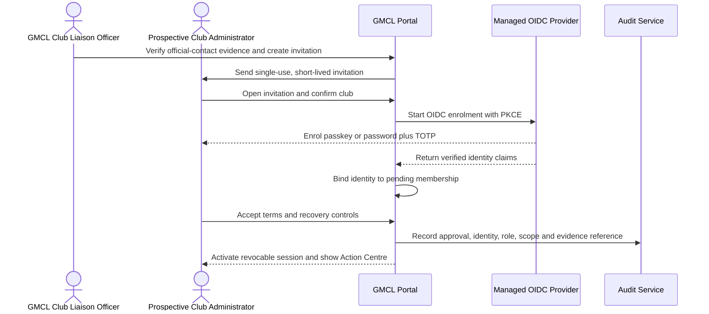

- **Recommendation:** Only a Club Liaison Officer or Super Administrator may approve the first Club Primary Administrator, against verified official-contact evidence. Later appointments follow club approval policy and notify the primary administrator and GMCL.
- **Failure journey:** Expired, already-used or mismatched invitations disclose no account state. Reissue creates a new token and invalidates the old one. An identity already connected to another club may accept the new membership without creating a duplicate user.

## Journey 2: Club reviews missed reports

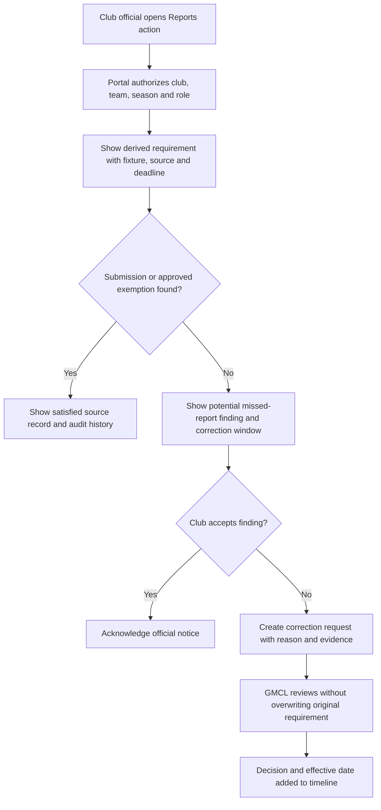

- **Verified fact:** The current calculation creates expected requirements by team and fixture and checks submissions, exemptions and legacy matching (`internal/httpserver/dashboard_data.go:8-116`).
- **Failure journey:** A stale page cannot create a duplicate correction. The API rejects a request for another club without disclosing whether the requirement exists.

## Journey 3: Club replies to a GMCL message

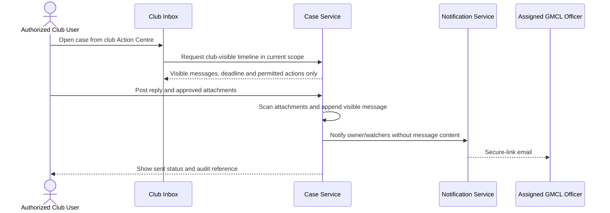

- **Recommendation:** The club-facing repository never joins the internal-note table. A reply changes `Awaiting club` to `Awaiting GMCL` atomically.
- **Failure journey:** Quarantined attachments are not downloadable or delivered. A departed administrator retains no access even if an old email link is opened.

## Journey 4: GMCL assigns and escalates a club case

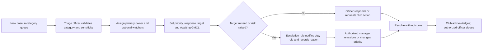

- **Recommendation:** Assignment history is append-only. Reassignment never removes previous ownership evidence.
- **Failure journey:** Safeguarding referrals route to a separate restricted service; a general triage officer sees only a neutral handoff status.

## Journey 5: Club updates its starred-player list

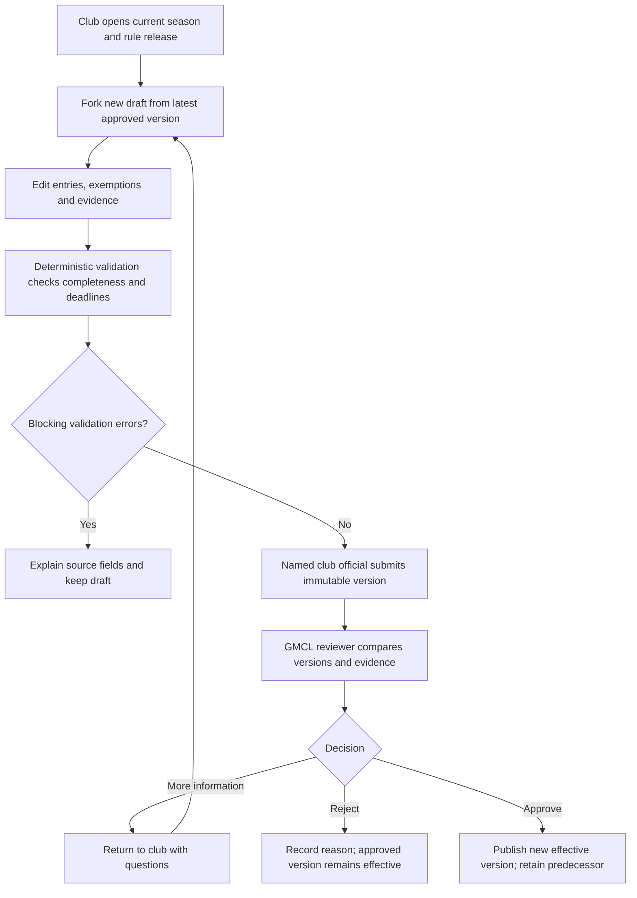

- **External dependency:** The workflow uses the season-specific published Rule 3.5 release; it must not encode 2026 thresholds permanently.
- **Failure journey:** A deadline override requires an authorized GMCL role, step-up, a reason and an audit event.

## Journey 6: Hawk explains a potential starred-player breach

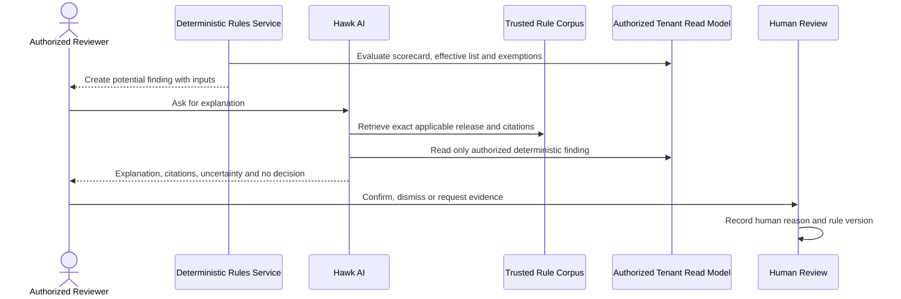

- **Recommendation:** Hawk cannot create or amend official records, approve, sanction, notify or publish. A deterministic service creates the potential finding; Hawk may explain it.
- **Failure journey:** Prompt injection, unavailable citations or ambiguous player matching produces a refusal or escalation, never a definitive eligibility decision.

## Journey 7: Junior administrator sends a junior communication

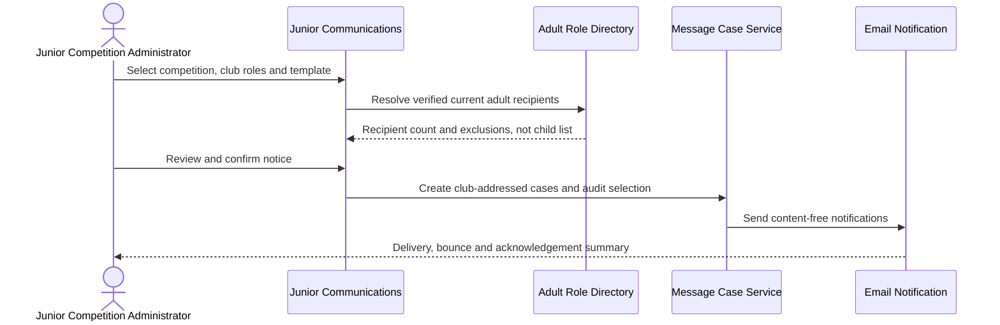

- **Recommendation:** Initial junior communications target verified adult club roles only. No player-level recipient selection is included.
- **Failure journey:** A safeguarding category cannot be sent through this bulk path; it enters the separate restricted safeguarding route.

## Journey 8: Umpire checks match-day player identity

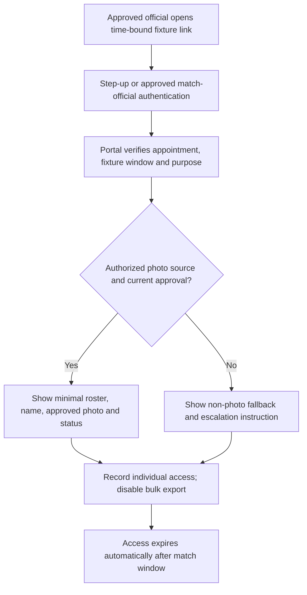

- **External dependency:** Play-Cricket photo API access, controller roles and redistribution rights are unconfirmed. This journey remains blocked until written ECB/Play-Cricket agreement and DPIA approval.
- **Failure journey:** No photo must not be displayed as a false match or an eligibility failure; the official follows the agreed manual identity route.

## Journey 9: Player completes a registration application

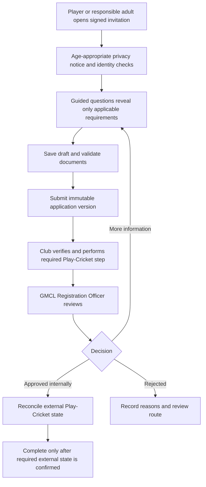

- **Recommendation:** The portal provides one guided status and task list while honestly labelling the Play-Cricket handoff.
- **Failure journey:** A duplicate person or external member ID creates a reconciliation task, not an automatic merge.

## Journey 10: Previous club provides transfer clearance

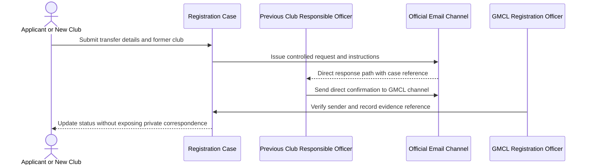

- **Verified fact:** Published Rule 3.1, updated 16 February 2026, requires a direct email from the responsible former-club officer and says forwarded emails are not accepted.
- **Recommendation:** Keep that direct-email evidence route until the rule is formally amended. The portal may coordinate and display status but must not pretend an in-portal click replaces the mandated email.
- **Failure journey:** An unverifiable or forwarded response remains `clearance required` and is referred to a Registration Officer.

## Journey 11: Fixture administrator generates and approves a candidate

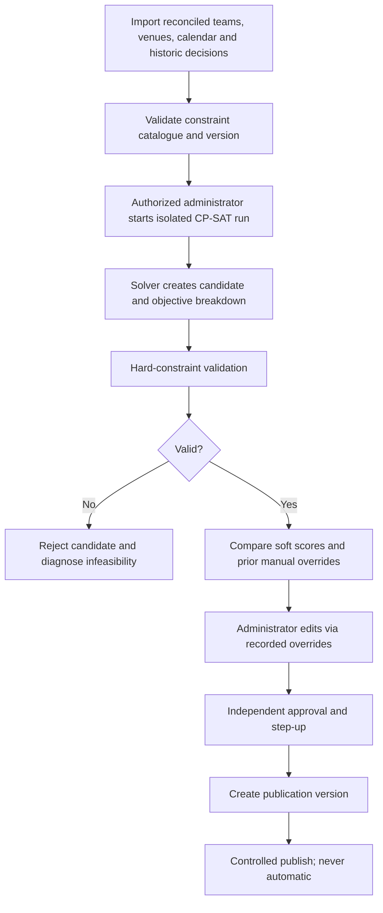

- **Recommendation:** OR-Tools CP-SAT is evaluated in an isolated prototype only after process interviews, constraint capture and historical-data preparation.
- **Failure journey:** An infeasible run returns conflicting constraints and preserves the last approved schedule. A solver crash or timeout cannot affect the published fixture set.

## Cross-journey exception requirements

| Exception | Required behaviour |
|---|---|
| Role expires during a draft | Preserve the draft but deny further access; an authorized successor may be explicitly assigned |
| Season changes | Keep the original season and rule release; never reinterpret a historical decision under the current release |
| Concurrent decisions | Use version checks and a database transaction; only one terminal decision succeeds |
| Notification fails | Preserve the portal action, retry safely, surface delivery state and follow the official-email fallback |
| External service unavailable | Queue bounded retries where safe, show a truthful stale/as-at state and provide a manual operational route |
| Attachment fails scanning | Keep it quarantined, notify the uploader without exposing storage details, and allow safe replacement |
| Permission denied | Return an authorized not-found or forbidden response with no foreign metadata and record suspicious patterns |
| Personal data mismatch | Create a restricted reconciliation task; do not silently merge identities or registrations |
| Rule ambiguity | Stop automation, cite the applicable text and assign a human decision owner |

## Research and validation plan

**Recommendation:** Validate these journeys with at least two representatives from club administration, captains, league operations, registration, sanctions/compliance, junior administration and fixture administration, plus safeguarding and data-protection reviewers. Test both desktop administration and representative mobile devices at a ground. Record observed terminology, exception frequency, evidence used, peak workload and accessibility needs.
