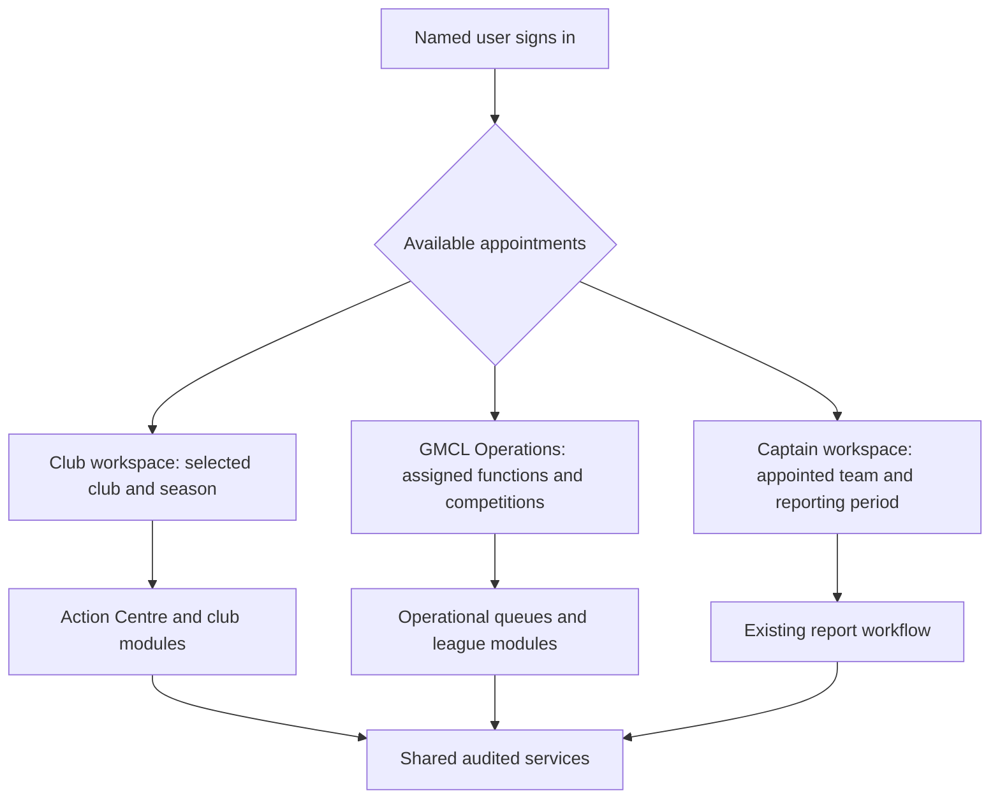
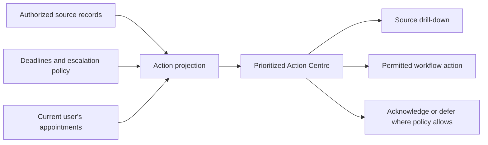

# Information Architecture

**Planning baseline:** 26 July 2026
**Status:** Recommended navigation and interaction architecture

The evidence labels defined in [00-executive-summary.md](00-executive-summary.md) apply throughout this document.

## Product structure

**Recommendation:** Use one portal shell with three clearly separated workspaces:

1. **Club workspace** for a selected club and season.
2. **GMCL Operations workspace** for staff assignments and competition scopes.
3. **Captain workspace** preserving the existing team/week reporting journey.

Switching workspace changes the authorization context, navigation and visual scope label; it never broadens permission. A person with two club memberships must deliberately select a club, and every page header must show the active club, season and acting role.

- **Verified fact:** Existing routes already separate captain and administrator boundaries (`internal/httpserver/router.go:65-157`).
- **Recommendation:** Preserve those boundaries during migration. Do not mount club handlers beneath the current coarse administrator authorization.

## Club navigation

| Area | Purpose and primary content | Visibility |
|---|---|---|
| Home | Club and season summary, urgent deadlines, service notices | All current club users |
| Action Centre | Prioritized tasks requiring the user's permitted action | Role-filtered |
| Teams | Entered teams, appointments and source identifiers | Club users; edit/correction by role |
| Reports | Due, submitted, late and missed reports; source drill-down and corrections | Club and team scope |
| Cards & Sanctions | Team-level cards, sanctions, deductions, appeals and club-derived totals | Restricted attachments by role |
| Players | Gated player identity and eligibility summaries | Later phase; least privilege |
| Registrations | Guided applications, transfer status and external handoff | Registration roles only |
| Starred Players | Drafts, approved versions, exemptions and potential findings | Club administrators and selected roles |
| Fixtures | Published fixtures, availability, constraints and change requests | Club users; edits by fixture role |
| Messages | Club-visible cases, replies, deadlines and acknowledgements | Category-restricted |
| Junior | Adult-recipient notices and junior competition actions | Junior roles only |
| Club Details | Club-owned contact data, notification routes and correction requests | Direct edit or request according to ownership |
| Users & Access | Memberships, appointments, expiry and invitation status | Primary/admin roles |
| History | Authorized decisions, changes, exports and audit timeline | Scoped and redacted |

**Recommendation:** Show unavailable areas as absent when their existence is sensitive; otherwise show a concise access explanation and the role that can perform the action. Never use a disabled button as the only authorization control.

## GMCL Operations navigation

| Area | Purpose |
|---|---|
| Operations Dashboard | Assigned queues, overdue cases, delivery failures and current-season service health |
| Clubs & Teams | Reconciled organisation hierarchy, contacts, appointments and external identifiers |
| Reports | Requirements, submissions, exemptions, findings and corrections |
| Compliance & Sanctions | Potential findings, cases, team cards, ledger effects, appeals and publication |
| Player Registrations | Applications, documents, transfer clearance and reconciliation |
| Starred Players | Season/rule releases, submissions, reviews, exemptions and potential breaches |
| Fixtures | Constraints, plan versions, candidate comparison, overrides, approval and publication |
| Messages & Cases | Triage, assignment, watchers, templates, deadlines and club-visible communications |
| Junior Administration | Adult-role communications, competitions and acknowledgements |
| Rules | Trusted sources, releases, effective dates, citations and activation |
| Users & Roles | Identity links, memberships, appointments, revocation and recovery administration |
| Audit | Authorized event search, decision histories and export oversight |
| System Administration | Feature flags, queues, provider health and tightly controlled break-glass operations |

**Recommendation:** Safeguarding is not a general navigation item. Authorized Safeguarding Officers enter a separately protected route with a distinct warning, storage boundary and support process.

## Action Centre

The Action Centre is the default operational page. It is a query over authorized work items, not another source of truth.

### Action item contract

Every card, row or count must expose:

| Field | Meaning |
|---|---|
| Title and plain-language explanation | What needs attention and why |
| Scope | Club, team, competition and season |
| Source | Authoritative record or external as-at timestamp |
| Status | Draft, potential, submitted, approved, published or other precise state |
| Effective date and deadline | When it applies and when action is due |
| Governing rule | Exact rule release and citation where relevant |
| Permitted action | One or more server-authorized next actions |
| Owner | Current user/role, club or GMCL assignment |
| Sensitivity | Visible label where handling restrictions matter |
| History | Link to source record and authorized audit timeline |

### Prioritization

**Recommendation:** Rank by a transparent operational rule: overdue critical items, deadlines within two days, unread official notices, awaiting-user actions, then informational updates. Users can filter and save views but cannot hide mandatory actions globally. Staff priority changes require a reason.

Suggested filters are season, team, competition, module, status, owner, deadline, priority and source freshness. Saved views store filters, not copied records.

## Dashboard structure

### Club home

1. Scope header: club, season, acting role and data freshness.
2. Urgent action strip: due/overdue actions and unread notices.
3. Reports: due, submitted, late, missed and correction-window counts.
4. Cards and sanctions: team rows first; club totals explicitly labelled as derived.
5. Starred and registrations: version/status counts when the modules are enabled.
6. Fixtures and junior notices: deadlines and requests, subject to role.
7. Service/source status: Play-Cricket as-at time and any degraded integrations.

### GMCL operations dashboard

1. Personal/role queue.
2. Unassigned and overdue cases.
3. Decisions awaiting approval.
4. Notification bounces and integration failures.
5. Data-reconciliation exceptions.
6. Current release health and audit alerts.

**Recommendation:** Counts must never be clickable into a broader dataset than the user is permitted to see. The detail query repeats authorization and tenancy filtering.

## Record-page pattern

Each official record uses a consistent layout:

- status and scope header;
- authoritative facts and source;
- applicable rule release;
- permitted next actions;
- club-visible timeline;
- separately rendered GMCL-internal area for authorized staff only;
- related records;
- effective and superseded versions;
- download/export controls with purpose and audit notice.

Drafts and official data use distinct labels and visual treatment. A potential AI/rules finding is never styled as a confirmed breach.

## Search and filters

- **Recommendation:** Search is authorization-first. Scope filters are applied in the repository query before matching or pagination.
- **Recommendation:** Do not create a global personal-data search for club users. GMCL searches are field- and role-limited, rate-limited and audited.
- **Recommendation:** Search results return minimal snippets and never reveal internal-note text to a role that cannot open the note.
- **Recommendation:** Exports are separate permissions, use the same scoped query, apply column-level redaction and create an audit event.
- **Assumption:** Common staff queues merit saved views; validate which combinations are operationally useful during discovery.

## Mobile and ground-side use

- A responsive layout supports 320 CSS-pixel width without horizontal scrolling for core actions.
- Primary actions, deadlines, fixture/team scope and offline/error state remain visible without hover.
- Match-day identity, captain reports, acknowledgements and message replies are optimized for one-handed use.
- Draft forms save after meaningful steps and show the last saved time.
- Attachments can be photographed only where policy permits; metadata and content are treated as untrusted.
- No long-lived photo cache, bulk roster export or browser-store persistence is used on match-day devices.
- External handoffs warn that the user is leaving GMCL and retain a return checklist.

**External dependency:** Real-world testing requires representative grounds and network conditions. Offline submission is not assumed; adding it would introduce device-storage and synchronization risks.

## Desktop administration

- Dense queues support keyboard navigation, column choice, saved filters and explicit bulk actions.
- Bulk actions show affected scopes and exclusions before confirmation.
- Decision screens keep evidence, prior versions and applicable rules visible.
- Split panes must not accidentally preload unauthorized records.
- Long-running imports, exports and solver jobs show a durable job reference and can be left safely.

## Status language

Use domain-specific, mutually exclusive states. At minimum:

- `Draft`, `Submitted`, `More information required`, `Approved`, `Rejected`, `Superseded` for submissions;
- `Potential finding`, `Under review`, `Confirmed`, `Dismissed`, `Appealed`, `Closed` for compliance;
- `New`, `Awaiting GMCL`, `Awaiting club`, `In progress`, `Resolved`, `Closed`, `Reopened` for messages;
- `Candidate`, `Validated`, `Approved`, `Published`, `Superseded` for fixture plans.

Avoid ambiguous labels such as `Done`, `Active` or `Complete` without a domain definition.

## Empty, loading, error and permission states

| State | Required design |
|---|---|
| Empty | Explain whether there are no records, filters exclude records, the module is not enabled or data has not synchronized |
| Loading | Preserve layout and scope; announce progress accessibly; do not imply zero |
| Stale external source | Show last successful synchronization and whether actions are blocked |
| Validation error | Link the summary to each field and preserve entered data |
| Service error | Give a correlation reference and safe retry guidance; do not expose internals |
| Permission denied | Explain the user's scope without confirming foreign record existence |
| Session expired | Preserve non-sensitive draft where safe; reauthenticate and re-check authorization |
| Conflict | Show that the record changed, reload the new version and preserve the user's proposed changes |

## Accessibility and content

**Recommendation:** Treat WCAG 2.2 AA as the release target:

- semantic landmarks, headings, labels and tables;
- full keyboard operation and visible focus;
- no colour-only status;
- error summary and inline errors;
- 4.5:1 text contrast except permitted large-text cases;
- 200% zoom and reflow;
- minimum target sizes and alternatives to drag gestures;
- announced asynchronous updates;
- accessible authentication without cognitive-function tests;
- plain-English definitions for league terminology;
- captions/transcripts for instructional media.

Automated scanning is necessary but not sufficient. Each production gate includes keyboard, screen-reader, zoom/reflow and representative user testing.

## Notification-to-portal continuity

Email contains only a non-sensitive subject, club/case reference, deadline and secure portal link. After sign-in, the portal resolves the reference only within current authorization. If the user's appointment changed, the link does not grant access. While Rule 1.5 keeps email as the primary channel, delivery and portal acknowledgement are shown together without claiming portal delivery supersedes the email record.

## Analytics and service measures

**Recommendation:** Collect privacy-minimized operational measures:

- time from action creation to first view and completion;
- missed deadline and escalation rate;
- percentage of users completing onboarding without support;
- correction and appeal resolution times;
- notification delivery/bounce rate;
- external handoff abandonment;
- accessibility defects and support contacts;
- denied cross-scope requests and stale-role access attempts.

Do not record message bodies, document contents, authentication secrets or full search queries in general analytics.

## Validation questions

- **Open question:** Which five tasks create the largest weekly burden for each GMCL team?
- **Open question:** Which club roles require distinct navigation rather than filtered content?
- **Open question:** What terminology do clubs use for report corrections, sanctions challenges and starred amendments?
- **Open question:** Which tasks are routinely completed at grounds with poor connectivity?
- **Open question:** Which dashboard metrics are actionable, and which should remain in reports?

Owners and gates are recorded in [16-open-questions-and-decisions.md](16-open-questions-and-decisions.md).
