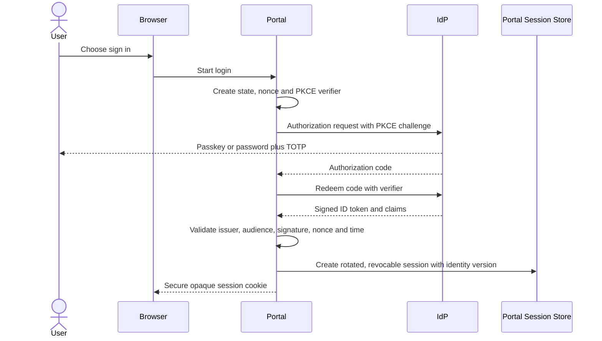

# ADR: Authentication and Session Architecture

**Decision status:** Recommended; provider selection, procurement, DPA and security review are blocking
**Decision date:** 26 July 2026
**Scope:** Named GMCL, club, captain, match-official and applicant accounts

The evidence labels defined in [00-executive-summary.md](00-executive-summary.md) apply throughout this document.

## Context

- **Verified fact:** Captains currently authenticate with team/week-scoped magic tokens and receive a signed two-hour cookie (`internal/auth/magic.go:35-179`, `internal/httpserver/captain.go:1320-1395`).
- **Verified fact:** Administrators use password verification, an emailed six-digit code and a signed eight-hour cookie (`internal/auth/admin.go:73-202`, `internal/httpserver/admin.go:364-393`).
- **Verified fact:** `requireAdmin` validates signed cookie content but does not consult a server-side session record, so there is no immediate per-device or all-device revocation (`internal/httpserver/admin.go:2541-2551`).
- **Verified fact:** The current captain token remains valid until expiry or supersession; it is not consumed after first use (`internal/auth/magic.go:84-179`).
- **Recommendation:** The portal needs named identities, strong authentication, scoped appointments, reliable revocation and recovery that cannot be performed by a single support operator.

## Decision

Use a managed OpenID Connect provider with Authorization Code flow and PKCE, subject to GMCL procurement, security assessment and a UK GDPR-compliant data-processing agreement.

1. Passkeys/WebAuthn are the preferred authenticator.
2. Password plus TOTP is the fallback where passkeys are unavailable.
3. Email links are limited to short-lived, single-use onboarding and controlled recovery.
4. Routine email magic-link or emailed-code sign-in is not the target baseline.
5. GMCL staff and Club Primary Administrators require passkey or password plus TOTP before privileged access.
6. The application owns club memberships, role assignments and season/team/competition scopes; IdP groups are not the authorization source.
7. The application creates a revocable server-side session after validating the OIDC response.
8. Existing captain reporting continues during migration and can later link a named identity to a captain appointment without removing the current route until adoption and fallback criteria are met.

**External dependency:** No provider is selected in this pack. Required capabilities, not a brand, are the decision.

## Options considered

| Option | Security strengths | Weaknesses and operational cost | Usability and support | Decision |
|---|---|---|---|---|
| Passkeys/WebAuthn | Phishing-resistant, origin-bound, no reusable server password | Device/account ecosystem and recovery need careful support; roaming authenticator coverage varies | Excellent routine sign-in after enrolment | Preferred authenticator |
| Password plus TOTP | Broadly understood; second factor independent of email when configured correctly | Password spraying/credential stuffing remains; TOTP is phishable; reset workload | Viable fallback with password manager guidance | Supported fallback |
| Routine email magic links | Low enrolment friction | Inbox compromise, forwarding/theft, replay and delayed delivery; weak for shared mailboxes | Easy initially, high incident ambiguity | Invitation/recovery only |
| Routine email one-time codes | Familiar and simple | Phishable, inbox-dependent, code interception and enumeration/rate-limit concerns | Accessible fallback but frequent delivery support | Not routine target |
| Microsoft/Google federation | Users can reuse protected identities; possible passkey/MFA | Organisation/account availability is uneven; upstream recovery and lifecycle vary | Optional convenience for suitable users | May be offered through managed IdP, never sole method |
| Application-owned authentication | Maximum direct control; no provider fee dependency | GMCL must safely build WebAuthn, MFA, federation, recovery, anomaly detection and lifecycle operations | Largest ongoing security/support burden | Rejected for target portal |
| Managed identity provider | Mature protocols, authenticator support, risk controls, revocation hooks | Procurement, availability, DPA, cost, configuration risk and vendor exit | Best support balance if capabilities are verified | Recommended |

Official NCSC guidance reviewed on 25 July 2026 treats passkeys/FIDO2 as phishing-resistant and ranks FIDO2 above challenge apps, TOTP and message-based MFA. See the source register in [02-rules-and-external-dependencies.md](02-rules-and-external-dependencies.md).

## Identity boundaries

The IdP authenticates an identity. PostgreSQL authorizes the resulting user through active memberships and role assignments. Email, club contact, identity and user records are separate. An OIDC subject is unique only within its issuer and must be keyed as `(issuer, subject)`.

## Required provider capabilities

- OIDC discovery and Authorization Code with PKCE.
- WebAuthn/passkey enrolment and authentication.
- Password plus TOTP fallback and one-time backup codes.
- Multiple authenticators and device/authenticator management.
- Recent-authentication or `auth_time`/ACR evidence for step-up.
- Per-account disablement and global/session revocation integration.
- Rate limiting, credential-stuffing protections and suspicious-login events.
- Generic responses that avoid account enumeration.
- Signed, verified webhook events with replay protection if lifecycle webhooks are used.
- UK/EU data-location and subprocessor information, DPA, breach terms, retention controls and export/exit plan.
- Accessible enrolment and recovery.
- Administrative audit log export.

## Portal session model

Store only a random opaque session identifier in a cookie. Store a keyed hash of that identifier server-side with:

- user and identity identifiers;
- creation, last-seen, idle-expiry and absolute-expiry times;
- authentication methods and last step-up time;
- identity/security version and authorization snapshot version;
- device label and proportionate device/IP risk metadata;
- revoked time, reason and actor;
- session family and rotation predecessor.

Cookie requirements: `Secure`, `HttpOnly`, `SameSite=Lax`, host-only where practicable, `Path=/`, no personal data, and rotation at login, privilege change and sensitive recovery. CSRF tokens protect state-changing browser requests; SameSite is defence in depth.

**Recommendation:** Re-check active session, user, membership and role assignment for every request. Cache policies only for a short bounded period with explicit version invalidation. Revoking a role or user increments a security version and invalidates affected sessions immediately.

### Session lifetime

- **Recommendation:** Default portal idle timeout 30 minutes for privileged staff/primary administrators and 60 minutes for ordinary club use; absolute lifetime 12 hours. Validate usability in pilot.
- **Recommendation:** Remembered device convenience may reduce primary sign-in prompts but never bypass step-up or revocation.
- **Recommendation:** Match-day access is tied to a fixture window and expires automatically.
- **Open question:** GMCL must approve exact session lifetimes against operating patterns and cyber-insurance requirements.

## Step-up authentication

Require recent phishing-resistant authentication where supported, otherwise password plus TOTP, for:

- granting/revoking roles and transferring Club Primary Administrator status;
- resetting authenticators, assisted recovery and revoking other sessions;
- viewing or exporting registration, identity, junior or safeguarding-sensitive material;
- approving, publishing, overturning or backdating sanctions and rule decisions;
- approving/publishing fixture schedules or changing activated rule releases;
- bulk exports or player-photo access;
- changing trusted Hawk rule sources, provider configuration or external integration secrets;
- break-glass administration.

**Recommendation:** The step-up window is 10 minutes and bound to the session and intended action class. High-risk changes display an exact confirmation and create an audit event.

## Invitation and verification

1. Reconcile the club and official contact from authoritative GMCL-held evidence.
2. A Club Liaison Officer or Super Administrator creates the initial Primary Administrator invitation and records evidence type, verifier and date, not unnecessary evidence content.
3. Send a random, hashed-at-rest, single-use invitation with a short expiry (recommended 24 hours).
4. Bind the invitation to club, proposed role and intended email; sign-in with a different verified email requires liaison review.
5. Complete strong-authenticator enrolment and recovery setup.
6. Atomically consume the invitation, activate the membership/appointment and create the session.
7. Notify the club's official contact and GMCL of activation through non-sensitive channels.

Later administrator invitations may be initiated by the Primary Administrator according to approved separation-of-duties policy, but GMCL receives an audit notification. A generic club mailbox can receive notices; it is never a shared identity.

## Recovery model

**Recommendation:** Encourage two registered authenticators and provide single-use backup codes. Self-service recovery uses an already authenticated device or a controlled verified-email link plus an additional factor; it revokes other sessions and emits notifications.

Assisted recovery for a Club Primary Administrator or GMCL staff member requires:

1. a support case with no secret recorded in notes;
2. identity re-proofing using an approved playbook;
3. two authorized approvers, neither acting alone;
4. provider reset and portal session revocation;
5. re-enrolment of strong authentication;
6. notification to previous channels and relevant role owners;
7. a 24-hour hold on role grants, sensitive exports and primary-admin transfer, with emergency override requiring Super Administrator approval and reason.

Support staff cannot view passwords, TOTP seeds, passkey private material, access tokens or backup codes.

## Abuse controls

- Rate limit by normalized account key, source network and device signals without exposing whether an account exists.
- Use generic login, invitation and recovery responses.
- Detect impossible travel/provider risk signals only where lawful and proportionate.
- Notify users of new authenticators, recovery, role changes and session revocation.
- Apply exponential/bounded throttling and safe lockout recovery; avoid an attacker permanently locking a victim out.
- Store invitation/recovery token hashes, purpose and expiry; consume them transactionally.
- Validate OIDC state, nonce, issuer, audience, algorithm, signature, PKCE and clock skew.
- Rotate keys with overlapping validation and documented emergency rollover.

## Migration of existing captains and administrators

### Captains

1. Reconcile captain email, team and season appointments; do not infer a durable person identity from email alone.
2. Invite captains to create a named identity and link the confirmed identity to the appointment.
3. Run both named login and existing team/week magic links under a feature flag for pilot teams.
4. Preserve existing report URLs, deadlines and calculations.
5. Measure adoption, delivery failures and support burden.
6. Retire or restrict magic links only after GMCL approval, notice and a tested emergency fallback.

### Administrators

1. Create named portal users and explicit scoped GMCL role assignments.
2. Require strong enrolment before the portal role activates.
3. Run existing `/admin` sessions separately during migration; do not translate a legacy cookie into a portal session.
4. Compare permissions and audit activity, then revoke legacy access explicitly.
5. Remove the hard-coded super-administrator exception only in a separately reviewed implementation change after equivalent break-glass controls exist (`internal/httpserver/admin.go:2554-2647`).

## Rollout

1. Provider sandbox, DPA/security review and threat-model validation.
2. Non-production integration with synthetic accounts.
3. GMCL staff pilot using low-risk read-only pages.
4. Pilot clubs with verified primary administrators and parallel captain access.
5. Staged role/module enablement and monitored support.
6. Broader rollout only after authorization, recovery, revocation, accessibility and incident exercises pass.

Feature flags are server-side and scoped by module/club. Disabling a feature removes its routes/actions, not historical records.

## Required tests

### Protocol and session

- Reject wrong issuer, audience, signature, algorithm, nonce, state, expired code and missing/incorrect PKCE.
- Prevent login CSRF and session fixation; rotate session at authentication and privilege change.
- Revoke one session and all sessions immediately.
- Expired/disabled membership denies the next request.
- Cookie attributes and CSRF controls hold for every state-changing route.
- Concurrent rotation cannot leave two valid successors.

### Invitation and recovery

- Invitation/recovery links are single-use and expire; replay returns a generic failure.
- A link for Club A cannot activate a role for Club B.
- Email changes and existing multi-club identities follow the approved verification branch.
- Assisted recovery needs two authorized approvers and enforces the hold.
- Notifications contain no authentication secret.

### Authorization

- Every proposed role receives only its club/team/competition/season/category scope.
- Horizontal tests request a Club B identifier as Club A and disclose no metadata.
- Vertical tests call approval, export, role and publication APIs directly with read-only roles.
- IdP group or email-domain claims cannot grant application roles.

### Security and resilience

- Password spraying, code guessing and enumeration controls are tested.
- Provider outage preserves safe existing sessions according to policy but blocks unverified new sessions.
- Signing-key rotation and webhook replay/spoofing are exercised.
- Authentication and recovery events are tamper-evidently audited without secrets.
- Keyboard, screen-reader and alternative-authenticator paths meet accessibility expectations.

## Consequences

### Positive

- Named, attributable access with modern phishing resistance.
- Immediate role and session revocation.
- One identity can hold separately authorized appointments for several clubs.
- Provider absorbs specialist authentication engineering while GMCL retains domain authorization.

### Negative and mitigations

- Provider dependency requires procurement, monitoring, an exit plan and degraded-mode procedures.
- Recovery is more operationally demanding; controlled playbooks and two-person approval are intentional.
- Dual-running captain access creates temporary complexity; it is bounded by feature flags and explicit retirement criteria.

## Rejected shortcuts

- Shared club credentials.
- Treating the generic club email as a person.
- Trusting hidden UI elements for authorization.
- Persisting roles in an unrevocable cookie.
- Using email possession alone to recover a privileged account.
- Mapping IdP groups directly to permanent GMCL permissions.
- Consuming Play-Cricket credentials or identity data as proof of a GMCL appointment without an approved agreement.
