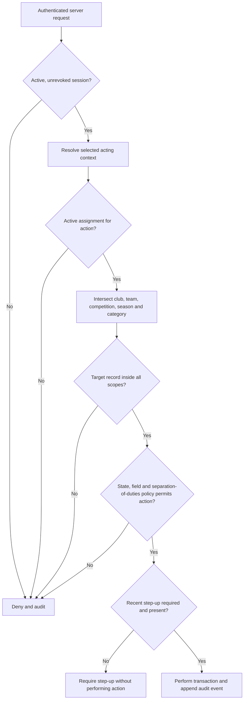

# Roles, Permissions and Data Ownership

**Planning baseline:** 26 July 2026
**Status:** Recommended authorization policy; named operational approvers remain to be assigned

The evidence labels defined in [00-executive-summary.md](00-executive-summary.md) apply throughout this document.

## Current-state evidence and target decision

- **Verified fact:** Current administrators have only `admin` and `super_admin` roles plus a limited per-user permission table; some super-administrator behavior is configured by a hard-coded identity (`migrations/0021_admin_roles_and_email_events.sql:1-8`, `migrations/0026_admin_user_permissions.sql:1-13`, `internal/httpserver/admin.go:2541-2647`).
- **Verified fact:** Captains are scoped by the team and reporting period carried in a magic token/cookie, not by reusable membership and appointment entities (`internal/auth/magic.go:35-179`, `internal/httpserver/captain.go:1320-1395`).
- **Recommendation:** Adopt deny-by-default, server-side authorization using application-owned, effective-dated role assignments scoped to club, team, competition and season.
- **Recommendation:** Keep a person, identity, club membership and role assignment separate. A person may hold roles in multiple clubs, but each request selects exactly one acting context.
- **Recommendation:** Add PostgreSQL row-level security to new club-private tables as defence in depth. Repository/service policy remains the primary authorization boundary.

## Permission notation

The detailed matrix uses:

- `V` — view scoped records and permitted fields.
- `C` — create a draft/request/message.
- `E` — directly edit data owned by that actor.
- `R` — request correction, review or appeal of an official record.
- `A` — approve/reject or make an official decision.
- `P` — publish/activate an approved result.
- `X` — export, only through a separately audited and redacted export.
- `I` — view GMCL internal notes in permitted categories.
- `T` — access an authorized attachment after security scanning.
- `H` — ask Hawk about the explicitly listed trusted data scope.
- `—` — denied.

Codes never imply broader scope. For example, `V/X` for a club role means that club and permitted seasons only.

## Scope dimensions

Every assignment contains:

| Dimension | Rule |
|---|---|
| Subject | One named `user_id`, never a shared mailbox |
| Role | One approved role definition and permission set |
| Organisation | GMCL or one club; club roles cannot use a wildcard |
| Team | Optional narrowing for captains/managers and team work |
| Competition/division | Optional narrowing for league officers and fixture/junior work |
| Season | Required for operational appointments unless a controlled standing role is justified |
| Category | Optional case/data restriction such as registration, junior or safeguarding |
| Effective interval | Start and end timestamps; expiry denies access automatically |
| Delegation | Granting actor, reason, original assignment and maximum duration |
| Status | Pending, active, suspended, expired or revoked |

**Recommendation:** The request context is the intersection of all dimensions, never their union. Multiple assignments are evaluated independently and combined only for the selected workspace and action.

## Final role set and responsibilities

### GMCL roles

| Role | Intended authority | Explicit exclusions |
|---|---|---|
| GMCL Super Administrator | Break-glass identity, role, configuration and incident administration | No routine operational case ownership; cannot erase audit history |
| Board or League Administrator | League/competition oversight, approved decisions and publication | No unrestricted safeguarding or authentication secrets |
| Club Liaison Officer | Initial club verification, club appointments and general club cases | No sanction/registration decision unless separately appointed |
| Compliance and Sanctions Officer | Compliance findings, sanction cases, cards, effects and appeals | No role administration or safeguarding |
| Player Registration Officer | Registration decisions, transfer evidence and external reconciliation | No general access to sanctions/internal notes |
| Junior Competition Administrator | Junior competition operations and adult-contact notices | No child-recipient messaging or safeguarding data |
| Safeguarding Officer | Separate safeguarding referral route | No implied access from other GMCL roles |
| Fixture Administrator | Constraint catalogue, candidates, overrides and publication workflow | No auto-publish and no registration/safeguarding access |
| Read-only Auditor | Time-bound inspection of approved records and audit events | No create/edit/approve/publish; attachments/exports require explicit purpose grant |

### Club roles

| Role | Intended authority | Explicit exclusions |
|---|---|---|
| Club Primary Administrator | Manages club memberships/appointments and all ordinary club operations | Cannot rewrite GMCL official decisions or access GMCL internal notes |
| Club Administrator | General club actions, contacts, messages, corrections and submissions | Cannot transfer primary role or access restricted junior/safeguarding/registration documents without another role |
| Club Secretary | Official club contact, correspondence, corrections and acknowledgements | No user/role administration by default |
| Club Play-Cricket Administrator | External identifiers, registration handoffs and reconciliation tasks | No GMCL registration approval |
| Club Junior Secretary | Junior competition messages and adult-contact administration | No safeguarding cases or general player documents |
| Club Safeguarding Officer | Separate restricted safeguarding route where approved | No broad club role administration |
| Team Captain | Existing reports, team messages and permitted team evidence | No club-wide official data changes |
| Team Manager | Team administration and team-scoped actions | Captain report submission only if explicitly assigned by policy |
| Read-only Club User | General read access to non-restricted club records | No mutations, restricted data, attachments or export by default |

### Match-official roles

| Role | Intended authority | Explicit exclusions |
|---|---|---|
| Umpire | Time-bound match-day identity check for appointed fixture | No search, bulk export, persistent photo access or club administration |
| Match Official | Same minimum fixture-specific identity capability where explicitly approved | No authority derived merely from a historical fixture |
| Restricted Identity Checker | Exceptional approved match-day check under GMCL policy | No roster browsing outside exact fixture/window |

## Full permission matrix

The matrix lists the maximum capability before scope, state and field rules are applied.

| Role | View | Create | Direct amend | Correction/appeal | Approve | Publish | Export | Internal notes | Attachments | Other clubs | Hawk sources |
|---|---|---|---|---|---|---|---|---|---|---|---|
| GMCL Super Administrator | `V` platform/security metadata and authorized break-glass domain data | `C` users, assignments, configuration changes | `E` platform-owned configuration | `R` through ordinary domain role only | `A` recovery/role break-glass with two-person controls | `P` system/rule activation with step-up; domain publication only when separately assigned | `X` separately approved/redacted | `I` only category explicitly assumed; safeguarding separate | `T` only purpose-scoped | `V` league-wide only during authorized task | `H` trusted rules and separately authorized deterministic read models |
| Board/League Administrator | `V` assigned league/competition operational records | `C` cases, notices, official drafts | `E` GMCL-owned drafts/configuration in scope | `R`/review operational records | `A` assigned official decisions | `P` approved league decisions/notices | `X` scoped, audited | `I` assigned non-safeguarding categories | `T` assigned cases | `V` clubs in assigned competition/purpose | `H` trusted rules and assigned operational read models |
| Club Liaison Officer | `V` allocated clubs, contacts, appointments, general cases | `C` invitations, cases, messages | `E` liaison-owned assignments/case metadata | `R` data reconciliation | `A` initial Primary Administrator and general corrections in policy | `P` — | `X` allocated contact/case summaries if granted | `I` general liaison cases | `T` general evidence in assigned case | `V` allocated clubs only | `H` rules and allocated club public/operational facts, no internal note content |
| Compliance/Sanctions Officer | `V` reports, scorecards, findings, cases, sanctions in assigned scope | `C` cases, potential findings, draft decisions | `E` case assignment and draft analysis | `R` reopen/review | `A` sanctions, corrections, appeals per separation policy | `P` sanction decision when separately authorized | `X` scoped compliance data | `I` compliance/sanctions cases | `T` sanction evidence | `V` clubs in assigned competition/cases | `H` rules and deterministic compliance read models |
| Player Registration Officer | `V` applications, permitted player details, transfers, external state | `C` review requests and draft decisions | `E` review metadata and reconciliation | `R` reopen/reconcile | `A` registration decision | `P` approved internal registration state if policy separates | `X` minimized registration reports | `I` registration cases | `T` approved registration documents | `V` applicants/clubs in assigned scope | `H` rules and deterministic registration facts; no documents by default |
| Junior Competition Administrator | `V` junior competitions, adult contacts, notices, acknowledgements | `C` adult-targeted messages/cases | `E` junior communication drafts/configuration | `R` correction request | `A` communication selection/template where policy allows | `P` send approved notices | `X` adult-contact/acknowledgement summary | `I` junior administration only, never safeguarding | `T` non-sensitive junior admin attachments | `V` clubs in assigned junior competitions | `H` published junior rules and non-personal competition facts |
| Safeguarding Officer | `V` explicitly assigned safeguarding cases | `C` restricted notes/messages/referrals | `E` restricted case workflow | `R` reopen/escalate under safeguarding policy | `A` safeguarding workflow actions defined by policy | `P` — | `X` denied by default; exceptional DPO-approved | `I` safeguarding service only | `T` assigned restricted attachments | `V` only parties to assigned case | `H` denied until DPIA and separate approved design |
| Fixture Administrator | `V` teams, venues, constraints, plans and relevant availability | `C` constraints, jobs, plan versions | `E` draft constraints/plans and recorded overrides | `R` fixture-change review | `A` validated candidate | `P` schedule with independent approval and step-up | `X` fixtures/constraint reports | `I` fixture cases only | `T` fixture evidence | `V` clubs in assigned competition | `H` published fixture rules and authorized deterministic plan facts |
| Read-only Auditor | `V` explicitly commissioned records/audit fields | — | — | — | — | — | `X` only separate approved grant | — by default; `I` only if purpose explicitly requires | — by default | `V` only commissioned scope | `H` published rules only; not tenant records |
| Club Primary Administrator | `V` all ordinary club modules, excluding separately restricted safeguarding and documents | `C` invitations, contacts, submissions, corrections, cases | `E` club-owned contacts/preferences/drafts and ordinary club appointments | `R` official reports/sanctions/registrations/starred/fixtures | — | `P` club submission only, never GMCL decision | `X` ordinary own-club data if granted | — | `T` own-club ordinary cases/evidence | — | `H` published rules and own-club deterministic permitted read models |
| Club Administrator | `V` ordinary own-club operations | `C` contacts, submissions, corrections, cases | `E` club-owned contacts/preferences/drafts | `R` official data in assigned modules | — | `P` club submission if assigned | `X` own-club ordinary data if granted | — | `T` own-club ordinary cases | — | `H` published rules and own-club permitted facts |
| Club Secretary | `V` own-club official contacts, reports, sanctions, messages | `C` replies, acknowledgements, corrections | `E` club-owned contacts and message drafts | `R` official club records | — | `P` club correspondence/submission if assigned | `X` own-club correspondence/report summary if granted | — | `T` ordinary own-club cases | — | `H` published rules and permitted own-club facts |
| Club Play-Cricket Administrator | `V` own-club external references and registration handoff status | `C` draft registrations/reconciliation evidence | `E` club-owned external mappings subject to validation | `R` registration/external-state correction | — | `P` club verification/submission if assigned | `X` minimized own-club reconciliation list | — | `T` own-club registration evidence if separately granted | — | `H` published registration rules and permitted deterministic status, no documents |
| Club Junior Secretary | `V` own-club junior notices, deadlines and adult contacts | `C` replies, acknowledgements, junior admin requests | `E` adult contact/preferences and drafts | `R` junior administrative records | — | `P` club response | `X` own-club non-player junior admin summary if granted | — | `T` non-sensitive junior case attachments | — | `H` published junior rules and non-sensitive own-club facts |
| Club Safeguarding Officer | `V` explicitly addressed own-club safeguarding route only | `C` restricted reply/referral | `E` restricted drafts | `R` restricted workflow review | — | `P` submit restricted response | — by default | — GMCL internal notes remain denied | `T` explicitly assigned restricted attachments | — | `H` denied until separate DPIA-approved design |
| Team Captain | `V` appointed team reports, requirements, fixtures and team-visible notices | `C` existing reports, team replies/corrections | `E` own drafts before submission | `R` appointed team official finding | — | `P` submit report | `X` own team report summary if policy grants | — | `T` team-visible evidence if granted | — | `H` published rules and own appointed-team deterministic facts |
| Team Manager | `V` appointed team operational records | `C` team messages/requests; reports only if assigned | `E` team-owned drafts | `R` appointed team records | — | `P` team submission only when explicitly granted | `X` own-team summary if granted | — | `T` team-visible attachments if granted | — | `H` published rules and own-team permitted facts |
| Read-only Club User | `V` own-club non-restricted approved records | — | — | — | — | — by default | — | — | — by default | — | `H` published rules only; optional own-club public facts |
| Umpire | `V` minimal appointed-fixture identity roster during window | — | — | `R` report mismatch via controlled route | — | — | — | — | — | — except exact fixture participants | `H` published match rules only |
| Match Official | `V` minimal appointed-fixture data during window | `C` permitted match report if separately defined | `E` own draft report | `R` report mismatch | — | `P` submit own report if assigned | — | — | `T` own permitted match evidence if policy allows | — except fixture participants | `H` published match rules only |
| Restricted Identity Checker | `V` minimal named-fixture roster in short window | — | — | `R` identity mismatch route | — | — | — | — | — | — except fixture participants | — |

## Permission evaluation

Authorization is checked again inside the service/repository transaction. User-supplied `club_id`, `role`, owner, state, timestamps and decision fields are never mass-assigned.

## Tenant-scoped repository pattern

**Recommendation:** Domain repositories accept a required `Scope` object created by trusted middleware, not a caller-selected club identifier. Queries include tenant and effective-date predicates. Identifiers should be unpredictable, but unpredictability is not a control.

For new club-private tables:

1. Enable and force PostgreSQL RLS for the application role.
2. At transaction start, set local, parameterized context for user, club, season and purpose.
3. Define policies for `SELECT`, `INSERT`, `UPDATE` and `DELETE`; deny when context is absent.
4. Keep migration/maintenance roles separate and unavailable to the web process.
5. Test both application policy and direct SQL policy.
6. Do not add RLS mechanically to legacy report tables until compatibility and query plans are evaluated; expose them to club code only through scoped repositories/read models.

**Recommendation:** New official/event records are append-only or versioned; destructive deletes are limited to controlled retention jobs after legal/operational approval.

## Data-ownership matrix

| Information | Owner | Club direct change | Official change route | Version/history requirement |
|---|---|---|---|---|
| Club contact details and notification preferences | Club-owned, subject to official-contact verification fields | `E` by authorized club role | Sensitive official-contact changes may require liaison verification | Effective-dated contact and verification history |
| Club administrators and appointments | Shared governance | Primary admin may propose/manage ordinary appointments | Initial/transfer Primary Administrator approved by CLO or Super Admin | Full assignment and revocation timeline |
| Team/captain appointments | Shared workflow | Club may propose and update club-side appointment | GMCL reconciliation where appointment controls league access | Season-specific appointment versions |
| Draft captain report | Club/team-owned draft | `E` by appointed reporter | Becomes submitted immutable version | Draft and submission timestamps |
| Submitted captain report and report requirement | GMCL-owned official record/source-derived | No destructive edit | Correction request with reason/evidence | Preserve original, correction decision and effective date |
| Missed-report finding/exemption | GMCL-owned official | No | Correction/review/appeal | Rule release and complete decision timeline |
| Cards, sanctions and point deductions | GMCL-owned official at team level | No | Correction or appeal | Append-only decisions/effects; superseding versions |
| Club card/sanction total | Derived view | No | Correct underlying team ledger entry | Reproducible as-at view |
| Message reply to GMCL | Shared workflow; author owns submitted content subject to case record | Draft may be edited before send | Submitted message is append-only; correction by follow-up | Complete visible timeline |
| GMCL internal note | GMCL-owned restricted | Never | Authorized GMCL addendum, not club correction | Separate append-only timeline |
| Club-supplied evidence | Club-supplied within shared case | Replace quarantined draft before submission | Submitted object retained/withdrawn through workflow | Immutable hash, scan state, access history |
| Starred list draft | Club-owned draft | Yes | — | Draft revision history |
| Approved starred list/exemption/finding | GMCL-owned official | No | New submission, correction, challenge or appeal | Season/rule release version; never overwrite |
| Registration draft | Applicant/club-supplied shared workflow | Yes before submission | — | Draft/version history proportionate to need |
| Submitted/approved registration | GMCL-owned internal decision plus separate external state | No direct official edit | More-information, correction, appeal or reconciliation | Application versions, decision and Play-Cricket observations |
| Transfer clearance | Shared workflow with external evidence | No silent status edit | Registration Officer verifies mandated evidence | Sender/source/evidence reference and decision |
| Player identity/photo | Shared/external, controller roles unresolved | No general direct edit | Approved source correction and reconciliation | Source, consent/authority where relevant, approval and expiry |
| Junior notice/acknowledgement | Shared operational | Club can acknowledge/respond | GMCL can correct by follow-up/version | Adult recipient resolution and delivery timeline |
| Safeguarding information | Separately governed restricted data | Only within dedicated workflow | Safeguarding policy | Separate retention/access log |
| Fixture availability/constraints | Club-supplied input | `E` until deadline; later request change | GMCL validates/locks | Constraint versions and source |
| Fixture candidate | GMCL draft/generated | No direct club edit; may request change | Authorized override and approval | Inputs, solver version, objective and overrides |
| Published fixture | GMCL official | No | Fixture-change workflow | Published plan version and supersession |
| Rule release and decision table | GMCL official from trusted source | No | Rule governance workflow | Source hash, citations, effective dates and activation |
| Audit event | GMCL accountability record | Never | Correct by linked addendum under policy | Append-only/tamper-evident |

## Direct edit versus correction or appeal

**Recommendation:** Club users can directly edit only club-owned data and unsubmitted drafts. Changes to verified official contacts, role appointments or external identifiers may require review because they affect access or source matching.

Official data—including submitted reports, missed findings, cards, sanctions, deductions, approved starred lists, exemptions, registration decisions and published fixtures—uses:

1. correction request or appeal reason;
2. linked original record and rule release;
3. optional scanned evidence;
4. requester identity, role and scope;
5. assigned reviewer and separation-of-duties check;
6. approve, reject or more-information decision;
7. effective date and any superseding event;
8. club-visible outcome plus separately stored internal analysis;
9. immutable audit timeline.

Historical pages render the record under the season/rule release that governed it.

## Team and club aggregation

- **Verified fact:** Current sanctions policy and ledger structures associate penalties/effects with teams, with club aggregates derived for some rules (`migrations/0038_sanctions_case_management.sql:187-355`).
- **Recommendation:** Keep yellow/red cards, sanctions and deductions as team-level ledger entries. A club total is a parameterized, season-specific projection over underlying entries.
- **Recommendation:** Every total links to team rows and shows included/excluded statuses and as-at time.
- **Recommendation:** Correcting a total means superseding an underlying ledger effect, never writing a stand-alone club number.

## Internal-note isolation

Internal notes are not messages with `is_internal=true`. They use:

- a separate `internal_notes` table with an internal-only RLS policy;
- a separate repository interface and service permission;
- separate API response types with no internal-note field in club schemas;
- separate search index/namespace;
- separate export serializers;
- notification builders that accept only club-visible message identifiers;
- Hawk adapters that never expose the internal-note repository;
- structured audit for create/read/export;
- dedicated negative and serialization tests.

Database foreign keys may link a note to a case, but club-facing queries start from `club_visible_messages` and cannot join notes. General case counts for clubs must not reveal hidden-note count or timestamps.

## Appointment lifecycle

1. Proposed assignment is validated against the grantor's delegation authority.
2. High-impact roles require step-up and, where specified, second approval.
3. The user and relevant official contacts are notified.
4. Assignment activates only within its effective interval.
5. Changes increment the user's/session security version.
6. Revocation takes effect immediately and invalidates affected sessions.
7. Scheduled expiry runs independently of login and appears in the Action Centre beforehand.
8. History remains available to authorized auditors; it is not restored by re-inviting the same email.

Primary Administrator transfer requires a verified successor, CLO or Super Administrator approval, step-up, dual notification and a short sensitive-action hold.

## Delegation and separation of duties

- Temporary access has a purpose, maximum expiry, narrower-or-equal scope and no right to redelegate.
- A person cannot approve their own primary-role grant, recovery, sanction appeal, registration application or fixture publication where policy requires independent approval.
- Super Administrator is not an automatic bypass; break-glass creates alerts and a post-event review.
- A single person with roles in two clubs chooses one club context. Data from both is never combined in one ordinary view/export.
- Safeguarding access is never inherited from Super Admin, Board, Junior Administrator or Club Primary Administrator without an explicit restricted assignment, except a documented break-glass incident route.

## Authorization test catalogue

### Horizontal privilege escalation

For every club-private resource and child resource:

- Club A role requests Club B ID through list, detail, search, count, export, attachment, notification, audit and AI endpoints.
- A user with two clubs selects Club A then passes a Club B record without switching context.
- A captain requests another team or a historical season outside appointment.
- An umpire changes fixture ID, player ID or access-window timestamp.
- Pagination, sort, autocomplete and error messages reveal no foreign metadata.
- RLS direct-query tests deny access when tenant context is absent or mismatched.

Expected result: authorized not-found or forbidden response, no title/count/filename/timestamp leak, no side effect, and a security audit event for suspicious patterns.

### Vertical privilege escalation

- Read-only roles call create, amend, approve, publish, export and role APIs directly.
- Club roles submit official decision fields, owner IDs, internal flags, effective dates or foreign keys.
- An approver attempts to approve their own restricted action.
- A role assignment is backdated, extended or delegated beyond the grantor's authority.
- An IdP group/email/domain claim attempts to grant a role.
- A stale session acts after role revocation.
- A non-safeguarding role requests safeguarding endpoints.

### Internal-note and attachment isolation

- Club APIs and schemas are snapshot-tested to contain no internal-note field.
- Club search, counts, audit timeline, email and exports remain identical when only an internal note is added.
- Club users cannot infer note existence through ETags, updated timestamps or case activity counts.
- Signed attachment URLs are short-lived, audience-bound and unavailable after role revocation.
- Quarantined or failed-scan objects are never downloadable.

### Concurrency and policy

- Only one decision succeeds for the same version.
- Approval and revocation in concurrent transactions fail closed.
- Season rollover cannot extend a role implicitly.
- Rule release changes do not reinterpret past decisions.
- Club aggregate totals reconcile exactly to authorized team ledger rows.

## Decisions and external dependencies

- **External dependency:** GMCL must name role owners, grantors, approval thresholds and emergency cover.
- **Open question:** Whether ordinary Club Administrators can invite peers or only the Primary Administrator can do so.
- **Open question:** Which case categories and attachment types each staff function may access.
- **Open question:** Exact export purposes and retention periods.
- **Recommendation:** Resolve these before implementing authorization policies; do not ship permissive placeholders.
