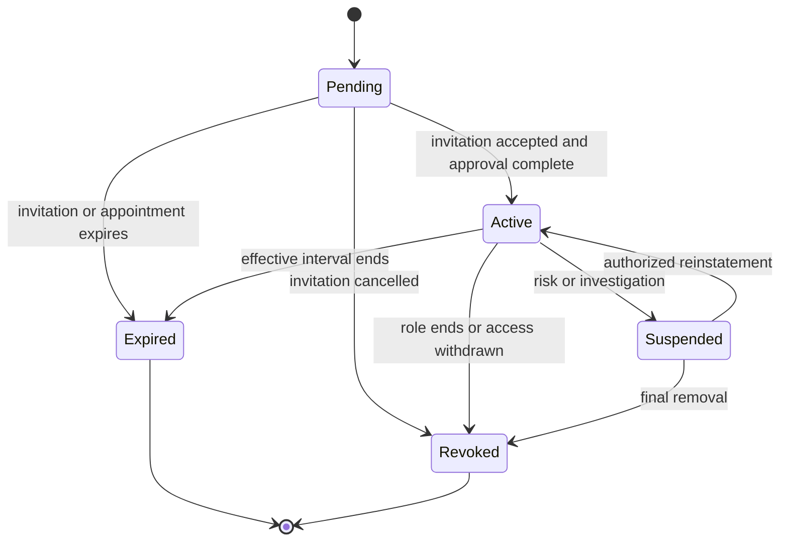
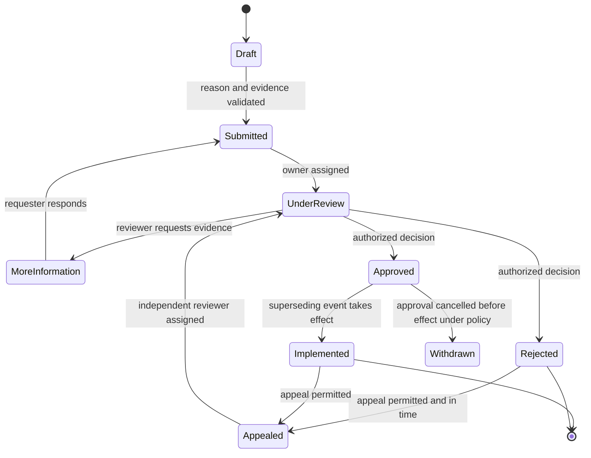
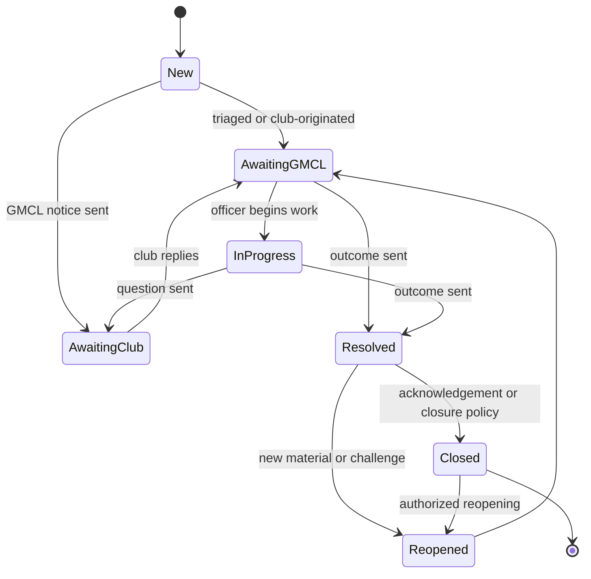
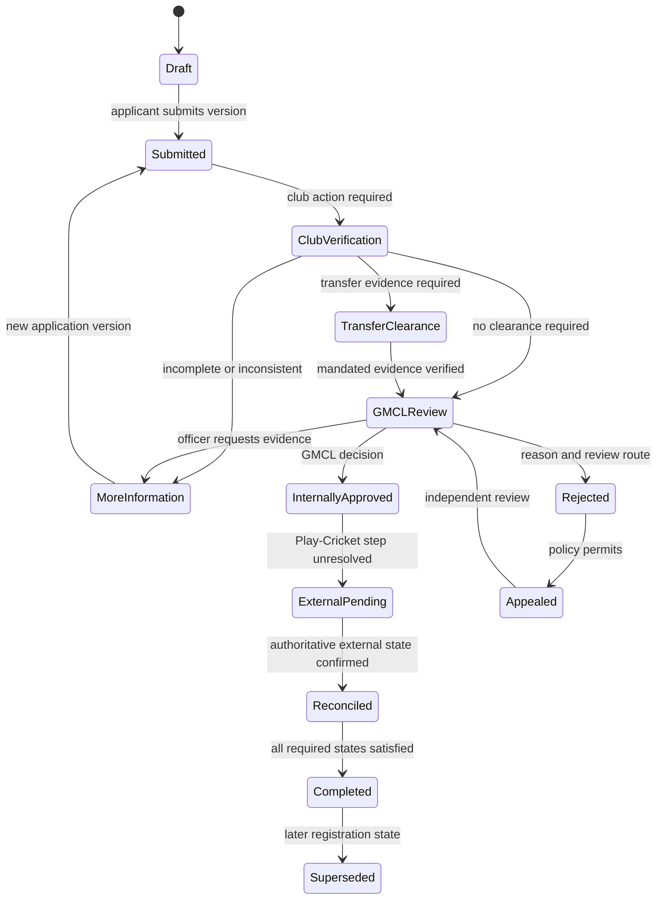
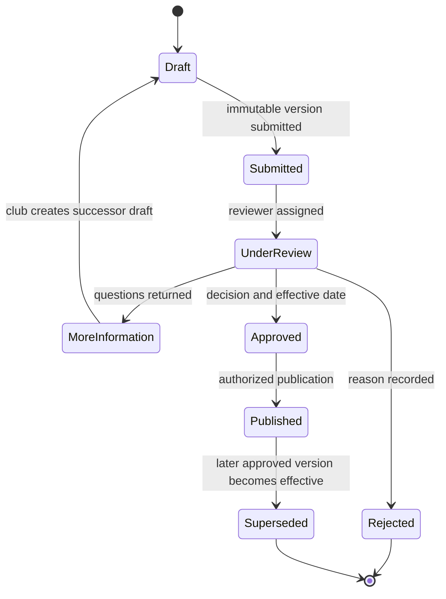
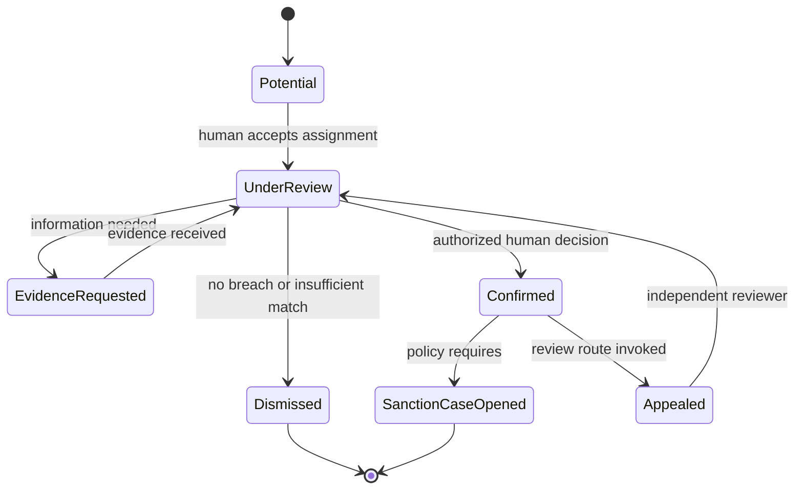
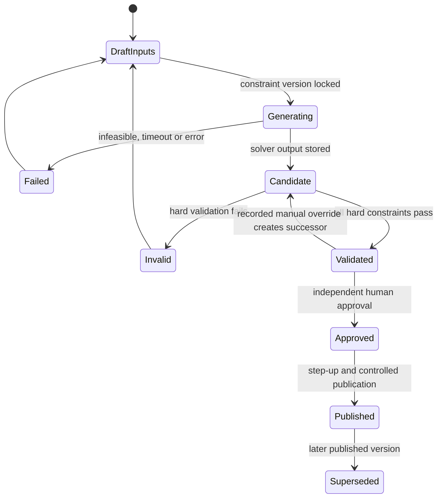
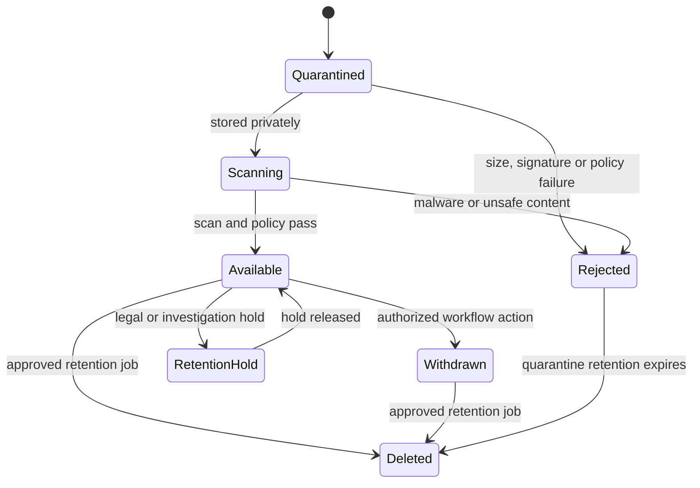

# Domain Model

**Planning baseline:** 26 July 2026
**Status:** Recommended logical model; physical schema design follows bounded-context implementation

The evidence labels defined in [00-executive-summary.md](00-executive-summary.md) apply throughout this document.

## Modelling decisions

- **Verified fact:** The current schema already distinguishes `clubs`, `teams`, `captains`, report submissions/drafts, fixtures, sanctions, starred entries and rule releases (`migrations/0001_core_schema.sql:22-92`, `migrations/0035_rules_assistant.sql:3-107`, `migrations/0038_sanctions_case_management.sql:7-424`).
- **Recommendation:** Extend the modular Go monolith and PostgreSQL incrementally. Do not replace proven captain-report or sanctions models merely to normalize names.
- **Recommendation:** Introduce explicit identities, memberships, appointments, seasons, competitions and versioned workflows alongside existing tables, with reconciliation mappings and read models.
- **Recommendation:** Use UUID/opaque identifiers for new externally referenced entities, UTC timestamps, effective intervals, optimistic version numbers, source/provenance fields and append-only events for official decisions.
- **Recommendation:** Draft, submitted, approved, published and superseded are distinct persisted states, not UI labels inferred from nullable fields.

## Bounded contexts

| Context | Principal entities | Authority |
|---|---|---|
| Identity and access | User, Identity, Session, Invitation, ClubMembership, RoleAssignment | Portal application; IdP authenticates identities |
| League structure | Club, Team, Season, Competition, Division, TeamSeasonEntry | GMCL official with external source references |
| Captain reporting | CaptainAppointment, Fixture, CaptainReport, ReportRequirement, Exemption, CorrectionRequest | Existing application plus versioned corrections |
| Compliance and sanctions | SanctionCase, DecisionRevision, CardLedgerEntry, SanctionEffect, Appeal | GMCL official, team-level ledger |
| Messaging | MessageCase, ClubVisibleMessage, InternalNote, Assignment, Watcher, Acknowledgement | Shared club-visible workflow; separate internal content |
| Players and registration | Player, ExternalPlayerReference, PlayerClubRegistration, RegistrationApplication, TransferClearance, PlayerDocument, PlayerPhoto | Shared application; GMCL decision; external Play-Cricket state distinct |
| Starred players | StarredList, StarredListVersion, StarredPlayerEntry, Exemption, PotentialFinding | Club draft; GMCL approval; rule-versioned |
| Rules and Hawk | RuleDocument, RuleRelease, RuleDecision, AIResponseAudit | Trusted GMCL source and advisory AI |
| Fixtures | FixtureConstraint, FixturePlan, FixturePlanVersion, FixtureOverride, SolverRun | GMCL official after human publication |
| Platform | Attachment, Notification, AuditEvent, OutboxEvent | Cross-context services with strict classification |

## Conceptual ERD

```mermaid
erDiagram
    USER ||--o{ IDENTITY : authenticates_with
    USER ||--o{ SESSION : holds
    USER ||--o{ CLUB_MEMBERSHIP : joins
    CLUB ||--o{ CLUB_MEMBERSHIP : has
    CLUB_MEMBERSHIP ||--o{ ROLE_ASSIGNMENT : carries
    USER ||--o{ ROLE_ASSIGNMENT : receives
    SEASON ||--o{ ROLE_ASSIGNMENT : bounds
    TEAM ||--o{ ROLE_ASSIGNMENT : may_scope
    COMPETITION ||--o{ ROLE_ASSIGNMENT : may_scope

    CLUB ||--o{ TEAM : owns
    SEASON ||--o{ COMPETITION : contains
    COMPETITION ||--o{ DIVISION : contains
    TEAM ||--o{ TEAM_SEASON_ENTRY : enters
    SEASON ||--o{ TEAM_SEASON_ENTRY : applies
    DIVISION ||--o{ TEAM_SEASON_ENTRY : places
    TEAM_SEASON_ENTRY ||--o{ FIXTURE : home_entry
    TEAM_SEASON_ENTRY ||--o{ FIXTURE : away_entry

    FIXTURE ||--o{ REPORT_REQUIREMENT : requires
    TEAM ||--o{ REPORT_REQUIREMENT : assigned
    REPORT_REQUIREMENT ||--o{ CAPTAIN_REPORT : satisfied_by
    REPORT_REQUIREMENT ||--o{ CORRECTION_REQUEST : challenged_by
    CAPTAIN_REPORT ||--o{ CORRECTION_REQUEST : corrected_by

    TEAM ||--o{ SANCTION_CASE : concerns
    SANCTION_CASE ||--o{ SANCTION_DECISION : versions
    SANCTION_DECISION ||--o{ CARD_LEDGER_ENTRY : produces
    SANCTION_DECISION ||--o{ SANCTION_EFFECT : produces
    SANCTION_CASE ||--o{ APPEAL : receives

    CLUB ||--o{ MESSAGE_CASE : addresses
    MESSAGE_CASE ||--o{ CLUB_VISIBLE_MESSAGE : contains
    MESSAGE_CASE ||--o{ INTERNAL_NOTE : has_separately
    MESSAGE_CASE ||--o{ CASE_ASSIGNMENT : assigned_by
    MESSAGE_CASE ||--o{ CASE_WATCHER : watched_by
    CLUB_VISIBLE_MESSAGE ||--o{ ACKNOWLEDGEMENT : acknowledged
    MESSAGE_CASE ||--o{ ATTACHMENT : links

    PLAYER ||--o{ EXTERNAL_PLAYER_REFERENCE : maps
    PLAYER ||--o{ PLAYER_CLUB_REGISTRATION : registers
    CLUB ||--o{ PLAYER_CLUB_REGISTRATION : holds
    PLAYER ||--o{ REGISTRATION_APPLICATION : applies
    REGISTRATION_APPLICATION ||--o{ PLAYER_DOCUMENT : supplies
    REGISTRATION_APPLICATION ||--o{ TRANSFER_CLEARANCE : requires
    PLAYER ||--o{ PLAYER_PHOTO : depicts

    CLUB ||--o{ STARRED_LIST : submits
    SEASON ||--o{ STARRED_LIST : governs
    STARRED_LIST ||--o{ STARRED_LIST_VERSION : versions
    STARRED_LIST_VERSION ||--o{ STARRED_PLAYER_ENTRY : contains
    PLAYER ||--o{ STARRED_PLAYER_ENTRY : identifies
    STARRED_PLAYER_ENTRY ||--o{ EXEMPTION : qualifies
    STARRED_LIST_VERSION ||--o{ POTENTIAL_FINDING : evaluated_against
    FIXTURE ||--o{ POTENTIAL_FINDING : observed_in

    RULE_RELEASE ||--o{ RULE_DOCUMENT : contains
    RULE_RELEASE ||--o{ RULE_DECISION : governs
    RULE_RELEASE ||--o{ STARRED_LIST_VERSION : governs
    RULE_RELEASE ||--o{ SANCTION_DECISION : governs
    RULE_RELEASE ||--o{ REGISTRATION_APPLICATION : governs
    RULE_DECISION ||--o{ AI_RESPONSE_AUDIT : cited_by

    SEASON ||--o{ FIXTURE_PLAN : plans
    FIXTURE_PLAN ||--o{ FIXTURE_PLAN_VERSION : versions
    FIXTURE_PLAN_VERSION ||--o{ FIXTURE_CONSTRAINT : evaluates
    FIXTURE_PLAN_VERSION ||--o{ FIXTURE_OVERRIDE : preserves
    FIXTURE_PLAN_VERSION ||--o{ FIXTURE : publishes

    USER {
        uuid id
        string display_name
        string status
        bigint security_version
    }
    IDENTITY {
        uuid id
        uuid user_id
        string issuer
        string subject
        string verified_email
    }
    ROLE_ASSIGNMENT {
        uuid id
        string role_key
        uuid club_id
        uuid team_id
        uuid competition_id
        uuid season_id
        timestamp starts_at
        timestamp ends_at
        string status
    }
    RULE_RELEASE {
        uuid id
        string release_key
        date effective_from
        date effective_to
        string source_hash
        string status
    }
    AUDIT_EVENT {
        uuid id
        uuid actor_user_id
        string action
        string target_type
        uuid target_id
        timestamp occurred_at
        string correlation_id
    }
```

The ERD is logical. Existing numeric keys and table names do not need a risky rewrite. Mapping tables may bridge legacy team/report/sanction identifiers to new read models.

## Identity and access invariants

- `(issuer, subject)` is unique and never reassigned silently.
- A verified email is contact/recovery data, not the user primary key.
- A user can have several identities and memberships.
- Every club role is attached to a membership for that club.
- Role scopes and effective intervals cannot exceed the granting assignment.
- Revocation increments authorization/security version and invalidates sessions.
- Audit events reference immutable actor identity and acting role snapshot even after later revocation.

## League structure and season versioning

`Club` and `Team` remain distinct. A team belongs to a club, but league participation is represented by `TeamSeasonEntry`, which connects the team to a season, competition and division with effective dates and external source identifiers.

**Recommendation:** Never attach historic sanctions, reports or fixtures only to the team's current division. They reference the applicable team-season entry or preserve the season/competition snapshot.

`Season` has explicit start/end and operational status. A rule release may overlap a season only through an approved activation record. If a mid-season release is allowed, `RuleDecision` identifies the exact release/effective interval applied to a decision.

## Provenance and reconciliation

Every imported or reconciled entity stores:

- source system and external identifier;
- last observed source version/timestamp;
- first/last synchronized timestamps;
- deterministic payload hash where appropriate;
- match confidence and reconciliation status;
- manual override with actor, reason and effective interval;
- superseded mapping history.

**Recommendation:** External player/member IDs are not the internal `Player` identity. A one-to-many history is possible across sources, and ambiguous matches enter a restricted queue.

## State machines

### Membership and role assignment

There is no direct `Revoked -> Active`; reappointment creates a new assignment.

### Correction, review or appeal

The original official record is preserved. `Implemented` adds a superseding version/effect rather than updating history destructively.

### Message case

Safeguarding referrals use a separate restricted workflow, even if neutral external status names resemble this machine.

### Registration application

`InternallyApproved` and `Reconciled` remain different. No public registration write API has been established.

### Starred-list version

An approved/published version is never reopened for editing. Amendments fork a new version.

### Potential breach finding

Hawk does not perform any transition.

### Fixture plan

The solver can create only `Candidate`. It cannot approve or publish.

### Attachment

## Club-visible messages and internal notes

`ClubVisibleMessage` and `InternalNote` are separate entities with separate repositories and response types. Both may point to `MessageCase`, but:

- internal notes do not contribute to club-visible message count, last-activity time, ETag or notification;
- club timeline queries cannot join internal notes;
- internal note attachments have a distinct relation and access policy;
- AI tenant adapters cannot reference the internal-note store;
- audit records may reveal note access only to authorized GMCL roles.

## Audit model

Every sensitive change appends an `AuditEvent` containing:

- actor user and immutable identity/acting-role snapshot;
- club/GMCL, team, competition and season scope;
- action and target type/identifier;
- previous/new state or version identifiers;
- UTC occurrence time and correlation/request identifier;
- reason and approval context;
- proportionate source/device metadata;
- whether AI advice was displayed, including response audit identifier;
- retention/classification label.

Do not store passwords, OTP/TOTP secrets, access tokens, backup codes, full sensitive message/document content or unnecessary search terms.

**Recommendation:** Enforce append-only writes through a restricted database function/trigger, periodically anchor a digest off-host, alert on gaps and test restoration. Existing mutable audit logs can be retained as legacy evidence while new portal events use the stronger model.

## Deletion and retention

Deletion is a policy outcome, not a generic entity method. Each context supplies a retention classification, trigger date, legal-hold behavior and anonymization strategy. Relationships use:

- `RESTRICT` for official history that cannot be orphaned;
- controlled tombstones/pseudonyms where the person no longer needs to be directly identifiable;
- explicit retention jobs with dry-run counts, approvals and audit;
- object deletion verification for attachments;
- no cascade from `User` to official decisions or audit actor snapshots.

Retention periods and lawful bases require DPO/GMCL approval; proposed classifications are in [10-junior-administration-and-privacy.md](10-junior-administration-and-privacy.md) and [14-security-threat-model.md](14-security-threat-model.md).

## Migration compatibility

- Map existing clubs/teams/seasons first and quarantine ambiguous rows.
- Preserve existing report and sanctions identifiers; expose them through versioned read models.
- Reconcile captains into users/identities/appointments only after verification.
- Import starred entries into a season/rule-linked initial published version without claiming the portal approved historic data.
- Do not create player identities from scorecard names alone.
- Backfill provenance and `legacy_source_id` for every migrated record.
- Compare counts, hashes and representative histories before enabling club reads.
- Feature flags allow new writes only after read-side reconciliation and rollback rehearsal.

## Physical-design requirements

- Foreign keys, not application-only relationships.
- Partial unique indexes for one active primary administrator per policy scope and one current published version.
- Check constraints for effective intervals and mutually exclusive terminal states.
- Transactions and version columns for decisions.
- Idempotency keys on external callbacks, notification jobs and decision commands.
- Transactional outbox for email, scan, synchronization and solver jobs.
- Tenant, season, status and assignment indexes that match scoped queries.
- RLS policies and tests on new private tables.
- Partitioning only after measured need; avoid speculative complexity.

## Open modelling decisions

- **Open question:** Authoritative competition/division identifiers and mid-season movement semantics.
- **Open question:** Whether one legal/natural `Player` can be reliably established from available identifiers and agreements.
- **Open question:** Exact appeal types and whether sanctions corrections share one generic request table or context-specific tables.
- **Open question:** Safeguarding storage and case model must be defined through a separate DPIA-led design.
- **Recommendation:** Resolve these at the relevant delivery gate; do not weaken core separation and versioning to avoid the decision.
