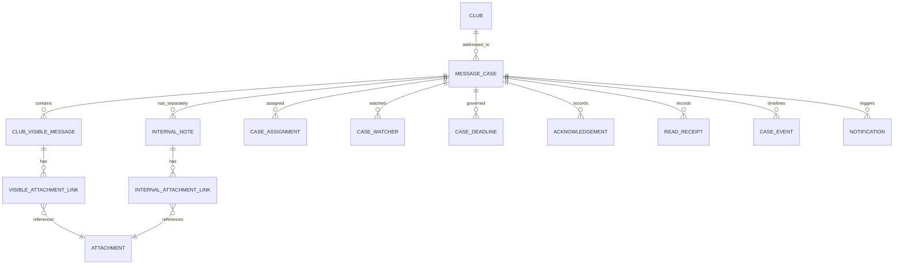
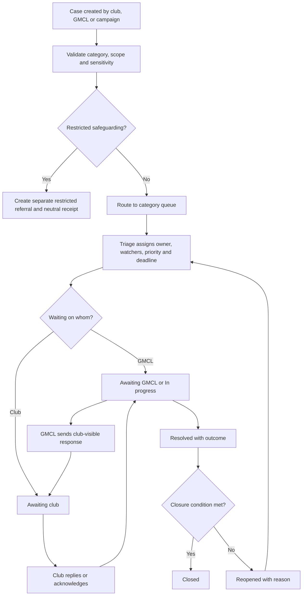
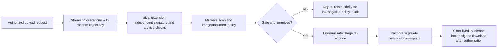

# Secure Messaging and Case Management

**Planning baseline:** 26 July 2026
**Status:** Recommended design; email remains the official record under current Rule 1.5

The evidence labels defined in [00-executive-summary.md](00-executive-summary.md) apply throughout this document.

## Purpose and current baseline

The portal needs a durable, accountable conversation around an operational matter, not a replacement webmail client.

- **Verified fact:** The repository sends SMTP email, supports SES event receipts and uses n8n for scheduled/operational jobs (`internal/email/email.go:23-139`, `migrations/0021_admin_roles_and_email_events.sql:10-31`, `migrations/0032_ses_webhook_receipts.sql:1-17`, `n8n_workflow.json`).
- **Verified fact:** The sanctions subsystem already demonstrates cases, assignments/events, decision revisions and a notification outbox, but there is no general club case inbox (`migrations/0038_sanctions_case_management.sql:7-424`).
- **Verified fact:** GMCL Rule 1.5, reviewed 25 July 2026, states that email is the primary communication channel.
- **Recommendation:** Add a generic bounded messaging context while retaining sanctions as its own official decision domain.

## Message and case model

### MessageCase

Stores reference, owning club, category, subcategory, sensitivity route, subject, status, priority, current owner, competition/team/season scope, response deadline, source channel, created/closed timestamps and optimistic version. It does not contain internal note bodies.

### ClubVisibleMessage

An append-only message addressed to the club/role or sent by an authorized club user. Store author, acting role, visible audience rules, body in safe supported markup/plain text, submission time and superseding clarification link. Submitted content is not silently edited.

### InternalNote

A separate GMCL-only entity, repository, RLS policy, API model, index and attachment relation. It stores author, permitted internal category/scope, body and creation time. It is never projected into club timelines.

### Assignment and watcher

`CaseAssignment` records owner, assigning actor, reason, start/end and queue. `CaseWatcher` records an authorized user or duty role and notification preference. Previous assignments remain history.

### Acknowledgement and read receipt

An acknowledgement is an explicit club/GMCL action on a specified notice version. A read receipt is an individual view event. Neither proves legal acceptance unless a rule/policy says so. Administrator changes do not erase club-addressed history.

## Addressing and audience resolution

GMCL can address:

- one club;
- an approved selection of clubs;
- every club;
- roles within those clubs;
- competitions, divisions, age groups or teams;
- a configured intersection of those scopes.

**Recommendation:** Resolve recipients from effective-dated role assignments at send time, record the audience query/version and create one club case or delivery target per club. Do not copy confidential content into a broad email. Club-addressed messages remain retrievable by future authorized administrators subject to category and retention rules.

For high-volume notices, a parent campaign records the approved content and selector, while child cases store each club's delivery, acknowledgement and replies. Clubs cannot see the campaign's other recipients.

## Categories

Initial configurable categories:

- General
- Captain reports
- Sanctions
- Rules clarification
- Player registration
- Starred players
- Fixtures
- Junior cricket
- Grounds
- Play-Cricket
- Finance
- Safeguarding referral

Category configuration defines:

- allowed originating roles;
- authorized queues and responders;
- club recipient roles;
- sensitivity classification;
- required fields/templates;
- default priority and target;
- attachment policy;
- acknowledgement requirement;
- retention class;
- whether email parallel-record steps are required.

**Recommendation:** `Safeguarding referral` does not create an ordinary `MessageCase`. It creates a neutral handoff reference into a separate restricted service. Ordinary users see only receipt and approved contact guidance.

## Status and assignment workflow

Allowed statuses are `New`, `Awaiting GMCL`, `Awaiting club`, `In progress`, `Resolved`, `Closed` and `Reopened`. Each transition records actor, reason and previous/new state. Deadline policies can create reminders or escalations but cannot send substantive decisions automatically.

### Escalation

- Queue target approaching: notify owner.
- Target breached: notify owner and configured duty role.
- Critical priority or risk flag: immediate duty-role notification.
- Repeated reassignment or reopen: manager review.
- Safeguarding indicator: stop ordinary routing and execute restricted handoff.

Escalation rules are effective-dated configuration. Changing them does not rewrite historical target performance.

## Club-visible and internal content isolation

The technical guarantee is structural:

1. `club_visible_messages` and `internal_notes` are separate tables.
2. Each has a separate attachment join table.
3. Club repositories cannot import/use the internal-note repository interface.
4. Club API types contain no internal-note or internal-count fields.
5. Internal search indexes are separately named, authorized and queried.
6. Club case `updated_at`, ETag, count and activity ordering depend only on club-visible events.
7. Notification commands carry a club-visible message ID, never an arbitrary case event ID.
8. Club exports serialize an explicit allowlist of visible types.
9. Hawk tenant tools are compiled/wired without internal-note adapters.
10. PostgreSQL RLS denies the club application role/context from the internal tables.

The GMCL interface uses a distinct internal-note composer, colour/icon plus text label, confirmation, and never defaults a note to club-visible.

### Leakage tests

- Add an internal note and assert byte-for-byte equality of every club API response except unrelated request metadata.
- Assert club list/count/search/order/ETag and notification state do not change.
- Generate all club exports and notification templates; scan for note text, author, timestamp and filename.
- Attempt direct note/attachment IDs from every club role and tenant.
- Test GraphQL/JSON over-posting equivalents if introduced; unknown/internal fields are rejected.
- Verify error, audit and telemetry messages do not echo note bodies.
- Prompt Hawk as a club user to summarize, infer, quote or enumerate internal notes; no tool can access them.
- Reclassify or move case categories and assert no internal record becomes visible.

## Attachment pipeline

**Verified fact:** Current sanctions uploads use private local files with a 10 MB limit, declared MIME checking, randomized keys, mode `0600` and SHA-256 hashing, but the repository does not show content-signature validation or malware scanning (`internal/httpserver/sanctions_cases.go:447-453`, `internal/httpserver/sanctions_cases.go:1177-1214`).

**Recommendation:** Use private object storage and the following pipeline:

Controls:

- allowlist content signatures and safe size/page/pixel/decompression limits;
- normalize displayed filename; never use it as an object path or response header unsafely;
- block active HTML/SVG and dangerous archives unless a specific justified workflow exists;
- scan before any user download or notification;
- encrypt in transit and at rest;
- recommended signed access lifetime five minutes;
- authorize on every URL issuance and record access to sensitive classes;
- no public bucket or predictable key;
- retention and legal hold by case classification;
- isolate the scanner and treat scanner failure as deny/quarantine.

## Notifications

Email contains only:

- a non-sensitive subject;
- club and case reference;
- response deadline where applicable;
- secure portal link;
- help/fallback contact.

It excludes message body, internal note, sensitive category details, document names and player/junior/safeguarding information.

Use a transactional outbox so a committed message is not lost if SMTP/SES is unavailable. Notification records include recipient role resolution, provider message ID, attempt, delivery/bounce/complaint result and correlation ID. Retries are bounded and idempotent with dead-letter/operator queues.

### Reminders and preferences

- Mandatory official notices and security events cannot be opted out of; routing channel/secondary contact follows policy.
- Optional digests and informational reminders respect per-role preferences.
- Deadline reminders use configurable intervals and cease after response/status change.
- A hard bounce creates a club/GMCL Action Centre task; it never removes the case.
- Emergency fallback is an approved operations playbook, not an automatic disclosure to personal channels.

## Email remains the official channel

**Recommendation:** Until Rule 1.5 is formally amended:

1. Send the required official email and record its delivery metadata.
2. Store the portal case and non-sensitive notification in parallel.
3. Require staff to follow current response/escalation rules even if the portal is unread.
4. Show both email delivery state and portal read/acknowledgement without treating either as the other.
5. Preserve an emergency mailbox/manual process and reconcile messages into the case where lawful.
6. Phrase portal content as an operational copy/workspace, not the sole official record.

Portal-primary communication requires a published rule/policy amendment defining legal/operational receipt, recipient roles, response clocks, email fallback, outage handling, record retention and transition date.

## Search, filtering and exports

Searchable fields: reference, subject, club, team, competition, category, status, owner, watcher, priority, deadline and visible message text where classification permits. Search:

- applies authorization and tenant predicates before text matching;
- uses separate internal and club-visible indexes;
- limits snippets and sensitive field indexing;
- is rate-limited and audited for sensitive categories;
- supports saved filters without copying results;
- excludes quarantined attachment content.

Exports require a dedicated permission, declared purpose, scope preview, row/field limit, step-up for sensitive or bulk data, watermark/reference where useful, expiry and audit. Safeguarding is excluded by default.

## Retention

**Open question:** Final periods require GMCL/DPO approval. Implement retention classes rather than one global delete period:

| Class | Trigger and proposed disposition |
|---|---|
| Routine operational correspondence | Close date plus approved operational/legal period; delete/anonymize message content while retaining minimal decision/audit facts |
| Official decision evidence | Follow governing sanction/registration/rules retention; preserve linked decision integrity |
| Unsubmitted/quarantined attachment | Short period after abandonment/rejection unless incident hold |
| Delivery metadata | Keep only as long as communication evidence/support requires |
| Read receipts | Minimize and aggregate/delete sooner than official acknowledgements |
| Safeguarding | Separate policy and legal hold; not governed by ordinary messaging job |

Retention jobs support dry run, legal hold, referential checks, object deletion verification, immutable summary and restore testing.

## Operational controls

- queue and dead-letter dashboards;
- delivery/bounce alerts;
- scan backlog and failure alerts;
- overdue/unassigned case metrics;
- after-hours escalation ownership;
- message template and category change approval;
- incident procedure for misaddressed content;
- recovery reconciliation between database, outbox and object storage;
- support tooling that shows metadata without bypassing content authorization.

## Acceptance test examples

1. Given a Club Administrator for Club A, when they request a Club B case/message/attachment/search result, then the response discloses no Club B metadata and a suspicious access event is recorded.
2. Given an internal note added to a case, when any Club A API, export, notification, count or Hawk query runs, then the result is unchanged by the note.
3. Given a submitted club reply and SMTP failure, when the outbox retries, then one visible message exists, delivery attempts are recorded, and the reply is not duplicated.
4. Given an administrator is revoked, when they open a previously delivered case link, then the session is invalidated and the link grants no access.
5. Given an attachment whose extension says PDF but whose signature is executable/active content, when scanned, then it never becomes available.
6. Given a broad campaign, when Club A opens its child case, then it cannot infer any other recipient club or delivery state.

## Decisions required

- **Blocking:** Rule 1.5 remains authoritative; no portal-primary claim is permitted.
- **Required before implementation:** case owner/queue map, category restrictions, target/escalation policy, attachment allowlist and notification templates.
- **Required before production:** retention, lawful basis, object-storage/scanner providers, incident playbook and emergency fallback.
