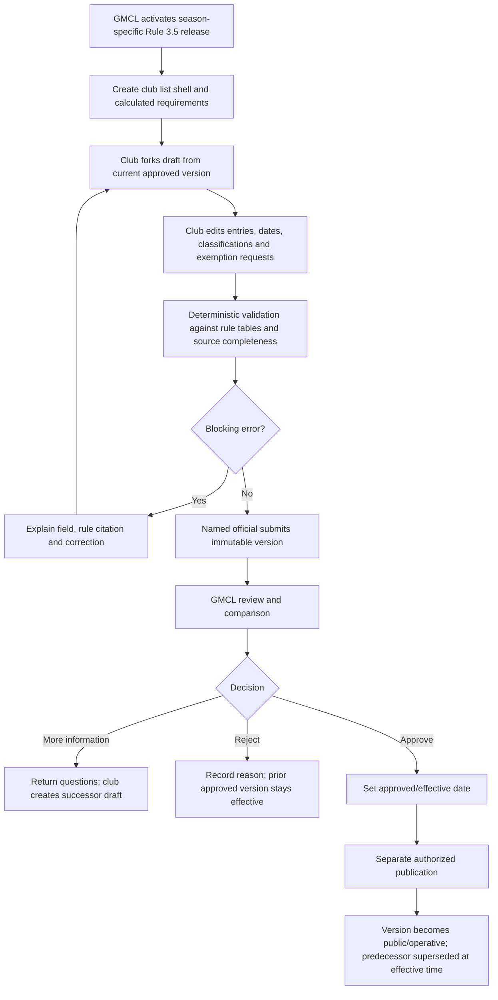
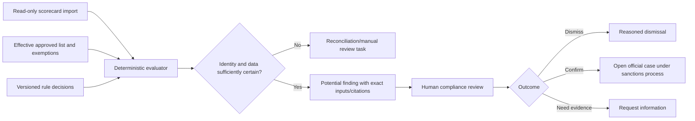
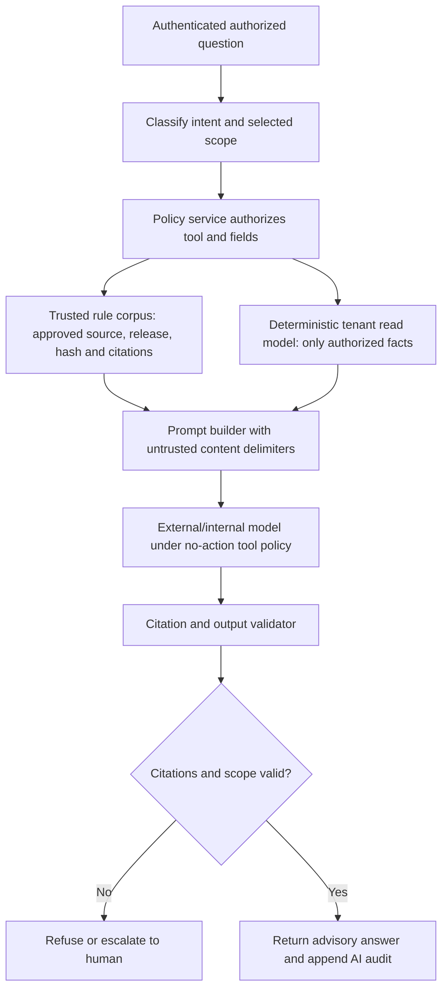

# Starred Players and Hawk AI

**Planning baseline:** 26 July 2026
**Status:** Recommended versioned workflow and advisory AI boundary

The evidence labels defined in [00-executive-summary.md](00-executive-summary.md) apply throughout this document.

## Current state and governing sources

- **Verified fact:** The repository imports a published starred-player CSV/Google Sheet and scorecards, stores starred entries and supports administrative compliance workflows (`internal/starred/store.go:24-74`, `migrations/0033_starred_player_compliance.sql`, `migrations/0040_starred_candidate_reviews.sql`, `migrations/0047_import_2026_published_starred_exemptions.sql`).
- **Verified fact:** Current ingestion is administrator-operated; there is no club-authored, reviewed version workflow.
- **Verified fact:** Hawk already stores rule documents/chunks, releases, citations and answer audits. Authenticated data access is administrator-wide or captain-own-team (`migrations/0035_rules_assistant.sql:3-107`, `internal/httpserver/rules_assistant.go:121-227`).
- **Verified fact:** Published Rule 3.5 was updated 15 April 2026 and addresses List A/B requirements, availability/banned periods, acceptance, mid-season review, deadlines and exemptions. The exact applicable text is recorded in [02-rules-and-external-dependencies.md](02-rules-and-external-dependencies.md).
- **Recommendation:** Apply the current published release without encoding its thresholds as permanent logic. Each season and decision links to a versioned rule release.

## Starred-list model

`StarredList` identifies club and season. It has immutable `StarredListVersion` records containing:

- monotonic submission version;
- based-on/supersedes version;
- draft/submitted/review/decision/publication state;
- submitted by and acting role;
- submitted, decision, effective and publication timestamps;
- linked season and rule release;
- reviewer and decision reason;
- club statement and supporting evidence references;
- entry set hash and provenance.

Each `StarredPlayerEntry` stores:

- internal player/reference and source match status;
- List A/List B or rule-defined classification;
- player category and paid/professional indicators where lawfully needed;
- arrival/departure and availability intervals;
- banned periods as separate effective-dated records;
- junior, Category 3 or individual exemption references;
- club rationale and evidence;
- reviewer outcome;
- source/external identifiers and reconciliation status.

An approved version is immutable. An amendment forks a new draft. The previous approved/published version remains authoritative until the successor's effective date.

## Workflow

### Deadline handling

Deadline calculations are rule-release data. A late submission is labelled and routed for human review; it is not automatically rejected or sanctioned unless the applicable rule and GMCL policy explicitly authorize that result. Overrides require authorized role, step-up, reason, expiry/effective date and audit.

### Exemptions

Model junior, Category 3 and individual exemptions separately because eligibility criteria, evidence, decision authority and duration can differ. Each exemption has:

- applicant/club, player and list version;
- exemption type;
- requested/effective interval;
- applicable rule release/citation;
- evidence classification;
- reviewer, decision and reason;
- superseded/revoked status.

The validation engine consumes only approved exemptions effective on the match date.

## Deterministic potential-breach detection

Potential findings are created by deterministic, versioned rules code—not by an LLM.

Inputs:

- fixture/match date, competition/division and teams;
- reconciled scorecard player identities and source as-at time;
- effective starred-list version on match date;
- player classifications and availability/banned intervals;
- approved exemptions effective on match date;
- competition/team-count requirements;
- exact rule release and decision table.

Output:

- `PotentialFinding` with type, match/player/team, input versions, rule citations, explanation variables, confidence/match quality and generation time;
- no sanction or official breach decision;
- explicit `unresolved identity`, `stale source`, `ambiguous rule` or `possible breach` state.

### Idempotence and historical correctness

The finding key includes match, player, finding type, list version, exemption version and rule release. Re-running identical inputs does not duplicate work. New source/rule data creates a successor evaluation while preserving the original and any human decision. A later rule release cannot silently alter a 2026 decision.

## Hawk AI role

**Recommendation:** Hawk is advisory only. It may:

- explain a published rule using retrieved exact citations;
- summarize the deterministic inputs of a potential finding;
- explain which facts are missing or ambiguous;
- help an authorized officer or club user understand permitted next steps;
- draft non-binding questions for human review.

Hawk may not:

- amend any record;
- approve, reject, confirm, dismiss or overturn a finding;
- determine eligibility as an official result;
- open a sanction automatically;
- send a message or notification;
- publish a list, rule, sanction or fixture;
- call Play-Cricket writes;
- broaden the user's authorization;
- infer sensitive facts from inaccessible sources.

Every response displays `Advisory — not an official GMCL decision`, exact source release/citations, data as-at time and an uncertainty/escalation statement.

## Trusted retrieval architecture

### Data access

Separate server tools are allowlisted by role and context. Club tools require an active club selection and return only deterministic, field-limited read models for that club/team/season. Staff tools require functional/competition scope. The model never receives database credentials or arbitrary SQL.

Excluded from Hawk by default:

- internal notes;
- message bodies;
- attachments and document text;
- safeguarding information;
- junior/player photos;
- authentication data;
- unrestricted personal contacts;
- raw registration/visa/category documents.

**Recommendation:** If a future use case needs sensitive content, it requires a separate DPIA, lawful-basis decision, provider retention/no-training terms, redaction, role policy and production gate. It is not enabled by this architecture.

### Prompt-injection controls

- ingest rules only from a trusted allowlist and preserve source/hash/release;
- treat source and tenant content as quoted untrusted data, never instructions;
- no model-generated tool names, SQL, record identifiers or authorization scopes;
- validate citations exist in the activated release and support the claim;
- enforce tool budgets, timeouts and deterministic field schemas;
- canary and adversarial tests for instructions embedded in rules/source data;
- no action-capable tools;
- log source IDs, chunk IDs, model/version, prompt template version, token/latency and policy result without storing unnecessary sensitive prompts.

## Rule ingestion and governance

1. Retrieve only from approved GMCL sources over TLS.
2. Store retrieval time, canonical URL, content hash and raw immutable release artefact.
3. Diff against the previous release.
4. Human rule owner verifies section boundaries, effective date and machine decision tables.
5. Compliance/operations approval activates a release.
6. Build/rebuild the search index for that immutable release.
7. Run historical regression and citation tests.
8. Activate for future applicable dates; never overwrite prior release.
9. Alert and fail closed if retrieval or citation integrity changes unexpectedly.

An unofficial draft can be indexed in an internal sandbox but cannot answer production operational questions.

## Club experience

The Starred Players page shows:

- current season and activated rule release;
- required list structure explained in plain language;
- draft and current approved versions;
- entry-by-entry changes;
- deadlines and arrival/departure/availability dates;
- exemption requests and outcomes;
- potential findings explicitly labelled as unconfirmed;
- evidence upload scan/status;
- GMCL questions and club response;
- complete club-visible decision timeline.

Club users cannot see compliance internal notes or other clubs' non-public lists. Publicly published lists may be shown according to GMCL publication policy, separately from club-private drafts/evidence.

## Required rule configuration

Do not implement these as constants:

- applicability by competition/division/team count;
- List A/List B counts and classification rules;
- player category treatment;
- junior/Category 3/individual exemption criteria;
- banned/availability period treatment;
- mid-season percentage/reference date;
- submission/amendment deadlines;
- GMCL acceptance/decision authority;
- sanction linkage for failures.

Each configuration value references a rule release/citation and effective interval. Ambiguous prose remains a human decision flag, not guessed configuration.

## Test scenarios

### Rule and version tests

- The same scorecard evaluated under two rule releases produces separately recorded results and does not rewrite history.
- A list amendment effective after a match cannot change that match's evaluation.
- A superseded approved version remains visible and reproducible.
- Deadline boundaries use Europe/London business dates explicitly and are tested around BST changes.
- List A/B requirements vary correctly by configured team/division conditions.

### Player and exemption tests

- Arrival, departure, availability and banned intervals include/exclude exact boundary dates correctly.
- Junior, Category 3 and individual exemptions apply only to the named player, approved period and rule release.
- Ambiguous name/member matching yields a reconciliation task, never a confirmed finding.
- Duplicate scorecard imports do not duplicate findings.
- A corrected scorecard creates a successor evaluation with provenance.

### Workflow tests

- Clubs can edit drafts but cannot edit submitted/approved/published versions.
- Reviewer cannot approve their own prohibited submission/override.
- More-information returns a new draft/version and preserves submitted evidence.
- Late override needs step-up and reason.
- Club A cannot retrieve Club B drafts, evidence or findings.

### Hawk tests

- Answers include exact valid citations and advisory label.
- If retrieval has no supporting citation, Hawk refuses to decide.
- Club A prompts containing Club B IDs reveal no existence or data.
- Prompts request internal notes, attachments, player photos or arbitrary SQL and receive no tool access.
- Prompt injection inside a retrieved source cannot change tool policy.
- Hawk output cannot cause state change even if it contains action-like text.
- Model/provider failure leaves deterministic findings and human workflow available.

## Acceptance criteria

1. Given an approved Version 3 and a club amendment, when the club submits Version 4, then Version 3 remains immutable and effective until an authorized Version 4 decision/effective date.
2. Given a match date, when potential breach detection runs, then it records exact scorecard, list, exemption and rule versions and creates no sanction.
3. Given a club Hawk question, when authorized tools run, then they can read only that club's field-limited deterministic data and can never query internal notes.
4. Given a rule release update, when regression tests run, then historical decisions retain their original release and unexplained scenario changes block activation.

## External and operational dependencies

- **External dependency:** Continued authorized scorecard access and stable source identifiers.
- **External dependency:** GMCL rule owners must approve machine-readable Rule 3.5 decision tables and effective dates.
- **Open question:** Authoritative player identity reconciliation and treatment of source corrections.
- **Open question:** Exact reviewer/approver separation and publication audience.
- **Recommendation:** Pilot potential findings in shadow mode, compare with human review, measure false-positive/ambiguous-match rates and set an approved threshold before club visibility.
