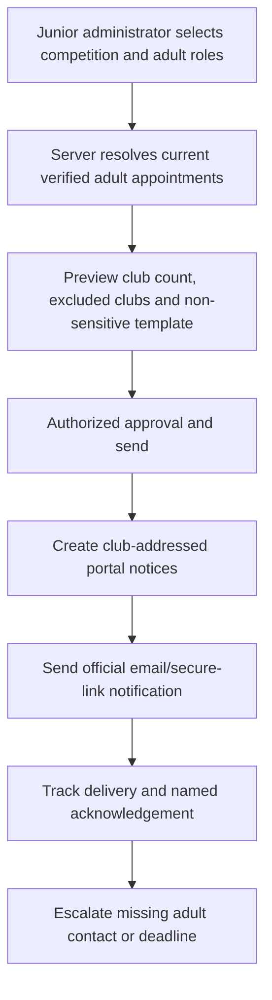

# Junior Administration and Privacy

**Planning baseline:** 26 July 2026
**Status:** Restricted recommendation; DPIA and safeguarding design are production blockers

The evidence labels defined in [00-executive-summary.md](00-executive-summary.md) apply throughout this document.

## Initial scope

**Recommendation:** The first junior-administration release supports communications to verified adult club roles, competition notices, deadlines and acknowledgements. It does not create child logins, message children directly, expose junior rosters broadly or handle safeguarding case content.

Recipients are current named adults with effective assignments such as Club Junior Secretary, Club Primary Administrator or another GMCL-approved adult duty role. A generic club contact may receive the official notification copy but is not a login identity.

## Permissions

| Actor | Permitted | Denied by default |
|---|---|---|
| Junior Competition Administrator | Configure/send approved junior competition notices to adult roles; view delivery and acknowledgements in assigned competitions | Player-level contact lists, safeguarding cases, registration documents, child photos |
| Club Junior Secretary | View/respond/acknowledge own-club junior notices; maintain verified adult route subject to policy | Other clubs, safeguarding referrals, bulk junior data |
| Club Primary Administrator | See ordinary junior actions and appoint adult junior role | Safeguarding content or child-level data merely because primary |
| Club Safeguarding Officer | Use separately assigned restricted route | General access to all junior administration is not implied |
| Safeguarding Officer | Handle explicitly assigned restricted referrals | Ordinary bulk communication tools unless separately appointed |
| Read-only Auditor | Approved, redacted operational evidence only | Identifiable junior/safeguarding records without specific lawful purpose |

Authorization is category-, club-, competition- and season-scoped. Bulk recipient resolution returns adult role appointments, not children.

## Safeguarding boundary

Safeguarding referrals require a separate design:

- separate restricted route and service boundary;
- explicit Safeguarding Officer assignments;
- separate data store/schema and object-storage prefix/keys;
- no ordinary message-case, search, export, analytics or Hawk ingestion;
- neutral receipt/status to the referrer;
- access reason and read audit for every view;
- legal hold and retention policy agreed with safeguarding/DPO owners;
- incident and emergency routes aligned to published GMCL safeguarding guidance;
- break-glass access with two authorized officers, alert and review;
- DPIA, lawful basis and data-sharing assessment before implementation.

**Recommendation:** Keyword detection must not silently copy an ordinary case into safeguarding storage. The UI gives a clear dedicated referral route and safe instructions; staff can perform an audited restricted handoff with minimal duplication.

## Published-rule and photo inconsistency

- **Verified fact:** Published junior Rule 7.5.3.3 says all junior players must include a photograph.
- **Verified fact:** GMCL's `Photo Required` page says juniors who are not playing senior cricket need not upload a photograph and should use a club badge.
- **Open question:** These published instructions conflict. GMCL's Rules and Safeguarding/Data Protection owners must issue one authoritative, effective-dated interpretation before photo-related validation is automated.
- **Recommendation:** Until resolved, the portal explains the uncertainty and routes the case to a human; it does not mark a child ineligible or demand a photo automatically.

## DPIA scope

The DPIA must cover:

- purposes and necessity of adult contact, junior/player, photo and safeguarding processing;
- age groups and whether children interact directly;
- source/controller/processor roles for GMCL, clubs, ECB/Play-Cricket, IdP, email, object storage and AI;
- lawful bases and, where relevant, special-category/criminal-offence conditions;
- transparency appropriate to children and responsible adults;
- data-sharing recipients and international transfers;
- automated rules findings and meaningful human review;
- identity/photo access at grounds and device risks;
- retention, deletion, objections and corrections;
- breach/incident impacts and mitigations;
- accessibility and best-interests assessment;
- consultation with GMCL safeguarding and representative clubs/parents where appropriate.

The ICO children/data-sharing guidance reviewed 25 July 2026 emphasizes best interests, high privacy by default, data minimisation and DPIAs for likely high risk. Source details are in [02-rules-and-external-dependencies.md](02-rules-and-external-dependencies.md).

## Data minimisation

- Store adult role/contact information for junior communications, not child email/phone data.
- Use competition, team and age-group aggregates until a player-level purpose is approved.
- Do not expose date of birth where an age-band/eligibility result suffices.
- Keep photographs out of general dashboards, messages, exports, analytics and AI.
- Do not store school, medical, family or safeguarding detail in ordinary junior records.
- Use private attachments only when a defined workflow requires evidence.
- Show match officials only the minimum identity fields for one fixture and time window.
- Redact support/telemetry and avoid free-text where structured data suffices.

## Junior photographs

**External dependency:** Play-Cricket's UI supports photograph approval, but public documentation reviewed for this pack does not establish an API photo endpoint, cache/redisplay rights or GMCL's controller/processor position.

Before any photo feature:

1. obtain written ECB/Play-Cricket authorization for access and permitted purpose;
2. confirm controller roles, lawful basis, notices, age/consent issues and redistribution/caching terms;
3. resolve the GMCL published-rule inconsistency;
4. approve a DPIA and retention/access policy;
5. establish source approval/status and correction route;
6. implement private storage or just-in-time access as permitted;
7. prevent bulk access, indexing, downloads and long-lived device/browser caches;
8. log each sensitive match-day access;
9. test no-photo/manual fallback;
10. set automatic expiry after the fixture window.

If authorized photographs are unavailable, use the approved existing/manual identity-check process. Do not scrape Play-Cricket, ask clubs to copy photos without rights, or make no-photo status an automatic eligibility failure.

## Portal-wide data classification

Final lawful bases and retention periods require DPO/legal and GMCL policy approval. `Confirm` means the likely purpose/basis must not be treated as approved.

| Classification | Purpose | Lawful basis requiring confirmation | Access | Export | Email | Retention/deletion requiring approval | DPIA | Hawk / external AI |
|---|---|---|---|---|---|---|---|---|
| Public league data | Publish rules, fixtures, results and approved public decisions | Public task/legitimate interests as applicable — confirm | Public/authorized | Public dataset policy | Link or public content permitted | Version/archive schedule; withdraw superseded personal elements | Usually no; assess aggregation | Trusted rules may be used; provider no-training/retention terms still required |
| Club operational data | Run reports, fixtures, actions and club service | Contract/public task/legitimate interests — confirm | Scoped club and GMCL roles | Scoped audited | Non-sensitive summary/link | Season plus approved operational period; anonymize where possible | Assess portal tenancy | Deterministic scoped facts may be used; no cross-tenant provider retention |
| Personal contact data | Authenticate, notify and route club duties | Contract/legitimate interests/legal obligation — confirm | Identity/support and scoped role owners | Restricted | Necessary notices only | Appointment plus approved support/legal period; remove from active directory promptly | Assess identity programme | No by default; never external AI without separate need |
| Player data | Registration, eligibility and match operations | Contract/public task/legitimate interests — confirm | Registration/compliance and minimal club roles | Minimized, approved | No sensitive detail; secure link | Registration/eligibility schedule; pseudonymize historic analytics | Likely where combined at scale | Deterministic fields only if approved; no raw personal data by default |
| Player photographs | Match-day identity where authorized | Legitimate interests/public task/consent issues — confirm | Time-bound match officials and restricted staff | No bulk export | Never attach | Shortest purpose-bound cache/access; purge and verify | Required | Never Hawk or external AI |
| Junior data | Competition administration and eligibility | Best interests plus applicable basis — confirm | Restricted adult roles/minimal staff | Denied or strongly minimized | No child-sensitive data | Short purpose-bound period; age-transition review | Required where high risk | No by default; no external AI |
| Registration documents | Evidence for registration decision | Contract/legal obligation/public task — confirm; special category as applicable | Registration Officers and explicitly granted club role | Exceptional, redacted, step-up | Never content; secure link only | Document-type schedule; delete/anonymize with verified object deletion | Likely required | Never external AI by default |
| Visa/category information | Eligibility/category assessment | Legal obligation/legitimate interests and special-category conditions if applicable — confirm | Registration/compliance need-to-know | Exceptional | Never content | Minimum decision/evidence period; structured result retained instead of copy where possible | Required/likely | No external AI |
| Sanction evidence | Investigate and decide compliance matters | Legitimate interests/public task/legal claims — confirm | Assigned compliance roles; club access to its permitted evidence | Controlled/redacted | Secure link only | Case/appeal/legal period; hold support | Likely for sensitive evidence | Deterministic decision facts only; documents excluded |
| Internal notes | Private GMCL analysis and case management | Legitimate interests/public task — confirm | Assigned GMCL category roles only | Internal exceptional; never club | Never body | Category-specific; minimize free text and apply legal hold | Assess, required for sensitive contexts | Never club Hawk; no external AI by default |
| Safeguarding information | Receive and manage safeguarding referrals | Legal obligation/vital interests/substantial public interest as applicable — specialist confirmation | Explicit safeguarding service roles only | Denied by default | Approved secure/emergency route only | Safeguarding statutory/policy schedule and holds | Required | Never Hawk/external AI |
| Authentication data | Secure identities, sessions and recovery | Contract/legitimate interests/legal obligation — confirm | Identity/security administrators only | Security incident only | Security alerts without secrets | Provider/portal security schedule; revoke/delete secrets promptly | Identity DPIA/assessment | Never |
| Audit logs | Accountability, security, dispute evidence | Legal obligation/legitimate interests — confirm | Auditors/security and purpose-scoped owners | Controlled/redacted | Alerts only | Risk/legal schedule; pseudonymize IP/device sooner where possible | Assess monitoring proportionality | AI-involvement metadata only; no log content to external AI |

No passwords, OTP/TOTP seeds, access tokens, backup codes, full document/message bodies or unnecessary personal data enter audit logs.

## Retention architecture

**Recommendation:** Use policy records with `classification`, `purpose`, `trigger_event`, `retain_for`, `legal_hold`, `review_due`, `deletion_method` and `approved_by`. Periods remain configuration until formally approved.

Controls:

- lifecycle starts from a defined event such as role end, case close, season end or fixture end;
- legal hold blocks automated deletion and is separately audited;
- deletion jobs have dry-run, approval threshold and referential checks;
- object/database/search/backup disposition is documented;
- backups expire through normal rotation rather than selective destructive editing;
- minimal anonymized official history may remain where necessary;
- annual review verifies the data still serves the stated purpose.

## Audit and privacy events

Record:

- view/export of restricted junior/photo/document/safeguarding data;
- recipient resolution and acknowledgement;
- role grant/revocation and reason;
- source sync/reconciliation and manual override;
- attachment upload/scan/download/deletion;
- correction/decision and applicable rule;
- match-day photo access with fixture and purpose;
- AI advice identifier where it influenced a human review.

Do not use access logging to create disproportionate surveillance. IP/device detail is recorded only at a level justified by the security purpose and retention policy.

## Tests

- Junior bulk send resolves only verified current adult roles and excludes expired/suspended appointments.
- Club A cannot see Club B junior notices, adult contacts or acknowledgement metadata.
- A Junior Administrator cannot access the safeguarding route or infer referral existence.
- An ordinary Primary Administrator cannot gain safeguarding access by editing role fields.
- No child/player/photo fields appear in junior communication email, analytics or Hawk payloads.
- Photo endpoint requires exact fixture appointment/window, prevents enumeration and bulk access, sets no-store/private cache headers and audits access.
- Retention dry run matches policy; legal hold prevents deletion; object deletion is verified.
- Subject access/correction workflows can locate authorized records without exposing other people.
- Accessibility tests include adult users with assisted-digital needs and mobile use at grounds.

## Release gates

- **Blocking:** DPIA and controller/lawful-basis decisions for junior, photo and safeguarding processing.
- **Blocking:** Resolve conflicting published photo instructions before automated enforcement.
- **Required before implementation:** adult role definitions, sender/approver policy, categories, acknowledgement/retention requirements.
- **Required before production:** safeguarding referral design, incident playbook, privacy notices, processor agreements, rights-request process and training.
- **Externally blocked:** authorized Play-Cricket photo access and caching/redisplay terms.
