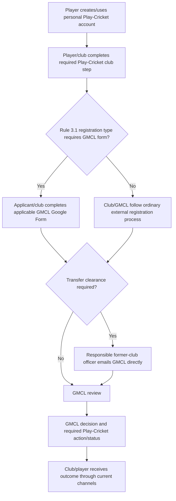
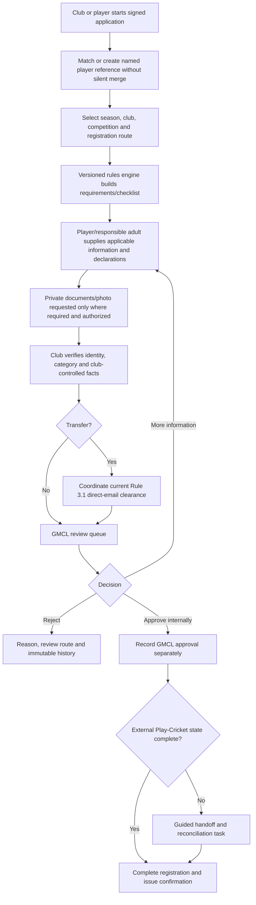
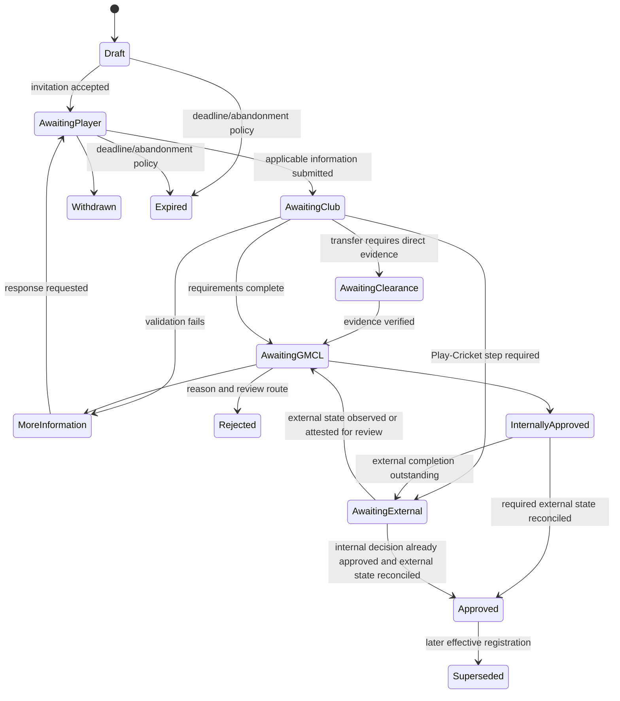
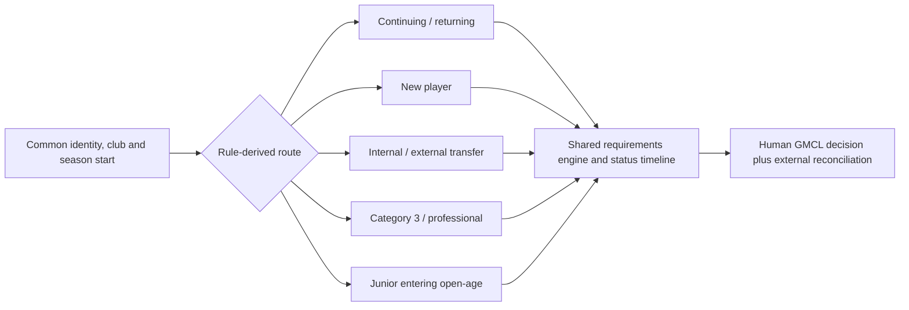

# Player Registration Redesign

**Planning baseline:** 26 July 2026
**Status:** Guided-handoff recommendation; direct external writes are unconfirmed

The evidence labels defined in [00-executive-summary.md](00-executive-summary.md) apply throughout this document.

## Current process map

**Verified from published Rule 3.1, updated 16 February 2026:**

- players require a personal Play-Cricket account and Play-Cricket/club registration steps;
- selected registration types require a GMCL Google Form;
- transfers require direct email from the responsible former-club officer; forwarded emails are not accepted;
- club/GMCL actions and category-specific information/deadlines apply as described in the release.

**Verified from repository:**

- there is no first-class registration application/player-registration domain;
- the current Play-Cricket-style client reads fixtures and scorecards only (`internal/leagueapi/client.go:29-169`);
- no public registration write client or webhook is implemented;
- current forms/spreadsheets are external to the repository and their fields/owners/responses were unavailable for inspection.

**Assumption requiring process interviews:** The operational sequence below synthesizes the published rule, but exact handoffs, spreadsheets, exception decisions, volumes and service targets need mapping with Registration Officers and clubs.

## Target outcome

One guided GMCL journey means:

- one application reference and task list;
- questions tailored to applicable season/rule/category;
- secure evidence upload where justified;
- explicit responsibility for player, current club, former club, GMCL and Play-Cricket steps;
- one truthful status view with source/as-at timestamps;
- no duplicate entry of data GMCL already lawfully holds;
- an external handoff clearly labelled when Play-Cricket remains separate;
- complete decision, correction and audit history.

It does not imply that GMCL can write to Play-Cricket.

## Proposed process

## Application states

Use a state plus explicit outstanding requirements rather than an ever-growing set of ambiguous flags:

- `Draft`
- `Awaiting player information`
- `Awaiting club confirmation`
- `Awaiting photograph`
- `Awaiting documents`
- `Awaiting previous-club clearance`
- `Awaiting Play-Cricket registration`
- `Awaiting Play-Cricket transfer`
- `Awaiting GMCL review`
- `More information required`
- `Internally approved`
- `Approved/complete`
- `Rejected`
- `Withdrawn`
- `Expired`
- `Superseded`

Only versioned rules/configuration may choose required steps. A missing external state never becomes `Approved` by UI convention.

## Data and evidence

Collect only applicable fields:

- applicant/player identity reference and contact route;
- club, season, competition and previous club;
- application route/category/professional status;
- category/visa information only where the rule and lawful basis require it;
- Play-Cricket member/application/status references;
- declarations and electronic attestation;
- requirements and validation outcomes;
- evidence objects and scan/retention class;
- former-club clearance source/status;
- GMCL reviewer, decision, reason and effective date;
- external state observations and as-at;
- correction/appeal and audit timeline.

Do not put visas, identity documents, photos or free-text evidence in email, general audit logs or Hawk. Prefer recording a verified result/expiry over retaining a document where policy allows.

## Nine required workflow variations

The rules engine selects fields and tasks; none of these branches should be hard-coded solely in UI.

### 1. Continuing player

Match the existing internal/external reference, confirm current club/season status, surface only new declarations or expired requirements, reconcile Play-Cricket and complete after GMCL rules permit. Identity ambiguity stops automation.

### 2. Player new to club cricket

Create a personal Play-Cricket account through supported external guidance, capture minimum GMCL application data, verify club relationship/category, complete required external club/league steps and reconcile the new member ID.

### 3. Returning player

Find historic identity/registration without reactivating it automatically, confirm changed contact/category/club data, identify whether a transfer or new external registration is required, and create a new effective registration version.

### 4. Internal GMCL transfer

Identify current/former club and effective registration; coordinate the direct-email clearance required by current Rule 3.1; verify debts/bans according to published process; record GMCL decision; reconcile Play-Cricket transfer.

### 5. Transfer from another league

Use the applicable external-club fallback and rule requirements, do not assume a GMCL portal identity exists for the former officer, preserve verified evidence and route exceptions to a Registration Officer.

### 6. Category 3 amateur

Present the exact season-specific Category 3 questions/evidence and deadline, apply only an approved exemption/decision, restrict documents and require human GMCL review.

### 7. Category 3 professional

Apply the professional and Category 3 requirements from the activated rule release, collect only necessary contract/visa/category evidence, use restricted review and never ask Hawk to decide eligibility.

### 8. Named professional

Use the named-professional route and deadline configured from the rule release, require applicable club/player declarations and GMCL decision, then reconcile the external state.

### 9. Junior beginning open-age cricket

Use an age-appropriate/responsible-adult route, request a photo only after the published GMCL inconsistency and Play-Cricket rights are resolved, restrict access, complete DPIA controls and apply the exact open-age eligibility rules.

## Transfer clearance

### Current release

Rule 3.1 requires a direct email from the responsible former-club officer; a forwarded email is not accepted. Therefore:

- the portal can create the case/reference and send instructions;
- the former-club officer sends directly to the GMCL official channel;
- a Registration Officer verifies sender, club and content, then records an evidence reference/status;
- applicant/new club cannot approve their own clearance;
- non-response escalates under the existing operational policy;
- external-club fallback remains available.

**Recommendation:** Do not replace this with an in-portal approval until Rule 3.1 is formally amended.

### Future verified portal option

If the rule is amended, a portal clearance would require a current verified former-club role, single-use request, named authentication, debts/bans declarations, response/effective date, restricted evidence, conflict-of-interest check, non-response escalation and complete audit. Clubs would need a fallback for external leagues or unavailable officials.

## Play-Cricket integration levels

| Level | Description | Decision |
|---|---|---|
| 1. Reconciliation only | GMCL records application; external steps remain manual; permitted status is imported/recorded | Safe baseline after agreement review |
| 2. Guided handoff | Pre-validate, explain exact supported destination/action, track outstanding task, reconcile later | Recommended initial implementation |
| 3. Approved API integration | Official supported read/write API under agreement with idempotency and reconciliation | Only after written confirmation; not currently evidenced |
| 4. Unsupported automation | Shared credentials, scraping, browser automation or circumvented approval | Prohibited |

Deep links must point to supported stable destinations, warn the user they are leaving GMCL and never embed/capture Play-Cricket credentials.

## Rules engine

Store:

- season and rule release;
- route predicate and required field/task;
- deadline rule and timezone;
- validation severity;
- exact citation and plain-language reason;
- permissible human override role and reason requirement;
- effective interval and test scenario version.

The engine returns requirements and explanations; official acceptance remains a human-authorized state transition. Overrides require step-up, reason, two-person approval where policy demands, expiry/effective date and audit.

## Duplicate detection and reconciliation

Use deterministic exact external IDs where authorized. Normalized name/email/date attributes may suggest candidates but cannot auto-merge. A restricted officer sees candidate provenance and resolves:

- same person with several external identities;
- same external ID mapped to different internal players;
- same-name players;
- club transfer/history;
- corrected source data.

Merges create a reversible mapping/supersession history. Official decisions continue to reference their original person/version snapshot.

## Google Forms and spreadsheet retirement

**Unavailable evidence:** The actual forms, response sheets, scripts, owners, retention and downstream processes were not in the repository. No specific form can be declared replaceable yet.

Discovery inventory for every form/sheet:

- owner and purpose;
- URL/form version and fields;
- rule/citation and lawful basis;
- submitter and approver;
- evidence/attachments;
- validation and manual calculations;
- notification/response process;
- spreadsheet joins and source identifiers;
- exports/consumers;
- volumes, deadlines and exceptions;
- retention and historic record need.

Candidate portal replacements after parallel reconciliation:

- application intake and dynamic checklists;
- club confirmations;
- secure evidence upload;
- status queries and more-information responses;
- reviewer queues, decision and confirmation;
- transfer-case coordination while direct email remains;
- operational reports.

Keep Play-Cricket account/registration steps and Rule 3.1 direct email until official capabilities/rules change. Retire a form only after owner sign-off, record import, count/hash reconciliation, link/communications update, read-only archive and rollback period.

## Notifications and confirmations

Notifications contain only application reference, non-sensitive task, deadline and secure link. Applicant/club views show who owns the next task and external/as-at state. Completion produces a verifiable GMCL confirmation/reference, not a claim about Play-Cricket beyond reconciled evidence.

## Tests

### Unit and historical

- all nine routes against versioned historic scenarios;
- deadline/category/competition boundaries and BST;
- applicable requirements and missing-item explanations;
- override permissions and expiry;
- previous rule releases remain reproducible.

### Integration

- application versioning and concurrent decisions;
- private attachment quarantine/scan/access;
- former-club evidence/reference and direct-email bridge;
- IdP roles and revoked sessions;
- Play-Cricket read/reconciliation rate limits, stale data and duplicates;
- notification outbox/idempotency;
- audit completeness without sensitive contents.

### End-to-end and security

- player- and club-initiated journeys;
- more-information/resubmission and rejection/review;
- each transfer fallback;
- Club A requesting Club B applications/documents;
- ordinary administrators requesting restricted category/visa data;
- mass assignment of decision, role, category or external status;
- duplicate approvals and replayed callbacks;
- malicious documents and signed-URL expiry;
- junior/responsible-adult route.

## Rollout and migration

1. Inventory processes/forms and create rule-versioned test corpus.
2. Reconcile clubs, users and external identifiers.
3. Pilot Level 2 guided handoff for one low-complexity route while forms remain official.
4. Compare every application and outcome in parallel.
5. Add routes one at a time, starting with the fewest sensitive documents.
6. Import historical metadata/decision references; do not indiscriminately copy old attachments.
7. Retire suitable forms only after GMCL/DPO owner approval.
8. Keep read-only archive and documented manual fallback through the first full season.

## Decisions and blockers

- **Blocking:** Exact current form/spreadsheet/process inventory and official decision ownership.
- **Blocking:** Registration lawful bases, document/photo retention and DPIA.
- **Blocking:** Rule 3.1 direct email remains; replacement requires amendment.
- **External dependency:** Registration write/webhook APIs are unconfirmed and unavailable to the plan.
- **Recommendation:** Implement Level 2 guided handoff first and treat Level 3 as a separately approved enhancement.
