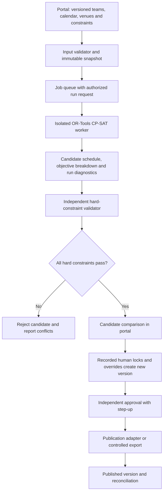

# Fixture Optimisation Plan

**Planning baseline:** 26 July 2026
**Status:** Standalone discovery and prototype programme; no automated publication

The evidence labels defined in [00-executive-summary.md](00-executive-summary.md) apply throughout this document.

## Decision

**Recommendation:** Treat fixture optimisation as an Extra Large standalone programme. Conduct process interviews, build a versioned constraint catalogue and prepare historical data before an isolated OR-Tools CP-SAT prototype. Generated schedules are candidates only and never publish automatically.

The modular Go portal owns inputs, authorization, versioning, approvals and publication controls. A separate isolated solver worker may use OR-Tools because solver experimentation and resource use should not affect portal availability. No solver dependency is added during this planning pass.

## Verified current state and unavailable evidence

- **Verified fact:** The repository imports and caches fixture/match data and stores season competition IDs (`internal/leagueapi/client.go:29-87`, `migrations/0006_league_fixtures_and_team_mapping.sql:1-33`, `migrations/0017_season_league_competition_ids.sql:1-5`).
- **Verified fact:** The current integration is read-oriented; the repository does not contain a fixture-generation solver or documented publication writer.
- **Verified fact:** The application models clubs and teams separately, which must be preserved (`migrations/0001_core_schema.sql:22-45`).
- **Assumption from brief:** A normal senior week exceeds 244 matches and future planning includes senior and junior competitions.
- **Unavailable evidence:** The present fixture creators, spreadsheets, scripts, manual decision logs, Play-Cricket publication method, change workflow and complete historical corpus were not available in the repository.
- **Recommendation:** Do not claim automation feasibility or benefit until those inputs are discovered and quality-assessed.

## Current-process discovery

Interview fixture administrators, competition leads and representative clubs while observing one complete planning/change cycle. Capture:

1. who creates, reviews, approves and publishes each competition;
2. source spreadsheets/templates/scripts and field definitions;
3. team entry, division, venue, pitch, ground-share and calendar sources;
4. manual locks, exceptions, traditional fixtures and undocumented conventions;
5. senior/junior/cup/reserve-date interactions;
6. change requests, late withdrawals and partial regeneration;
7. publication/import format and Play-Cricket permissions;
8. recurrent conflicts and time spent;
9. historic schedules, revisions, overrides and known-quality labels;
10. what “tightening” means and how success is measured.

### Fixture-constraint questionnaire

For every proposed constraint ask:

- exact plain-language rule and worked example;
- hard (must never fail) or soft (may trade off);
- source and data owner;
- competitions/seasons/teams/dates affected;
- priority/weight and rationale;
- effective dates and exceptions;
- who may override it and with what approval;
- how violation is detected/explained;
- historical examples;
- desired behavior after withdrawal/ground change;
- whether it is published rule, operational policy or preference.

No constraint enters the production catalogue without owner, version, test and override policy.

## Data requirements

| Dataset | Required fields | Quality/provenance checks |
|---|---|---|
| Seasons/calendars | date range, play days, holidays, cup/reserve dates, blackouts | Owner, timezone, version, conflicts |
| Competitions/divisions | format, teams, rounds, required opponents/counts | Entry version, movement/withdrawal history |
| Clubs/teams | stable IDs, level/competition, linked teams | Reconcile legacy/external IDs |
| Venues/pitches | coordinates, capacity by date/time, shared-resource group | Geocode accuracy, temporary closures |
| Availability | team/venue/date/time availability and source | Deadline, confidence, late change |
| Fixed/locked fixtures | teams, venue, time, lock reason/authority | Duplicate/conflict validation |
| Ground sharing | resources that cannot overlap and capacity | Formal versus preference |
| Travel | approved coordinate/distance matrix and method | Reproducible version; road/geodesic choice |
| Club operations | maximum simultaneous home teams, facility/staff limits | Club-confirmed effective values |
| Traditional/derby preferences | paired teams and preferred periods | Soft/hard owner approval |
| Historic fixtures | every published version and change | Missing/duplicate/withdrawn labels |
| Manual overrides | before/after fixture, reason, actor and decision context | Preserve even if undocumented through interview |
| Publication mapping | target IDs, required format/fields and validation | Written external capability/agreement |

Each solver run stores immutable input snapshot/hash, constraint catalogue version, distance matrix version, solver/build/configuration, seed, limits and outcome.

## Defining “tightening”

**Open question:** GMCL must choose measurable objectives. Candidate measures:

| Objective | Measure | Baseline/comparison |
|---|---|---|
| Reduce total travel | Sum of approved distance measure across scheduled away journeys | Current/historic schedule under same matrix |
| Reduce extreme travel | 95th percentile and maximum journey distance | Distribution, not only average |
| Geographic compactness | Within-division pairwise travel or outlier count above threshold | Entry/division design baseline |
| Calendar consistency | Variance/gaps in match intervals; unscheduled reserve use | Historic fixture pattern |
| Ground conflicts | Count of overlapping use beyond capacity | Must be zero if hard |
| Club operational conflicts | Weighted simultaneous-home violations/preferences | Club constraint catalogue |
| Home/away balance | Difference and longest consecutive home/away run per team | Competition requirement |
| Fairness | Distribution of travel/undesirable slots across clubs | Max-min/variance and stakeholder-approved tolerances |
| Change resilience | Number/score of altered fixtures after a localized change | Compare partial versus full regeneration |

GMCL should approve thresholds, for example “zero hard violations, 10% lower median total travel with no club's maximum journey increasing by more than the approved tolerance.” This is an example format, not a selected target.

## Constraint catalogue

### Candidate hard constraints requiring confirmation

- every team plays the required opponents/rounds;
- correct fixture count and allowed byes;
- no team in two simultaneous fixtures;
- venue/pitch capacity and availability;
- shared-ground resource conflicts;
- competition, cup, reserve and blackout dates;
- fixed and locked fixtures;
- withdrawn teams and entry eligibility;
- senior/junior separation where resources/rules require;
- allowed start times;
- known binding ground-share agreements.

### Candidate soft constraints requiring weighting

- total and maximum travel;
- geographic outliers;
- home/away balance and run length;
- simultaneous home teams within operational preferences;
- local/derby/traditional preferences;
- fair shared-facility use;
- club preferences;
- congestion/recovery gaps;
- major events;
- equitable distribution of travel and undesirable slots.

**Recommendation:** Never convert an infeasible hard rule into a soft penalty silently. The run fails with a smallest-useful conflict explanation and owner decision.

## Solver options

| Approach | Strengths | Limitations | Assessment |
|---|---|---|---|
| Constraint programming / CP-SAT | Natural Boolean/integer scheduling, rich hard constraints, weighted objectives, good diagnostics/model iteration | Requires careful modelling; optimality may take time | Recommended prototype using OR-Tools CP-SAT |
| Mixed-integer programming | Mature optimization and bounds, strong linear models | Some scheduling/logical constraints become cumbersome; licensing/solver choice | Benchmark if CP-SAT quality/runtime is insufficient |
| Graph algorithms | Useful for opponent pairing, travel and conflict subproblems | Does not alone handle complete calendars/resources/preferences | Supporting preprocessing |
| Heuristics/metaheuristics | Fast candidates and flexible objectives | May violate/struggle to prove hard feasibility; reproducibility/quality bounds harder | Candidate generation or repair only |
| Hybrid | Decompose pairing/calendar, CP-SAT validation/repair and heuristics | More components and explanation burden | Consider after prototype evidence |

For GMCL administrators: CP-SAT searches combinations while treating mandatory rules as non-negotiable and preferences as scored trade-offs. It can return several valid candidates and explain their objective components. It still depends on correct data and human policy choices.

## Architecture

### Portal responsibilities

- authorize input, run, compare, override, approve and publish;
- version constraints/inputs/plans;
- show scores and violations plainly;
- preserve manual decisions;
- transactional outbox for solver jobs/publication;
- audit and rollback to a previous published version.

### Worker responsibilities

- accept an immutable schema/version;
- validate input limits;
- generate one or more candidates;
- return objective components, solver status/bounds and infeasibility diagnostics;
- no portal database credentials;
- no external publication credentials;
- resource/time limits and sandboxing;
- deterministic replay using recorded configuration/seed where solver behavior permits.

### Independent validation

Do not trust solver output solely because the solver returned feasible. A separate validator recomputes every hard constraint and fixture total. Publication requires validator success for the exact candidate hash.

## Manual locks, overrides and partial regeneration

Every manual decision is first-class:

- fixture/date/venue values before and after;
- hard lock or preference;
- reason/category;
- actor/approver;
- effective plan version;
- whether it should survive regeneration;
- conflict/impact score.

A new run treats approved locks as input constraints. Partial regeneration specifies affected competition/date/resources, freezes unaffected fixtures and reports unavoidable ripple. Administrators can compare two plan versions by changed fixtures, hard validity, each soft objective and club impact.

## Prototype plan

### Gate 0: discovery

Process maps, dataset inventory, rule/policy owners, definition of success and publication process are signed off.

### Gate 1: data preparation

Create a synthetic-safe schema and at least two historical seasons with reconciled teams, venues, calendars, published fixtures, changes and manual decisions. Label data gaps.

### Gate 2: feasibility model

Model one bounded senior competition. Implement opponent/count, no-overlap, venue capacity, locks and home/away balance. Return infeasibility rather than relaxing hard rules.

### Gate 3: objective experiments

Add approved travel/fairness/club preferences one at a time. Compare with historical schedule and administrator judgement.

### Gate 4: change resilience

Exercise withdrawal, closure, locked fixture and partial regeneration scenarios. Confirm manual overrides persist.

### Gate 5: decision-support pilot

Run in shadow mode; humans create/publish official fixtures through the existing process. The prototype supplies candidates/comparisons only.

Success measures include zero hard violations, complete reproducibility, agreed runtime ceiling, transparent score agreement, no lost locks and administrator acceptance. Numerical thresholds are set after baseline data, not invented here.

## Historical testing corpus

Include:

- a clean complete competition;
- multiple teams sharing one ground;
- junior and senior capacity interaction;
- byes and odd team counts;
- withdrawal before and after initial generation;
- venue blackout and late closure;
- cup/reserve/fixed/traditional fixtures;
- extreme geography and travel outliers;
- deliberately infeasible inputs;
- every known manual override/change category;
- current published schedule plus each revision.

Golden assertions:

- required opponents and totals;
- no duplicate team booking;
- no ground over-capacity;
- valid dates/start times;
- home/away requirements;
- locks unchanged;
- byes/withdrawals correct;
- distance/objective recomputation exact;
- overrides survive;
- conflict explanations identify relevant constraints;
- same input/configuration reproduces the accepted candidate;
- runtime and memory within approved worker limits.

Use property-based tests for small generated leagues and metamorphic tests such as adding a venue blackout cannot create use of that venue/date.

## Approval, publication and rollback

1. Fixture Administrator selects a validated candidate.
2. Review shows exact input/catalogue/run versions, changes, scores and warnings.
3. Manual overrides create a successor candidate and rerun validation.
4. An authorized independent approver confirms with step-up.
5. Publication creates an immutable version and uses an approved adapter/export.
6. Reconcile every target record and report partial failures.
7. Rollback republishes a prior approved version only through the same authorization and external rules.

**External dependency:** The current method and authority for publishing to Play-Cricket are unavailable. No write integration is assumed. A controlled file/export may remain the delivery method.

## Security and operations

- Isolate worker CPU/memory/network; validate payload size and schema.
- No arbitrary solver code, expressions or user-provided file paths.
- Protect external publication credentials separately from solver.
- Step-up and separation of duties for publication.
- Idempotency and optimistic concurrency for runs/approval/publication.
- Alert on hard-validation mismatch, queue failure and partial publication.
- Backup input/plan/audit records and rehearse restore.
- Do not expose private club constraints to other clubs or Hawk by default.

## Rollout

1. Discovery and historical replay only.
2. Shadow decision support for a bounded competition.
3. Human-selected export alongside existing manual construction.
4. Expanded competitions after quality/fairness review.
5. Controlled publication only after external process/permissions and rollback are proven.

Automatic publication remains prohibited. Solver recommendations never become rules or official decisions by themselves.

## Decisions required

- **Blocking:** Current process, people, artefacts and publication method.
- **Blocking:** Approved hard constraint catalogue.
- **Required before prototype:** historical corpus, objective definitions, distance method and measurable “tightening”.
- **Required before production:** independent approver, runtime targets, worker platform, publication agreement, incident/rollback playbook.
- **Can be deferred:** alternative MIP/hybrid benchmark unless CP-SAT evidence shows need.
