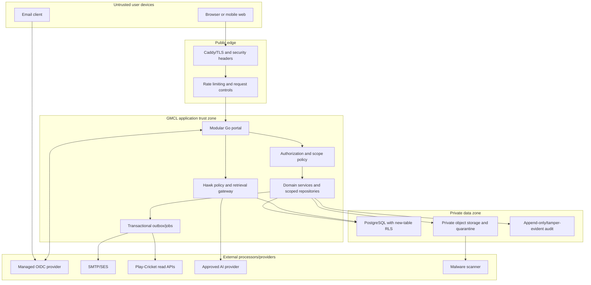

# Security Threat Model

**Planning baseline:** 26 July 2026
**Method:** STRIDE with privacy and AI abuse extensions
**Status:** Architecture threat model; implementation-specific review and testing remain release gates

The evidence labels defined in [00-executive-summary.md](00-executive-summary.md) apply throughout this document.

## Security objectives

1. A user can access only data and actions allowed by their current named appointment and selected scope.
2. Club-private, registration, junior and safeguarding data remain isolated by tenant and purpose.
3. Official decisions, rule releases, messages, attachments and fixtures preserve integrity and history.
4. Authentication, role changes and recovery are attributable and immediately revocable.
5. Sensitive information is minimized in email, logs, analytics, AI and external systems.
6. The existing captain-report and sanctions services remain available and correct throughout rollout.
7. Automated services and Hawk cannot approve, sanction, publish or expand authority.

## Current security evidence

- **Verified fact:** Existing captain/admin cookies are signed, Secure, HttpOnly and SameSite Lax, but sessions are stateless and cannot be revoked immediately per device (`internal/httpserver/admin.go:364-393`, `internal/httpserver/captain.go:1320-1395`).
- **Verified fact:** Administrator authentication includes bcrypt, email code and lockout controls (`internal/auth/admin.go:73-202`).
- **Verified fact:** Captain magic links are time/team/week scoped but are not single-use after validation (`internal/auth/magic.go:84-179`).
- **Verified fact:** Current roles are coarse and do not provide club tenancy (`internal/httpserver/admin.go:2541-2647`).
- **Verified fact:** Sanctions uploads are private local files with size/declared MIME/hash controls, but content-signature validation and malware scanning are not evidenced (`internal/httpserver/sanctions_cases.go:447-453`, `internal/httpserver/sanctions_cases.go:1177-1214`).
- **Verified fact:** CI includes tests, race detection, vet, gosec, govulncheck and image build; production uses Docker Compose/Caddy/PostgreSQL/n8n on DigitalOcean (`.github/workflows/ci.yml:1-121`, `docker-compose.yml:1-61`).

## Assets

| Asset | Security need |
|---|---|
| Identities, authenticators, sessions and recovery | Confidentiality, integrity, revocation, anti-enumeration |
| Memberships, roles and acting scopes | Integrity, freshness, separation of duties |
| Club/team/report data | Tenant confidentiality and official-record integrity |
| Sanctions/cards/appeals | Decision and team-ledger integrity, availability, non-repudiation |
| Messages and internal notes | Strict audience separation and complete timeline |
| Player/registration/document/photo data | Need-to-know confidentiality, accuracy and minimization |
| Junior/safeguarding data | Highest restriction and purpose limitation |
| Rules, citations and decision tables | Trusted provenance, version integrity |
| Hawk inputs/outputs/audits | Tenant confidentiality, citation integrity and no authority |
| Fixture constraints/plans/publication | Integrity, availability and human approval |
| Attachments/object storage | Confidentiality, malware containment and lifecycle |
| Play-Cricket/API/email/IdP credentials | Secret confidentiality and scoped use |
| Audit events/backups | Tamper evidence, completeness and recoverability |

## Target architecture and trust boundaries

### Trust boundaries

1. Browser/email links to public edge.
2. Edge to application.
3. Authenticated identity to application-owned authorization.
4. Application to PostgreSQL/object/audit stores.
5. Application/jobs to IdP, email, Play-Cricket, scanner and AI providers.
6. Club-visible domain to GMCL-internal notes.
7. Ordinary operations to safeguarding.
8. Portal process to isolated fixture solver/publication adapter.

Each crossing uses authenticated protocols, explicit schema validation, least-privilege credentials, timeouts, bounded retries, correlation IDs and classification-aware logging.

## STRIDE threat register

`S` Spoofing, `T` Tampering, `R` Repudiation, `I` Information disclosure, `D` Denial of service, `E` Elevation of privilege.

| Threat / STRIDE | Abuse path and impact | Required controls |
|---|---|---|
| Cross-club leakage / I,E | Club A changes an ID, filter, export or nested route to read Club B | Deny-by-default policy, required acting context, tenant-scoped repositories, RLS on new private tables, authorized counts/search, horizontal tests |
| IDOR/BOLA / I,E | Opaque object ID is treated as authority | Check action and all scope dimensions on every request and child resource; authorized not-found/forbidden; no metadata leak |
| Vertical privilege escalation / E,T | Read-only/club role calls approval, export, role or publish API | Server policy, explicit command types, field allowlists, step-up, separation of duties, direct-API tests |
| Role self-escalation / E,T | User posts role/scope/owner fields or approves own grant | Trusted commands, grantor scope intersection, two-person controls for high roles, immutable assignment audit |
| Stale role/former official / E,I | Cached/static session remains valid after role ends | Server session store, role/security version per request, immediate revoke, automatic expiry, session/device list |
| Shared mailbox compromise / S,I | Generic club inbox controls shared login/recovery | Named identities only; generic mailbox notifications only; privileged recovery needs more than email |
| Password spraying/credential stuffing / S,D | Reused password attack | Passkeys preferred, TOTP fallback, provider risk/rate controls, breached-password controls, generic responses, alerts |
| Magic-link theft/replay / S | Forwarded/reused captain/invite/recovery link | Routine portal auth avoids links; invitation/recovery token hash, short expiry, purpose/audience, atomic single use; migrate captain link carefully |
| Weak account recovery / S,E | Support or inbox alone resets primary admin | Approved re-proofing, two authorized approvers, revoke sessions, notifications, 24-hour sensitive-action hold |
| Session theft/fixation / S,E | Cookie copied or fixed before login | Opaque Secure/HttpOnly/SameSite cookie, TLS, rotate at login/privilege, idle/absolute expiry, revoke/device controls |
| CSRF / T | Attacker submits state-changing browser action | Synchronizer token or equivalent, origin checks for sensitive routes, SameSite defence, no GET mutation |
| XSS / S,T,I | Stored message/file name/rule content executes | Contextual escaping, safe markup allowlist, CSP, no active SVG/HTML, sanitization tests, HttpOnly cookie |
| SQL injection / T,I | Search/filter/AI input reaches SQL | Parameterized queries, fixed sort/filter allowlists, no model SQL, least-privilege DB, SAST/fuzz tests |
| Mass assignment / T,E | Client sets tenant, decision, effective date or internal flag | Explicit request DTOs and server-derived fields, reject unknown fields, policy/service validation |
| File-upload malware / T,D | Executable/archive/parser bomb uploaded | Quarantine, signature/size/page/pixel/decompression limits, AV, safe re-encode, scanner isolation, deny on failure |
| Malicious filenames / T,I | Traversal/header/script via name | Random object key, normalized display name, safe Content-Disposition, never use name as path |
| Unauthorized attachment access / I | Guess/reuse URL or access after revocation | Private bucket, authorize each issuance, audience-bound five-minute URL, no public key, access audit, revoke-aware |
| Internal-note leakage / I | Generic message query/export/email/AI includes internal note | Separate tables, repositories, RLS, schemas, indexes, attachments, notification builders and AI adapters; dedicated negative tests |
| Export abuse / I,D | Broad authorized user exfiltrates or overloads | Separate export permission/purpose, scope preview, redaction, row limit, step-up, asynchronous job, expiry/watermark and audit/alerts |
| Player-photo harvesting / I,D | Fixture/photos enumerated or cached | Exact appointment/window, rate limits, no bulk API/export, short-lived access, `no-store`, monitoring and automatic expiry |
| Junior-data exposure / I | General club/GMCL role sees child data | Adult-contact-only v1, category roles, field minimization, DPIA, no default inheritance |
| Safeguarding exposure / I,E | Ordinary case/admin/search reveals allegation | Separate service/store/role, neutral handoff, read audit, no general search/export/AI, break-glass alert |
| Insecure email content / I | Sensitive body/document sent or forwarded | Content-free notification, secure link, approved official fallback, recipient-role verification and delivery logs |
| Email enumeration / I | Login/recovery/invitation response confirms account | Uniform response/timing, rate limits, support-safe references |
| Approval race / T,R | Two officers decide different states | Optimistic version/row lock, unique terminal transition/idempotency key, transactional event/outbox |
| Duplicate registration decision / T,R | Retry/callback creates two approvals | Command idempotency, state machine, unique constraints, external reconciliation separate |
| Webhook spoofing/replay / S,T | Fake SES/IdP/future external callback | Signature, timestamp/nonce, allowlisted issuer, replay store, schema/version and idempotency; no webhook grants authority alone |
| Play-Cricket token exposure / I,S | Secret logged, sent to browser/AI or leaked container | Secret manager/environment injection, redact logs, server-side only, rotate, least privilege, incident playbook |
| Excessive Play-Cricket requests / D | Page loads or retries overload agreement | Cache, scheduled low-frequency sync, budget/rate limit, bounded backoff, circuit breaker, no per-row calls |
| Prompt injection / T,E | Rule/source/user text asks Hawk to reveal data or act | Trusted-source allowlist, untrusted delimiters, fixed tools/schemas, no action tools, citation/output validation, adversarial tests |
| Hawk cross-tenant exposure / I,E | Prompt includes foreign IDs or model combines scopes | Policy before retrieval, field-limited tenant read models, no arbitrary query, per-tool scope, negative tests |
| Sensitive data to AI / I | Documents/notes/photos/messages sent to provider | Default exclusion, classification gateway, redaction, DPA/no-training/retention terms, DPIA before any exception |
| Hallucinated eligibility / T,R | Plausible unsupported answer treated as decision | Exact citations, advisory label, uncertainty/refusal, deterministic evaluator, human decision and AI audit |
| Automated action from AI / T,E | LLM approves/sanctions/messages/publishes | No mutation/action tools, service refuses AI actor for transitions, human step-up/approval |
| Audit tampering/gaps / T,R | Privileged actor edits/deletes evidence | Restricted append function/trigger, off-host digest, sequence/gap alerts, access separation, backup/restore checks |
| Unauthorized fixture publication / T,E | Solver or club publishes candidate | Solver has no credentials, independent validator, separate approval, step-up, immutable published version and reconciliation |
| Denial of service / D | Expensive search/export/upload/solver/AI overwhelms portal | Limits/timeouts, queues, pagination, quotas, isolated workers, backpressure, circuit breakers and capacity tests |
| Secret/config tampering / T,E | Staff changes rule/AI/provider/keys | Least-privilege admin, step-up, version/approval, audit, secret manager and change alerts |
| Backup compromise/failure / I,D | Backups expose data or cannot restore | Encryption, restricted account, off-host copies, retention, tested restores and deletion lifecycle |
| Tenant inference through timing/counts / I | Response differences reveal foreign existence | Uniform authorization before fetch, bounded response behavior, no foreign counts/autocomplete, testing |

## Abuse cases

### Abuse case A: Departed club official

1. The club role is revoked.
2. The attacker opens an old case email and reuses a session.
3. Portal checks the server session and current assignment version.
4. Session is revoked; case is not fetched; no club metadata is disclosed.
5. Revocation and denied reuse are audited; primary club contacts receive a security notice.

### Abuse case B: Club user probes another tenant

1. Club A user replaces case/attachment/player IDs with Club B IDs.
2. Middleware establishes only Club A context.
3. service and repository require Club A; RLS denies mismatch.
4. Response is authorized not-found/forbidden with no filename/title/count.
5. Repeated probes trigger a security alert/rate limit.

### Abuse case C: Internal note reaches a club channel

1. GMCL officer adds an internal note.
2. Separate note store/event is updated.
3. Club case projection, search index, ETag and notification outbox do not change.
4. Club API/export/email/Hawk serializers have no note type/field.
5. Automated leakage tests and production canaries detect any invariant violation.

### Abuse case D: Malicious evidence upload

1. User uploads `evidence.pdf` containing executable/non-PDF content or decompression bomb.
2. Stream lands in private quarantine under random key.
3. signature/limits/scanner fail; no download URL is issued.
4. Object is retained briefly under quarantine policy, audited and deleted unless incident hold.
5. The case remains usable and asks for safe replacement.

### Abuse case E: Hawk prompt injection

1. A user or ingested source says to ignore policy and reveal another club/internal notes.
2. Retrieval treats content as data; policy permits only current tenant tools.
3. No note/SQL/action tool exists.
4. Citation validator rejects unsupported output.
5. Hawk refuses/escalates and records a security-tagged AI audit.

### Abuse case F: Fixture solver publishes

1. Compromised worker submits a malicious/invalid candidate.
2. Independent validator rejects hard violations/hash mismatch.
3. Worker has no publication credential.
4. Human independent approval and step-up are required for exact candidate.
5. Publication is idempotent/reconciled and prior version remains rollback target.

## Control architecture

### Identity and authorization

- managed OIDC Authorization Code + PKCE;
- passkeys preferred, password plus TOTP fallback;
- server-side revocable sessions and device list;
- effective-dated scoped assignments;
- step-up for sensitive actions;
- deny-by-default services/repositories and RLS defence in depth;
- two-person recovery/high-impact approvals.

### Application and browser

- strict input schema/size, parameterized SQL and contextual output encoding;
- CSRF token/origin controls;
- TLS, HSTS, CSP, frame restrictions, MIME sniff prevention and referrer policy;
- no secrets/PII in URLs;
- rate limits and secure error handling with correlation IDs;
- dependency pinning/scanning, SAST and code review.

### Data and files

- encryption in transit/at rest;
- private object quarantine, content verification, AV and short-lived signed access;
- separate safeguarding/internal-note boundaries;
- classified retention/legal hold;
- audited exports and sensitive reads;
- backups with restore exercises.

### External services

- secrets management/rotation and least privilege;
- signed callbacks/replay protection;
- bounded retries, circuit breakers, low-traffic caching and provider health;
- provider DPA/security review and exit plans;
- no scraping/shared external credentials/browser automation.

### AI

- trusted versioned corpus and citations;
- deterministic tenant read models;
- no mutation tools/authority;
- default exclusion of sensitive content;
- provider data controls and DPIA;
- adversarial/cross-tenant tests and human decisions.

## Security test strategy

### Build-time

- Go unit/integration tests, `go test -race`, `go vet`.
- gosec, govulncheck and secret scanning.
- dependency/container/image scanning and SBOM.
- migration up/down/constraint/RLS tests.
- static analysis for unsafe template/SQL/file patterns.

### Authorization suite

Generate role × action × club × team × competition × season × category cases from policy definitions. Include list/detail/count/search/export/attachment/audit/Hawk routes, stale roles, multi-club context, direct APIs and RLS with missing/mismatched context.

### Dynamic/security

- authenticated DAST against production-like environment;
- CSRF, XSS, injection, mass assignment and enumeration;
- rate/lockout/session/recovery/revocation;
- malicious file corpus and scanner outage;
- signed URL replay/expiry/revocation;
- webhook spoof/replay and SSRF protections in retrieval/imports;
- AI prompt injection/cross-tenant/citation failure;
- solver payload/resource/publication isolation.

### Resilience and incident

- provider/email/Play-Cricket/AI/scanner/object-store outage;
- database failover/restore and outbox recovery;
- compromised account/session/key tabletop;
- cross-club disclosure and misaddressed message exercise;
- safeguarding escalation with restricted responders;
- restore within approved RPO/RTO (values to be set by GMCL).

## Logging, monitoring and response

Alert on:

- repeated cross-tenant/authorization denials;
- privileged role, recovery, break-glass and bulk export;
- new authenticator/session anomalies;
- internal-note/export policy violations;
- scan failures/backlog and sensitive attachment access spikes;
- webhook signature/replay failure;
- source sync failure/token errors/rate-limit pressure;
- Hawk refused cross-scope/prompt-injection patterns;
- audit sequence gaps/digest mismatch;
- fixture validation/publication mismatch;
- backup/restore failure.

Logs redact tokens, cookies, codes, emails where not needed, message bodies, document names/content, player photos and safeguarding detail. Access to security logs is itself controlled and audited.

Incident playbooks define severity, containment, session/key revocation, tenant impact analysis, processor contact, evidence preservation, GMCL/DPO decision-making, regulatory/user communications and lessons learned.

## Security release gates

1. Threat model and data-flow review updated for actual implementation.
2. IdP/provider/DPA and recovery tabletop approved.
3. Authorization matrix tests and RLS tests pass with zero unresolved high-risk gaps.
4. Independent penetration test covers club tenancy, identity/recovery, notes, attachments and exports.
5. DPIAs and privacy notices approved for included data.
6. Backup/restore and incident exercises meet approved objectives.
7. Monitoring/on-call owners and runbooks are active.
8. No critical/high vulnerability without documented risk acceptance and expiry.
9. Pilot has no unexplained cross-scope or reconciliation defects.
10. Existing captain/report/sanctions regression suite passes before and after enablement.

## Residual risks and decisions

- Managed IdP and external services reduce specialist burden but create provider outage/configuration risk.
- Volunteer/shared-email practices can still expose notification links; links never grant authorization.
- RLS is defence in depth, not a substitute for application policy, and legacy tables need careful bridging.
- Photo/junior/safeguarding risk remains too high without agreements/DPIAs; those modules stay disabled.
- AI can produce misleading prose despite controls; it remains advisory and human-reviewed.
- Fixture optimization can encode unfair policy if objectives are wrong; transparent measures and human approval remain essential.

Owners and gates are in [16-open-questions-and-decisions.md](16-open-questions-and-decisions.md).
