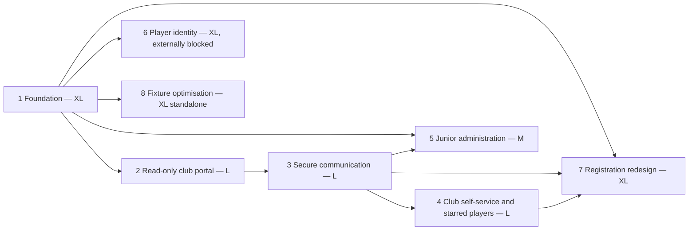

# Delivery Roadmap and Implementation Backlog

**Planning baseline:** 26 July 2026
**Estimation:** Relative size only; no calendar estimate is credible without team size, capacity and external lead times
**Status:** Recommended delivery sequence

The evidence labels defined in [00-executive-summary.md](00-executive-summary.md) apply throughout this document.

## Delivery principles

- Retain the modular Go monolith and PostgreSQL; introduce bounded modules incrementally.
- Preserve captain-report routes, calculations, sanctions and current-season operations.
- Establish identity, tenant authorization, audit and safe files before club-private workflows.
- Use server-side feature flags by module and pilot club.
- Reconcile and prove read models before enabling writes.
- Parallel-run any workflow that replaces an official email/form/process.
- Keep externally blocked player/photo/write features disabled.
- Treat solver/AI outputs as advice and require named human decisions.
- Roll back feature exposure/configuration, not historical evidence.

## Recommended sequence

Player identity, registration and fixture discovery can research in parallel after governance is available, but production data/functions cannot bypass their gates.

## Epic 1 — Identity and tenancy foundation

| Required field | Backlog definition |
|---|---|
| **Epic name** | Foundation — identity, named accounts, tenancy and platform controls |
| **Business outcome** | GMCL can grant and revoke attributable, least-privilege access without weakening current captain services |
| **Scope** | Managed OIDC integration; passkeys/password+TOTP; invitations/recovery; users/identities/sessions; club memberships; season/team/competition roles; tenant policy/RLS framework; audit; notification outbox; private attachment pipeline; club/team/contact reconciliation; support/admin tooling |
| **Non-goals** | Replacing captain reporting; moving every legacy table behind RLS; club business workflows; photo/registration/fixture features |
| **Dependencies** | Provider procurement/DPA; role owners; authoritative club/contact evidence; data classification/retention; object store/scanner; incident/support ownership |
| **User roles** | GMCL Super Administrator, Club Liaison Officer, Club Primary Administrator, security/support, auditors; all later roles consume foundation |
| **Data involved** | User, Identity, Session, Invitation, ClubMembership, RoleAssignment, Club/Team mappings, Notification, Attachment, AuditEvent |
| **Security considerations** | OIDC code+PKCE, passkeys, step-up, two-person recovery, revocation, deny-by-default policy, RLS for new private tables, CSRF/rate limiting, secret management, tamper-evident audit |
| **Privacy considerations** | Identity/contact minimization, DPA/subprocessors, provider retention, device/IP proportionality, privacy notices, access/deletion processes |
| **External dependencies** | Managed IdP, email provider, private object storage/malware scanning; procurement and operational agreements |
| **Relative size** | **Extra Large** |
| **Required skills** | Go/PostgreSQL, identity/OIDC/WebAuthn, application security, platform/SRE, data migration, QA automation, accessibility, DPO/legal, service design/support |
| **Key risks** | Incorrect tenancy, unsafe recovery, identity duplicates, provider lock-in/outage, role-policy ambiguity, migration affecting captains |

### User stories

- As a Club Liaison Officer, I can invite the verified first Primary Administrator for one club and see the evidence/approval history.
- As a person serving two clubs, I can use one identity but select one acting club and role at a time.
- As a Primary Administrator, I can see and revoke my sessions and current appointments.
- As GMCL, I can revoke a role and all affected sessions immediately.
- As an auditor, I can trace sensitive grants, recovery and access without seeing authentication secrets.

### Acceptance criteria

1. Given an approved invitation for Club A, when it is redeemed once after strong-authenticator enrolment, then exactly one membership/assignment activates, replay fails generically, and the approval is audited.
2. Given a user with Club A and Club B roles, when Club A is selected and a Club B identifier is requested, then no Club B metadata is disclosed and a security event is recorded.
3. Given an active session, when its role is revoked, then the next request is denied without waiting for cookie expiry and all affected devices show revoked.
4. Given assisted recovery for a Primary Administrator, when fewer than two authorized approvers act, then no reset completes; successful recovery revokes sessions and enforces the sensitive-action hold.
5. Given current captain/report tests, when the foundation flag is disabled or enabled for a pilot, then existing captain routes and calculations behave identically.

### Test requirements

- OIDC issuer/audience/signature/state/nonce/PKCE and key-rotation tests.
- Invitation/recovery replay, enumeration, rate, CSRF and session fixation/revocation tests.
- Generated role/scope policy suite plus PostgreSQL RLS tests.
- Private upload quarantine/signature/malware/signed-access tests.
- Audit append/gap/digest and notification outbox idempotency tests.
- Accessibility tests for enrolment, step-up and recovery.
- Existing `go test ./...`, race/security tooling and captain/sanctions regression.

### Migration requirements

- Reconcile authoritative club/team/contact identifiers and quarantine ambiguities.
- Link existing captains/admins to named users only after verification; never infer identity from email alone.
- Preserve legacy sessions/routes during controlled parallel run.
- Backfill provenance and legacy mapping IDs; reconcile counts and samples.

### Operational requirements

- IdP/object-store/scanner/email health dashboards and runbooks.
- Role/recovery/support playbooks, staffed escalation and break-glass review.
- Key/secret rotation, backup/restore and incident exercises.
- Pilot help material and accessible alternative enrolment.

## Epic 2 — Read-only club portal and action centre

| Required field | Backlog definition |
|---|---|
| **Epic name** | Read-only club portal — reports, team cards, sanctions and history |
| **Business outcome** | Clubs can see trusted current-season obligations and official records with source drill-down instead of asking GMCL for routine status |
| **Scope** | Club shell/navigation; season/team filters; action centre; reports due/submitted/late/missed; exemptions/correction windows; team-level cards/sanctions/deductions; derived club totals; history/source/audit drill-down; accessible responsive UX |
| **Non-goals** | Direct editing of official data; general messaging; starred submissions; registration/photos; fixture generation |
| **Dependencies** | Epic 1; reconciled club/team/season mappings; read-model definitions; sanction/report source owners; dashboard metric contracts |
| **User roles** | Club Primary Administrator, Club Administrator, Secretary, Captain/Manager, Read-only Club User, Compliance/Admin viewers |
| **Data involved** | Club, Team, Season, Fixture, ReportRequirement, CaptainReport, Exemption, sanctions cases/decisions/ledger, AuditEvent read projections |
| **Security considerations** | Scoped repository over legacy data, authorized counts/detail, no foreign search, field filtering, export disabled by default |
| **Privacy considerations** | Avoid unnecessary captain/contact data; redacted audit views; source/retention classification |
| **External dependencies** | Play-Cricket fixture/scorecard freshness for applicable source rows; no new external capability |
| **Relative size** | **Large** |
| **Required skills** | Go/PostgreSQL, domain/data analysis, UX/accessibility, QA/authorization, operations |
| **Key risks** | Incorrect mapping or totals, exposing another club, confusing potential versus official findings, current-season disruption |

### User stories

- As a club official, I see prioritized reports, notices and deadlines for my club/season.
- As a captain, I can reach the existing report flow and view my team source record.
- As a club official, I can expand a club card total into its team-level ledger entries.
- As a historical viewer, I can select a season and see the rules/status effective then.
- As GMCL, I can explain the source/as-at and calculation behind every metric.

### Acceptance criteria

1. Given a Club A user, when a dashboard count is opened, then the same scope is enforced on the detail query and every row belongs to Club A.
2. Given card/sanction ledger entries for several teams, when a club total is shown, then it reconciles exactly to included team rows and links to them; no stand-alone club card value exists.
3. Given a report requirement with submission/exemption/correction period, when displayed, then team, fixture, season, source, status, effective/deadline dates, rule and permitted action are present.
4. Given an external source is stale, when the page loads, then it shows the last successful synchronization and does not label missing data as zero/compliant.
5. Given keyboard and 320-pixel viewport use, when core action/detail journeys are tested, then all information/actions remain operable to WCAG 2.2 AA target.

### Test requirements

- Golden reconciliation tests for reports, exemptions and team/club sanction totals.
- Club/team/season horizontal authorization across list/count/detail/history.
- Historical season/rule rendering and stale-source states.
- Browser E2E for dashboard/source drill-down/current captain handoff.
- Accessibility, performance and query-plan tests.

### Migration requirements

- Create read-only mappings/projections over legacy report/sanction tables.
- Reconcile counts/hashes for pilot clubs with GMCL and club representatives.
- No source-table rewrite; record mapping exceptions and manual resolutions.

### Operational requirements

- Source freshness and projection error monitoring.
- Feature flag/pilot club enablement, support scripts and rollback by disabling views.
- Published metric definitions and data correction escalation.

## Epic 3 — Secure communication and case management

| Required field | Backlog definition |
|---|---|
| **Epic name** | Secure communication — cases, assignment and parallel email |
| **Business outcome** | GMCL and clubs can track accountable questions, responses, deadlines and outcomes without losing the official email record |
| **Scope** | Configurable categories/templates; club-addressed cases; visible messages; separate internal notes; assignments/watchers; priorities/status/deadlines; acknowledgements/read receipts; safe attachments; search/filters; notifications/delivery/bounces/retries/reminders; parallel Rule 1.5 operation |
| **Non-goals** | Replacing email as official channel; detailed safeguarding repository; AI over message bodies |
| **Dependencies** | Epics 1–2; category/queue/retention owners; attachment platform; Rule 1.5 interpretation; email/n8n integration |
| **User roles** | Club roles by category; Board/Admin, CLO, Compliance, Registration, Junior, Fixture roles; auditors |
| **Data involved** | MessageCase, ClubVisibleMessage, InternalNote, Assignment, Watcher, Attachment, Notification, Acknowledgement, CaseEvent |
| **Security considerations** | Separate stores/repos/RLS/API types, content-free email, scan/quarantine, scoped search/export, state concurrency, leakage tests |
| **Privacy considerations** | Category-based minimization/retention, read-receipt proportionality, no safeguarding content, processor review |
| **External dependencies** | Email remains official; SMTP/SES delivery and bounce data; object storage/scanner |
| **Relative size** | **Large** |
| **Required skills** | Go/PostgreSQL, security, messaging/deliverability, UX, QA, DPO/records management, service operations |
| **Key risks** | Internal-note leakage, misaddressed bulk message, email/portal divergence, attachment malware, unclear case ownership |

### User stories

- As a club, I can ask GMCL a question and follow one club-visible timeline.
- As a GMCL officer, I can triage, assign, watch, escalate and resolve a case.
- As an authorized GMCL officer, I can add an internal note that can never reach club channels.
- As a club administrator, I retain club-addressed case history when another volunteer leaves.
- As operations, I can see delivery, bounce, retry and overdue states.

### Acceptance criteria

1. Given only an internal note is added, when any club API/list/count/search/export/email/Hawk route runs, then its output is unchanged and reveals no note metadata.
2. Given a club reply commits and email delivery fails, then one message exists, an idempotent outbox retry is recorded, and case state remains truthful.
3. Given a case is reassigned, then previous/current owners, reasons and timestamps remain in the timeline and only authorized queues can receive it.
4. Given a campaign selects clubs/roles, then the preview records the selector/version, each club sees only its child case, and excluded/missing adult roles are reported.
5. Given Rule 1.5 remains active, then required email delivery and portal state are both recorded and portal acknowledgement is not presented as replacing official email.

### Test requirements

- Dedicated internal-note leakage suite across serialization, counts, indexes, notifications, exports and AI.
- Case state/concurrency, assignment/escalation and campaign isolation.
- Notification idempotency, bounce/complaint/retry/dead-letter.
- Malicious attachment and signed-access tests.
- Cross-category/club/role authorization and accessibility E2E.

### Migration requirements

- Do not indiscriminately import mailboxes. Define whether active cases need manual creation/linking.
- Reuse sanctions case concepts but do not merge official sanctions content into generic messages.
- Import templates/categories only after owner review; establish parallel-email reference format.

### Operational requirements

- Category queues, duty cover, targets and escalation runbooks.
- Delivery/scan/search monitoring and misaddressed-message incident playbook.
- Staff/club training on visible message versus internal note.
- Controlled feature rollback while preserving cases.

## Epic 4 — Club self-service and starred players

| Required field | Backlog definition |
|---|---|
| **Epic name** | Club self-service — contacts, corrections, evidence and versioned starred players |
| **Business outcome** | Clubs maintain their owned information and submit reviewable changes without rewriting official records; compliance gets reproducible potential findings |
| **Scope** | Contact/preferences direct edits; verified-contact review; correction/appeal workflows; evidence; starred drafts/versions/entries/exemptions/deadlines/review/publication; deterministic potential findings; Hawk rule explanations with guardrails |
| **Non-goals** | AI decisions/actions; permanent hard-coded 2026 Rule 3.5; unrestricted player documents; automatic sanctions |
| **Dependencies** | Epics 1–3; activated rule releases/decision tables; player/scorecard reconciliation; rule owner; Hawk provider/DPA and trusted retrieval |
| **User roles** | Club Primary/Admin/Secretary, Compliance Officer, Board/Admin, auditor; Hawk subject to same scopes |
| **Data involved** | Contact versions, CorrectionRequest, Attachment, StarredList/Version/Entry, Exemption, PotentialFinding, RuleRelease/Decision, AIResponseAudit |
| **Security considerations** | Official data versioning, no mass assignment, reviewer separation, club isolation, AI no-action tools, prompt-injection/citation validation |
| **Privacy considerations** | Player/category/evidence minimization, AI provider exclusion rules, retention and access audit |
| **External dependencies** | Rule 3.5 releases, scorecard feed, AI procurement/DPA if external |
| **Relative size** | **Large** |
| **Required skills** | Go/PostgreSQL, rules/domain analysis, applied AI security, UX, QA, compliance operations, DPO |
| **Key risks** | Misencoded rules, identity ambiguity, false positives, users treating Hawk as authoritative, missed deadlines/version confusion |

### User stories

- As a club, I can directly update owned contact/preferences and request review of official records.
- As a club official, I can fork, validate and submit a new starred-list version.
- As a Compliance Officer, I can compare versions/evidence and decide without overwriting the previous list.
- As a reviewer, I receive deterministic potential findings with exact input and rule versions.
- As an authorized user, I can ask Hawk for a cited explanation, never a decision.

### Acceptance criteria

1. Given an approved starred Version 3, when Version 4 is submitted/rejected/approved, then Version 3 remains immutable and effective until a successor effective date.
2. Given a match date, when detection runs twice with identical inputs, then one idempotent potential finding exists with exact scorecard/list/exemption/rule versions and no sanction is created.
3. Given an ambiguous player match, then the system creates a reconciliation task and cannot produce a confirmed breach automatically.
4. Given a club Hawk query containing another club's ID or an instruction to reveal internal notes, then no foreign/internal tool data is available and no existence is disclosed.
5. Given an official correction, when approved, then a new effect/version records requester, reviewer, reason and effective date while the original remains visible.

### Test requirements

- Rule-release historical corpus, dates/deadlines/BST and exemptions.
- Version/state/concurrency and separation-of-duties.
- Player reconciliation/idempotence and false-positive shadow comparison.
- Prompt injection, tenant bypass, citation failure, provider outage and no-action invariants.
- Evidence scanning/access and club-visible decision timeline.

### Migration requirements

- Import current published starred data into provenance-labelled initial versions.
- Do not infer historic approval actors/reasons that are unavailable.
- Reconcile player references; quarantine ambiguous entries.
- Pilot correction requests without changing existing official write paths until verified.

### Operational requirements

- Rule release activation/diff/review process.
- Compliance queue, shadow-mode thresholds and human-review guidance.
- Hawk model/provider/source monitoring and refusal/escalation path.
- Deadline/override support and communications.

## Epic 5 — Junior administration

| Required field | Backlog definition |
|---|---|
| **Epic name** | Junior administration — verified adult communications and safeguarding boundary |
| **Business outcome** | Junior competition notices reach accountable adult club roles with acknowledgements while child and safeguarding data remain minimized and restricted |
| **Scope** | Junior role/scopes; club/competition/age-group audience selection; templates/scheduling; adult recipient resolution; delivery/acknowledgement/reminders; restricted navigation; neutral safeguarding handoff |
| **Non-goals** | Junior accounts/direct messages; detailed safeguarding repository in ordinary cases; player-photo functionality |
| **Dependencies** | Epics 1 and 3; DPIA; adult role data; safeguarding process/owners; privacy notices/retention; Rule 1.5 |
| **User roles** | Junior Competition Administrator, Club Junior Secretary, approved adult contacts, Club Safeguarding Officer/Safeguarding Officer through separate route |
| **Data involved** | Adult role appointments, junior competition/age-group selector, cases/notices, delivery/acknowledgement, restricted handoff reference |
| **Security considerations** | No default admin inheritance, category/competition scope, separate safeguarding route, content-free email, audience preview |
| **Privacy considerations** | Best interests, high privacy default, no child recipient list, minimization, SAR/deletion/retention processes, DPIA |
| **External dependencies** | GMCL safeguarding policy/official route, DPO approval, email channel |
| **Relative size** | **Medium** |
| **Required skills** | Go/PostgreSQL, safeguarding and DPO expertise, service/UX/accessibility, email operations, QA/security |
| **Key risks** | Misrouting, excessive child data, safeguarding leakage, missing adult appointments, published photo-rule conflict |

### User stories

- As the Junior Competition Administrator role, I can target verified adult roles by club/competition/age group.
- As an adult club official, I can receive, read and acknowledge a notice.
- As operations, I can see clubs with no valid recipient and escalate safely.
- As a referrer, I can reach the official safeguarding route without placing detail in a general case.

### Acceptance criteria

1. Given a junior campaign, when recipients resolve, then only verified current adult appointments are selected and no junior player contact is queried.
2. Given an expired Club Junior Secretary, when a scheduled message sends, then that identity is excluded and the missing-route exception is surfaced.
3. Given an ordinary Junior Administrator requests safeguarding data, then access is denied without metadata disclosure and audited.
4. Given a safeguarding handoff, then ordinary case/search/export/AI stores contain only the approved neutral reference/status.
5. Given no approved photo interpretation/agreement, then the junior module cannot request or display player photographs.

### Test requirements

- Adult role resolution, scheduled audience drift and acknowledgement.
- Cross-club/competition/category access.
- Safeguarding negative tests and incident exercise.
- Content-free notifications, bounce/reminders and accessibility.
- DPIA control traceability and retention/legal-hold tests.

### Migration requirements

- Verify adult contacts/appointments; do not convert generic mailboxes into users.
- Inventory current Joe-operated templates/lists/schedules without hard-coding the individual.
- Parallel-run current email records and reconcile acknowledgements.

### Operational requirements

- Named junior/safeguarding cover, urgent escalation and privacy training.
- Missing-recipient and misaddress incident playbooks.
- Template/selector change approval and annual adult-role recertification.

## Epic 6 — Player identity

| Required field | Backlog definition |
|---|---|
| **Epic name** | Player identity — reconciled players and time-bound match-day photographs |
| **Business outcome** | Authorized match officials can perform a minimal visual identity check where data rights and accuracy are proven |
| **Scope** | Agreement discovery; player/external-reference reconciliation; approved source/photo status; private photo lifecycle if permitted; fixture appointment/window; minimal match-day view; manual fallback |
| **Non-goals** | Facial recognition/biometrics; public/bulk roster; scraping; shared Play-Cricket credentials; assuming photo absence means ineligible |
| **Dependencies** | Epic 1; ECB/Play-Cricket agreement; DPIA/controller/lawful-basis decisions; photo-policy conflict resolution; official appointments/rosters; source quality |
| **User roles** | Umpire, approved Match Official/restricted checker or explicitly approved opposing Captain, Registration/Data Protection staff |
| **Data involved** | Player, ExternalPlayerReference, registration observation, fixture roster, PlayerPhoto/source/approval, sensitive access audit |
| **Security considerations** | Exact fixture/window, rate limiting, no bulk/export/cache, short-lived access, private storage, revocation and harvesting monitoring |
| **Privacy considerations** | Photos/juniors high risk, purpose limitation, notices, minimum fields, retention, no AI, rights/correction |
| **External dependencies** | **Externally blocked:** API/export/photo access and redisplay terms; DPA/agreement |
| **Relative size** | **Extra Large** |
| **Required skills** | API/data integration, Go/PostgreSQL, identity reconciliation, mobile UX, security, DPO/safeguarding/legal, QA |
| **Key risks** | No contractual permission, stale/wrong photos, duplicate players, harvesting, junior exposure, ground connectivity |

### User stories

- As a data steward, I can reconcile external member references without silently merging people.
- As an appointed official, I can view only the exact fixture roster during the approved window.
- As an official, I receive a clear manual route when no authorized/current photo exists.
- As a player/club, I can request correction of identity/photo data.

### Acceptance criteria

1. Given no written photo agreement/DPIA approval, then the feature flag cannot expose a photo route in any environment containing live data.
2. Given an appointed official outside the fixture window or for another fixture, then no player/photo metadata is returned.
3. Given a missing/rejected/stale photo, then the view states that no authorized photo is available and invokes the approved manual path without declaring ineligibility.
4. Given 100 sequential/bulk photo requests, then rate/authorization controls stop harvesting and generate an alert.
5. Given ambiguous external identities, then no automatic merge occurs and historic records retain provenance.

### Test requirements

- Provider contract/sandbox tests and low-traffic caching.
- Identity duplicate/correction/transfer and stale-source scenarios.
- Exact fixture/window/role authorization and photo signed-access/cache headers.
- Harvesting/rate/mobile/offline failure/accessibility.
- DPIA/security penetration test and incident exercise.

### Migration requirements

- Start with external references, not photographs.
- Import only agreement-permitted data with provenance/as-at.
- Human-reconcile duplicates; do not create players from names alone.
- Pilot photos separately and purge test/live data according to agreement.

### Operational requirements

- Data-quality/photo correction queue and ground-side fallback.
- Provider/source health and access-anomaly monitoring.
- Immediate revocation/withdrawal process and processor-termination deletion.

## Epic 7 — Player registration redesign

| Required field | Backlog definition |
|---|---|
| **Epic name** | Registration redesign — guided external handoff and versioned GMCL decision |
| **Business outcome** | Players and clubs see one clear task/status journey while GMCL preserves mandatory external and human approvals |
| **Scope** | Process/form inventory; nine registration routes; dynamic rules/checklist; applications/versions; club/player/GMCL tasks; secure evidence; transfer coordination; Level 2 Play-Cricket handoff/reconciliation; decisions/review; form retirement |
| **Non-goals** | Unsupported Play-Cricket writes/webhooks; scraping/browser automation; replacing Rule 3.1 direct email before amendment; Hawk eligibility decisions |
| **Dependencies** | Epics 1 and 3; rule tables; forms/process evidence; DPO/DPIA; Registration Officers; external identifiers/agreement; photo feature optional/gated |
| **User roles** | Player/responsible adult, Club Primary/Admin/Play-Cricket Administrator, former-club officer, Registration Officer, auditor |
| **Data involved** | Player, ExternalReference, RegistrationApplication/Version/Requirement, TransferClearance, Document, external state observations, decisions/audit |
| **Security considerations** | Signed applicant links, restricted documents, duplicate/replay decision controls, separation of duties, step-up, no credentials |
| **Privacy considerations** | Category/visa/document minimization, age-appropriate route, retention/lawful basis, secure links and restricted exports |
| **External dependencies** | Play-Cricket manual/read reconciliation, Rule 3.1 direct email, form owners, possible later API agreement |
| **Relative size** | **Extra Large** |
| **Required skills** | Product/process analysis, Go/PostgreSQL, rules engine, secure files, API integration, UX/content/accessibility, DPO/legal, QA, change management |
| **Key risks** | Incorrect process map, rule/category errors, sensitive-document exposure, duplicate identity/decision, external state divergence, premature form retirement |

### User stories

- As a player/club, I answer only questions applicable to my registration route.
- As a former-club officer, I can supply the currently required direct-email clearance with a case reference.
- As a Registration Officer, I review a complete version, request information and make a reasoned decision.
- As an applicant, I see Play-Cricket as a named external task and its last reconciled status.
- As operations, I can retire a suitable form only after parallel reconciliation.

### Acceptance criteria

1. Given each of the nine required registration scenarios, then the activated rule release produces a tested checklist, citation, owner and deadline.
2. Given a transfer under current Rule 3.1, then a forwarded/applicant-approved clearance cannot satisfy the requirement; only verified direct evidence recorded by an authorized officer can.
3. Given internal approval but outstanding external state, then the application remains explicitly external-pending and is not shown as complete.
4. Given two concurrent approval commands, then only one terminal decision/version succeeds and one notification is emitted.
5. Given a form retirement candidate, then field/process inventory, historical import, count/hash reconciliation, owner sign-off, archive and rollback are complete before links close.

### Test requirements

- Nine-route historical rule/deadline corpus.
- Application state/concurrency/idempotency and more-information/resubmission.
- Document malware/access/retention and sensitive field authorization.
- Transfer direct-email/fallback/non-response.
- External reconciliation/staleness/duplicate player and unsupported write prevention.
- Full E2E/accessibility/security tests.

### Migration requirements

- Inventory every form/sheet/script/consumer and identify authority.
- Import minimum historical metadata with provenance; do not copy attachments without need.
- Pilot one low-complexity route in parallel, reconcile every result.
- Read-only archive and communications before staged retirement.

### Operational requirements

- Registration queues/SLAs/cover, document review training and DPO support.
- Manual external reconciliation and provider outage route.
- Rule release/override governance and form rollback.

## Epic 8 — Fixture optimisation

| Required field | Backlog definition |
|---|---|
| **Epic name** | Fixture optimisation — discovery, CP-SAT decision support and controlled publication |
| **Business outcome** | GMCL can create and compare valid, explainable schedules more efficiently while preserving human policy and publication authority |
| **Scope** | Process interviews; data/constraint catalogue; historical corpus; immutable inputs; isolated OR-Tools CP-SAT prototype; candidate scoring/comparison; validation; locks/overrides; partial regeneration; approval/version/export/publication controls |
| **Non-goals** | Immediate production generator; auto-publication; invented constraints/weights; solver access to production publication secrets |
| **Dependencies** | Epic 1 platform/audit; fixture process/data owners; historic schedules/overrides; approved metrics/constraints; publication method/agreement; isolated worker platform |
| **User roles** | Fixture Administrator, independent approver/Board Administrator, club constraint contributors, auditor |
| **Data involved** | TeamSeasonEntry, venue/resource, calendar, FixtureConstraint, SolverRun, FixturePlan/Version, Override, published Fixture mappings |
| **Security considerations** | Isolated/resource-limited worker, schema limits, no publication credential, independent validation, step-up/separation of duties, idempotent publication |
| **Privacy considerations** | Club preferences/constraints scoped; avoid unnecessary personal data; external data terms |
| **External dependencies** | Current Play-Cricket publication/import method and permissions; mapping/data sources |
| **Relative size** | **Extra Large, standalone programme** |
| **Required skills** | Operations research/CP-SAT, data engineering, Go/Python worker integration as approved, PostgreSQL, UX/data visualization, SRE/security, fixture-domain experts, QA |
| **Key risks** | Unknown/inconsistent constraints, infeasibility, unfair objective, poor history, solver runtime, lost overrides, publication error |

### User stories

- As a Fixture Administrator, I can catalogue a constraint with owner, version, priority and example.
- As an administrator, I can generate several candidates and compare hard validity/objective components.
- As an administrator, I can lock/override a fixture with a reason that survives regeneration.
- As an independent approver, I can approve the exact validated version and publish through a controlled adapter/export.
- As an auditor, I can reproduce a candidate from recorded inputs/configuration.

### Acceptance criteria

1. Given identical immutable inputs/catalogue/configuration, when replayed, then the accepted candidate and objective components are reproducible within documented solver determinism.
2. Given any hard constraint violation, then independent validation blocks approval/publication and identifies the affected records/constraints.
3. Given an approved manual lock and partial regeneration, then it remains unchanged unless an authorized successor override records the conflict/reason.
4. Given a generated candidate, then no solver identity/service can approve or publish it.
5. Given publication failure after partial external writes, then reconciliation identifies exact differences and the last published GMCL version remains available for controlled rollback.

### Test requirements

- Historical replay, property/metamorphic and deliberate infeasibility.
- Opponent/count/team/ground/home-away/lock/withdrawal/bye/travel assertions.
- Worker resource/input/timeout isolation and deterministic metadata.
- Authorization/approval/publication idempotency and rollback.
- Administrator usability and fairness review.

### Migration requirements

- Inventory and version source spreadsheets/scripts.
- Reconcile teams/venues/calendars and capture historic overrides.
- No production migration until shadow results are signed off.
- Import published versions with provenance; preserve existing publication route initially.

### Operational requirements

- Solver queue/capacity/diagnostic monitoring.
- Fixture change, partial regeneration and publication/rollback runbooks.
- Objective/constraint change governance and club communication.
- Decision-support pilot before any controlled publishing.

## Cross-epic quality backlog

The following work is part of every epic rather than a final hardening phase:

- architecture decision records and data-flow updates;
- server authorization policy and negative tests;
- versioned migrations with rollback/recovery rehearsal;
- accessibility/content design and representative user research;
- audit/observability/runbooks and support tooling;
- privacy classification, lawful basis, retention and processor checks;
- threat modelling and secure code review;
- performance/query/load testing proportional to module;
- data reconciliation reports and sign-off;
- documentation/training/change communication.

## Pilot and rollout controls

| Control | Required behavior |
|---|---|
| Feature flags | Server-side, module/action/club scoped; deny routes when off |
| Pilot clubs | Representative sizes/workflows; written support and feedback path |
| Parallel running | Existing official route continues until reconciliation/owner sign-off |
| Data reconciliation | Count, hash, exception and representative record review |
| Support/training | Role-specific guidance, recovery and escalation rehearsals |
| Rollback | Disable new action/UI safely; preserve submitted official history; restore prior config/version |
| Communications | Exact scope, status meanings, rule/external limitations and fallback |
| Rule/policy changes | Published/effective before dependent feature claims authority |

## Production-readiness gates

Each enabled epic must pass:

1. Product owner, operational owner, security and DPO acceptance of scope/non-goals.
2. Role matrix and authorization suite complete, including cross-club direct API tests.
3. Migrations tested on representative copies with reconciliation and restore.
4. Threat-model risks resolved/accepted with expiry and owner.
5. Applicable DPA/DPIA/rule/external agreement approved.
6. Accessibility target and representative journey tests pass.
7. Monitoring, alerts, on-call/support and incident/rollback runbooks live.
8. Load/failure behavior within approved objectives.
9. Pilot evidence and no unexplained high-severity data/authorization discrepancy.
10. Existing captain/report/sanctions regression and `go test ./...` pass.

Additional gates:

- messaging: zero internal-note leakage in dedicated suite;
- starred/Hawk: historical rules and no-action/prompt-injection tests;
- junior: DPIA/safeguarding route and adult-recipient proof;
- photos: written ECB/Play-Cricket rights and privacy approval;
- registration: exact process inventory and parallel-form reconciliation;
- fixtures: hard validation, reproducibility and human-only publication.

## Relative prioritization

**Recommendation:** Fund Epics 1–3 as the initial MVP programme. Epic 4 follows because it builds on secure cases/rules and yields club self-service. Epic 5 is bounded but cannot precede privacy/safeguarding governance. Epics 6–8 are separate large programmes: player identity is externally blocked, registration needs deep process/rules work, and fixtures require operations-research discovery.

No calendar promises should be made until GMCL confirms delivery capacity, named skills, procurement lead times, pilot availability and decision-owner availability.
