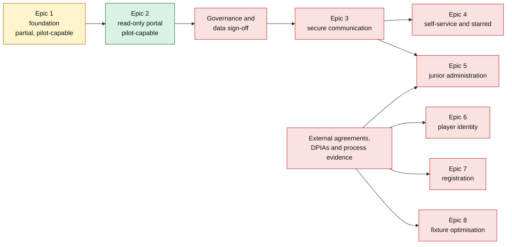

# Implementation Status and Delivery Gates

**Status date:** 27 July 2026

**Implementation branch:** `codex/club-operations-portal`

**Purpose:** Evidence-based handoff from the planning pack to test-server delivery

The evidence labels defined in [00-executive-summary.md](00-executive-summary.md) apply throughout this document.

## Status definitions

| Status | Meaning |
|---|---|
| **Implemented and verified** | Code, migrations and tests exist on this branch and the behavior has passed the recorded local/disposable-environment checks. |
| **Implemented; live gate remains** | The technical mechanism exists, but real people or live data must not use it until the named governance, procurement, privacy or operational evidence is approved. |
| **Partially implemented** | A safe subset exists; one or more explicit acceptance criteria remain unmet. |
| **Not implemented — gated** | Building the feature now would require inventing policy, authority, data rights, retention, safeguarding controls or an external capability. |
| **Existing service preserved** | The repository already has related behavior, but it is not represented as completion of the new portal epic. |

Passing tests is necessary but does not turn an unresolved policy or external dependency into an implementation default.

## Delivery truth

**Verified fact:** The branch contains a secure foundation and a feature-flagged read-only club pilot. It does not contain the complete eight-epic programme.

**Recommendation:** Deploy only the synthetic/test-server slice described in [17-implementation-and-test-server.md](17-implementation-and-test-server.md). Do not expose live identities, approve a production pilot or describe later epics as delivered until their gates below are closed.

## Epic 1 acceptance evidence — identity and tenancy foundation

| Criterion | Status | Implementation and verification evidence | Remaining gate |
|---|---|---|---|
| 1.1 Approved invitation activates exactly one membership/assignment; replay fails; approval is audited | **Implemented; live gate remains** | Invitation creation requires an official-contact evidence reference and records the approving legacy administrator ([identity_store.go](../../internal/portal/identity_store.go#L190)). Redemption locks and consumes an approved, unexpired token, requires a verified matching provider email, creates or activates one membership/assignment and writes outbox/audit evidence ([identity_store.go](../../internal/portal/identity_store.go#L266)). The signed OIDC lifecycle integration test covers redemption and replay ([oidc_integration_test.go](../../internal/portal/oidc_integration_test.go#L27)). Pilot preflight requires either the generic baseline/step-up ACR contract or a verified Cognito policy; Cognito step-up requires forced reauthentication and a fresh `auth_time` ([oidc.go](../../internal/portal/oidc.go), [preflight.go](../../internal/portal/preflight.go)). | `B-01` must approve the Cognito security/DPA position and verified User Pool policy; `B-02` must name approvers and define acceptable official-contact evidence. |
| 1.2 One multi-club identity cannot disclose another club when acting as Club A | **Implemented and verified** | Acting contexts are separately selected and rotate the bearer token ([store.go](../../internal/portal/store.go#L570), [store.go](../../internal/portal/store.go#L659)). Tenant transaction context, application authorization and forced RLS are exercised by the cross-tenant integration suite ([rls_integration_test.go](../../internal/portal/rls_integration_test.go#L15)). Rejected filters write a denial audit without confirming whether the requested identifier exists ([filters.go](../../internal/portal/filters.go#L155)). | Production use still requires `B-03`, `B-04` and `I-08`; those gates affect the correctness of real assignments and mappings, not the negative technical control. |
| 1.3 Revoked role denies the next request and invalidates affected sessions | **Implemented and verified** | Authentication revalidates current user, membership, assignment, feature and security-version state on every request ([store.go](../../internal/portal/store.go#L412)). Assignment and club-access revocation invalidate affected sessions transactionally; individual and all-device revocation are also implemented ([store.go](../../internal/portal/store.go#L787), [store.go](../../internal/portal/store.go#L859), [store.go](../../internal/portal/store.go#L911)). The end-to-end database lifecycle covers immediate denial and the club kill switch ([oidc_integration_test.go](../../internal/portal/oidc_integration_test.go#L27)). | None for the mechanism. The final role/revocation operating policy is still `B-03`. |
| 1.4 Assisted Primary Administrator recovery needs two authorized approvers and revokes sessions | **Not implemented — gated** | No application recovery workflow is exposed. OIDC step-up and all-device revocation exist, but they are not misrepresented as assisted recovery. | `P-05` must define and rehearse the support route; `B-03` must define authorized recovery approvers and separation of duties; `P-09` must define provider-outage fallback. |
| 1.5 Existing captain behavior remains identical with portal flags off/on | **Implemented and verified** | Portal routes are additive and feature-flagged. The captain handoff validates the selected club/team pair without replacing the magic-link flow ([captain_portal_integration_test.go](../../internal/httpserver/captain_portal_integration_test.go#L18)). Full host and Linux race suites, clean migrations and legacy HTTP smoke checks are recorded in the [implementation runbook](17-implementation-and-test-server.md#validation-recorded-for-this-branch). | A production-like pilot regression is still part of `P-04` and the production-readiness gates. |

### Epic 1 scope not yet complete

| Planned foundation capability | Current state | Why it stops here |
|---|---|---|
| Managed identity provider | Provider-neutral OIDC Authorization Code + PKCE remains available. An AWS Cognito profile now validates issuer shape, rejects unsupported ACR configuration, verifies Cognito ID-token purpose and authentication time, and requires fresh same-user forced reauthentication for step-up. A read-only AWS policy verifier gates the deployment attestation. | AWS procurement/DPA approval, real User Pool configuration and recovery support remain external (`B-01`, `P-05`, `P-09`). |
| Named accounts, identities, memberships and scoped roles | Implemented in separate tables and tenant-scoped repositories. Current appointments and active sessions are user-visible. | Real grantors, delegations, expiry and separation rules need `B-03`, `I-01` and `I-02`. |
| Audit, notifications and operational preflight | Implemented with append-only versioned hash chains, allowlisted account-security notifications, retry/dead-letter health and a fail-closed preflight. | Production alert ownership, RPO/RTO and on-call arrangements need `P-02` and `P-03`. |
| Private attachment pipeline | Only the tenant-private schema and RLS boundary exist. No upload, object-store, quarantine, malware scanning, signed download or deletion worker is exposed. | Object-store/scanner selection, attachment access matrix and retention need `I-03` and `P-01`. |
| Reconciliation | The Super Administrator pilot view exposes mapping completeness and exceptions without rewriting legacy sources. | Authoritative mapping and exception sign-off need `B-04` and `I-08`. |
| Assisted recovery | Not implemented. | It cannot safely precede `P-05`, `B-03` and `P-09`. |

## Epic 2 acceptance evidence — read-only club portal

| Criterion | Status | Implementation and verification evidence | Remaining gate |
|---|---|---|---|
| 2.1 Dashboard counts and details enforce the same Club A scope | **Implemented and verified** | Summary and detail repositories both derive club/team/season from the effective assignment and tenant transaction ([read_model.go](../../internal/portal/read_model.go#L51), [history.go](../../internal/portal/history.go#L43)). Filters can only narrow access ([filters.go](../../internal/portal/filters.go#L37)). Database integration covers Club A/Club B, team and season denial. | Real-data correctness needs mapping sign-off under `B-04` and `I-08`. |
| 2.2 Club sanction total exactly reconciles to team ledger rows | **Implemented and verified** | The summary is a sum over `sanction_card_ledger_entries`; displayed team rows are grouped from the same ledger and no club card record is created ([read_model.go](../../internal/portal/read_model.go#L248)). Unlinked legacy sanctions are counted separately and visibly excluded. The tenant-scoped source history selects only public case fields ([history.go](../../internal/portal/history.go#L220)). | Pilot sample/count sign-off remains `B-04` and `P-04`. |
| 2.3 Report requirement shows team, fixture, season, source, status, dates, governing basis and permitted action | **Partially implemented** | The report history shows selected season, team, fixture/match/submission identifiers, match/effective date, derived status, deadline, exemption reason and view-only/captain-handoff action ([portal.go](../../internal/httpserver/portal.go#L118)). It also names the versioned-in-code calculation contract. | No approved governing rule release or correction-period policy is stored, so the UI deliberately does not invent one. Close `B-06` and `I-04`, then add effective-dated rule/correction data and its historical tests. |
| 2.4 Stale source is not shown as zero/compliant | **Implemented and verified** | The dashboard retains the last fixture synchronization, labels data stale after 36 hours and renders missing source as unavailable ([read_model.go](../../internal/portal/read_model.go#L51), [portal.go](../../internal/httpserver/portal.go#L118)). Zero expected records are not presented as a compliance percentage by the unit contract ([read_model_test.go](../../internal/portal/read_model_test.go#L22)). | Source SLA/alert ownership remains `P-03`; the safety behavior itself is implemented. |
| 2.5 Keyboard and 320-pixel journeys meet the WCAG 2.2 AA target | **Implemented; live gate remains** | Server-rendered pages have skip-link focus, current-page semantics, captions/scoped headers and responsive table containers; unit checks cover navigation/semantic output ([portal_test.go](../../internal/httpserver/portal_test.go#L88)). A real 320 CSS-pixel keyboard journey is recorded in the [runbook validation](17-implementation-and-test-server.md#validation-recorded-for-this-branch). | Representative disabled-user/pilot acceptance and formal release sign-off remain `P-04`. |

**Open question:** `I-05` still owns the final action/metric contract. The current pilot uses transparent source-derived counts and does not assert that the prioritization is the final operational design.

## Epics 3–8 — safe stopping points

| Epic | Status | Existing related behavior that remains available | Evidence required before implementation can safely continue | First implementation slice after unblock |
|---|---|---|---|---|
| 3. Secure communication | **Not implemented — gated** | Existing email/SES delivery, n8n jobs and sanctions-case functions remain unchanged. Email remains the official record under Rule 1.5. | `B-05`, `I-03`, `I-06`, `I-07`, `P-01`, `P-08`, `P-11`; approved categories/queues/owners/targets, visible/internal field matrix, retention/search policy and fallback recipients. | Separate `message_cases`, `club_visible_messages` and `internal_notes` tables/repositories/API projections, then a dedicated negative leakage suite before any UI. |
| 4. Club self-service and starred players | **Not implemented — gated** | Existing starred imports, candidate/review tools, sanctions and Hawk rules assistant remain preserved. Hawk has no portal action authority. | `B-06`, `I-04`, `I-09`, `I-10`, `P-06`, `P-07`; activated rule-release process, correction/approval policy, reconciliation thresholds and AI processor approval. | Versioned contact/correction requests and starred-list releases in shadow mode; deterministic potential findings remain human-reviewed. |
| 5. Junior administration | **Not implemented — gated** | No child account, child-recipient or player-photo route has been added. | `B-07`, `B-08`, `I-06`, `P-01`; safeguarding DPIA, separate restricted route, adult-recipient fallback and authoritative photo-rule interpretation. | Verified-current-adult appointment resolution and neutral notices only, with safeguarding negative tests before live data. |
| 6. Player identity | **Not implemented — externally gated** | Existing Play-Cricket fixture/scorecard reads remain unchanged. No photo route, scrape, bulk roster or biometric feature exists. | `B-09`, `I-03`, `I-10`, `P-01`, `P-09`; written API/photo/redistribution/controller terms, DPIA and identity-reconciliation process. | External-reference reconciliation with provenance and ambiguity queue; photos remain disabled until separately approved. |
| 7. Registration redesign | **Not implemented — gated** | Current external/manual registration process is not silently replaced. Direct former-club email remains required under Rule 3.1. | `B-10`, `I-03`, `I-04`, `I-11`, `P-01`, `P-12`; exact process/form inventory, decision table, evidence access and any published Rule 3.1 amendment. | Guided external handoff for one low-complexity route in parallel; no unsupported Play-Cricket write or webhook assumption. |
| 8. Fixture optimisation | **Not implemented — standalone gated programme** | Existing fixture reads and operational publication route remain unchanged. | `B-11`, `I-12`, `P-10`; interviews, historical corpus, hard constraints, fairness/objective definitions and supported publication/rollback method. | Isolated OR-Tools CP-SAT prototype with immutable inputs and independent validation; generated schedules never auto-publish. |

## Decision and dependency closure map

This table makes the next action attributable. “Approved” means written evidence is attached to the delivery record, versioned where applicable, and accepted by the named owner.

| Gate group | Decision records | Owner/evidence needed | Unblocks |
|---|---|---|---|
| Identity procurement and onboarding authority | `B-01`, `B-02` | Procurement/Security/DPO-approved provider contract and DPA; Board/Operations-approved CLO/Super Administrator approvers and official-contact evidence playbook | Live named-account onboarding |
| Authorization and session policy | `B-03`, `I-01`, `I-02` | Signed role/grant/delegation/separation matrix; approved idle/absolute/step-up policy and accessible fallback | Production role administration and recovery design |
| Tenant data authority | `B-04`, `I-08` | Signed club/team/season/competition identifiers, effective-date semantics, exception list and pilot reconciliation | Production read-only portal and all later tenancy |
| Messaging, files and records | `B-05`, `I-03`, `I-06`, `I-07`, `P-01`, `P-08`, `P-11` | Category/queue/owner/target configuration; attachment field-purpose matrix; fallback recipients; retention/lawful basis/search schedule; Rule 1.5 decision | Epic 3 and the shared evidence pipeline |
| Rules, corrections, starred and Hawk | `B-06`, `I-04`, `I-09`, `I-10`, `P-06`, `P-07` | Effective-dated rule releases/decision tables; appeal/approval separation; reconciliation and false-positive thresholds; Hawk processor/security terms | Epic 4 deterministic shadow mode |
| Junior and safeguarding | `B-07`, `B-08` | Approved DPIA, separate safeguarding route and authoritative Rule 7.5.3.3/photo interpretation | Epic 5 |
| ECB/Play-Cricket identity and photos | `B-09` | Written agreement, permitted endpoint/export schema, rate limits, controller/processor/redistribution/retention terms and DPIA | Epic 6 |
| Registration process and rule authority | `B-10`, `I-11`, `P-12` | Exact form/process inventory, nine-route decision table and any published Rule 3.1 change | Epic 7 |
| Fixture process, objectives and publication | `B-11`, `I-12`, `P-10` | Process/constraint catalogue, historical corpus, approved objectives and supported publication/rollback contract | Epic 8 prototype and later controlled publication |
| Cross-cutting operations and pilots | `P-02`, `P-03`, `P-04`, `P-05`, `P-09` | Restore exercise and RPO/RTO; alert/on-call owners; representative pilot cohort and stop criteria; two-person recovery rehearsal; provider/email/manual fallback exercises | Production promotion across all applicable epics |

The detailed wording, owners and delivery gates remain authoritative in [16-open-questions-and-decisions.md](16-open-questions-and-decisions.md).

## Test-server scope

The current branch can be tested safely with:

- synthetic named users and a provider sandbox;
- controlled test mail routed through `EMAIL_OVERRIDE`;
- one synthetic or explicitly approved pilot club;
- read-only fixture, report, exemption and sanction projections;
- invitation, context selection, activity, appointment and session-security journeys;
- feature disable, role revocation, provider failure, SMTP retry and audit-integrity exercises.

The current branch must not be tested with:

- real safeguarding or junior case content;
- real player photographs or bulk player identity data;
- registration documents or decisions;
- portal-primary official messages;
- generated fixture publication;
- any AI instruction that can mutate, approve, sanction or publish.

## Promotion decision

The test-server deployment is technically ready only when the strict preflight and staging verifier pass. A live pilot additionally requires, at minimum:

1. `B-01` through `B-04` closed with written evidence.
2. `I-01`, `I-02` and `I-08` closed.
3. `P-02` through `P-05` and `P-09` closed for the pilot scope.
4. Pilot club reconciliation has no unexplained high-severity mismatch.
5. The exact deployed commit passes the checks in [17-implementation-and-test-server.md](17-implementation-and-test-server.md).

**Recommendation:** Treat the current build as a controlled foundation/read-only test-server release, not as completion of the programme. Resume implementation in dependency order when the named evidence arrives; do not bypass a gate by converting an unanswered policy question into a code constant.
